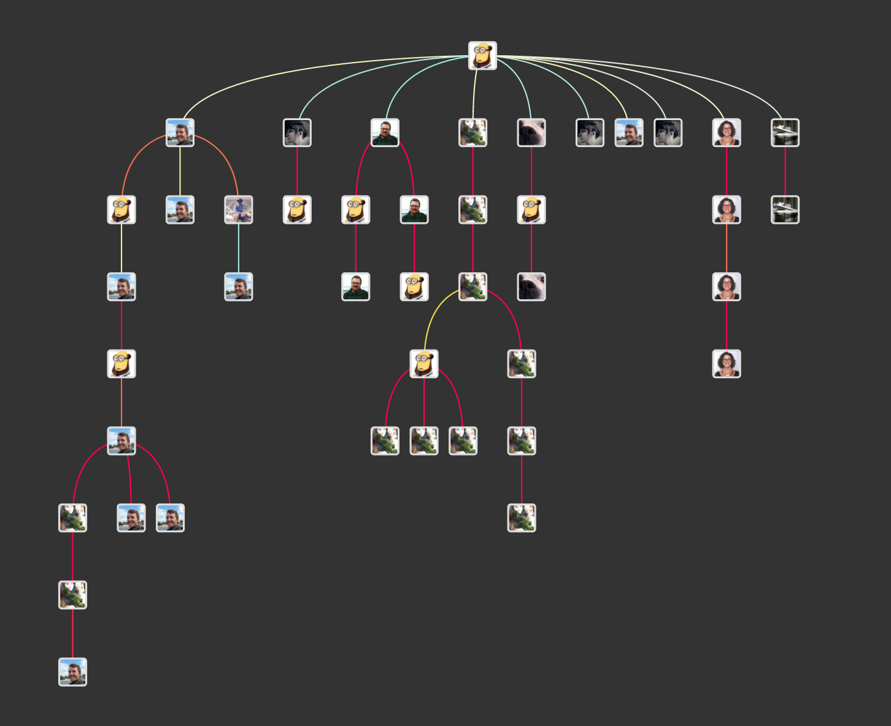

# Going Digital

> Digital archaeology should exist to assist us in the performance of archaeology as a whole. It should not be a secret knowledge, nor a distinct school of thought, but rather simply seen as archaeology done well, using all of the tools available to and in better recovering, understanding and presenting the past. In the end, there is no such thing as digital archaeology. What exists, or at least what should exist, are intelligent and practical ways of applying the use of computers to archaeology that better enable us to pursue both our theoretical questions and our methodological applications. [@evans_digital_2006]

While we agree with the first part of the sentiment, the second part is rather up for debate. We believe that there _is_ such a thing as digital archaeology. Digital tools exist in a meshwork of legal and cultural obligations, and moreso than any other tool humans have yet come up with, have the capability to exert their own agency upon the user. Digital tools and their use are not theory-free nor without theoretical implications. There is no such thing as neutral, when digital tools are employed. This is why digital archaeology is - or should be - a distinct specialization in the wider archaeological project.

In a conversation initiated on Twitter on March 10, 2017, Graham asked the question ([the thread for which discussion starts here](https://twitter.com/electricarchaeo/status/840199677572186112)), 'is digital archaeology the same as using computers in archaeology?' The resulting conversation ranged widely over everything from the topic of study to the ways in which computational power enables the researcher to ask questions that were not previously feasible to ask. Other researchers [sounded a note of caution](https://twitter.com/lornarichardson/status/840224965567868928) against the kind of 'technological fetishism' that digital work can often fall pray to, especially given the larger issues of gender and 'solutionitis' that emerge given the white, 20-35 year old demographic of many tech workers (for criticisms of technological solutionism or utopianism in archaeology, see the work of @morgan2012emancipatory, @joyce2007, @trigham2001, @morozov, and @kansa2011). Others [sounded a warning](https://twitter.com/ewg118/status/840268038146514944) that to think of digital archaeology as something distinct from archaeology risks becoming 'increasingly exclusive of the community' and instead appealed for broad engagement within the field of archaeology.

Hanna Marie Pageau succintly captured these issues, when over a series of tweets [beginning here](https://twitter.com/tinysapien/status/840213509623406593) she wrote,

> 'Digital archaeology has an obvious digital component. However, saying it's simply using a computer is like saying being a computer scientist means you use a computer to do science. There is an implied addition [to the] topic of specific methods that brings you from an archaeologist using a computer to being an archaeologist who studies digital archaeology. I would argue that archaeogaming is the most straight forward example. Because while gaming is usually thought of as digital, it could study table top gaming and not technically be digital in nature. However if you're studying ethics of representation in games you're going from just using a computer as a tool to it being THE medium.'

An important aspect of digital archaeology that differentiates it from the use of computing power to answer archaeological questions is the question of _purpose_. In this section, we take up this issue in terms of _teaching_ digital approaches. We progress by suggesting that teaching digital archaeology is akin to work at the intersection of art and public archaeology and digital humanities - it is playful, experiential and deformative. We provide you the necessary basics for setting up your own digital archaeological practice. Entrance into the world of digital archaeology requires organizational ability and facility with versioning files. It is allied with the practice of open notebook science, and it attempts to future-proof by using the simplest file formats and avoiding proprietary software where possible. These are the basics on which the rest of this textbook in digital archaeological practice is founded.

### Further Reading {-}

For a comprehensive discussion on 'theorising the digital' in digital archaeology, see @taylor_and_perry_2018 ([full text on ResearchGate](https://www.researchgate.net/publication/329642181_Theorising_the_Digital_A_Call_to_Action_for_the_Archaeological_Community)). For a discussion on different kinds of digital archaeology, see @cook_compton_2018.
