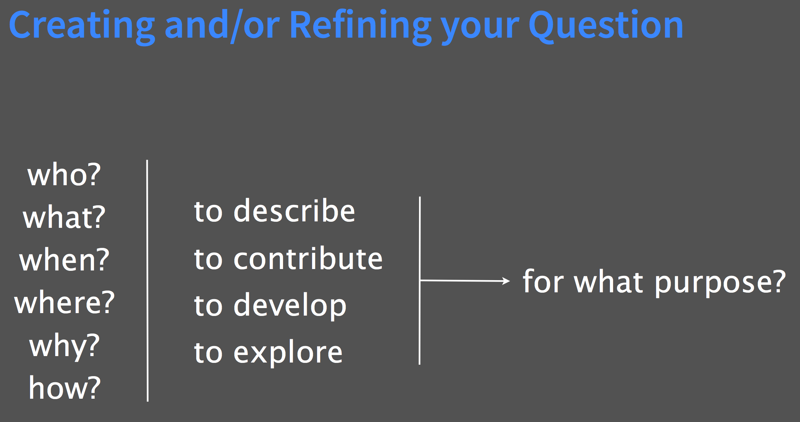

##  Project Management Basics

A digital project, whether in archaeology or in other fields, iterates through the same basic steps. There is

	1. finding data
	2. fixing data
	3. analyzing the data
	4. communicating the story in the data

Eighty percent of your time on any digital project will be invested in cleaning up the data and documenting what you've done to it. But in truth, a digital project begins long before we ever look at a data set (or are given data to work with, if we're part of a larger project). How do we formulate a research question or our exploration more generally? How do we translate a gut feeling or intuition or curiosity into something that is _operable_? [@Moretti2013]

The four steps we identified above are cyclical; at any one time you might be at a different stage of the process. Indeed, those four steps could easily be subsumed under what Simon Appleford and Jennifer Guiliano of [devdh.org](http://devdh.org) identify as the 'Best Practice Principles Of Designing Your First Project.' For Appleford and Guiliano, the outline of a project involves figuring out:

1. the question, problem, or provocation
2. sources (primary, secondary)
3. analytical activity
4. audience
5. product

Note that 4, audience, comes before 5, product. You must think of your reader/user!

Let us imagine that we were inspired by Allison Mickel's piece, 'Tracing Teams, Texts, and Topics: Applying Social Network Analysis to Understand Archaeological Knowledge Production at Çatalhöyük' [@mickel_tracing_2016].

We could frame a question: 'What role do social networks play in the development of knowledge production at my site?'

We could frame a problem: 'Mickel's exploration of social networks considered x, but not y.'

We could frame a provocation: 'Social Network Analysis promises to revolutionize our knowledge of the social contexts that underpin archaeological fieldwork, putting this power in the hands of everyone from the site director on down.'

Following Appleford and Guiliano, we can refine our question, or our problem, or our provocation down to its essence in order to figure out the next parts of the the process. Knowing exactly what kind of question, problem, or provocation we're after, we then have a better sense of what to do when confronted with a mass of data (for instance, the excavation diaries from Kenen Tepe held in [OpenContext.org, deposited by Parker and Cobb, 2012](https://opencontext.org/projects/3DE4CD9C-259E-4C14-9B03-8B10454BA66E)). Once the question is well-drawn out, questions 3 and 4 take care of themselves.

One other element that we might add is 'collaboration'. How do you plan to collaborate? While many digital archaeology projects are done by a single individual working in the quiet of their own space, most projects require many different skill sets, perspectives, and stakeholders. It is worth figuring out at the outset how you plan to work together. Will you use email? Will you use a private [slack](http://slack.com) or messaging client? What about Kanban boards? A Kanban board can be as simple as a whiteboard with three columns on it, marked 'to do', 'doing', and 'done'. Tasks are written on post-it notes and moved through the columns as necessary. A popular software implementation of a Kanban board is [Trello](http://trello.com). We would also recommend that you write down the ideal division of labour and areas of responsibility for each of the participants, _along with a mechanism for resolving disputes_.

Finally, how much time would you have to work on your digital archaeology project? All of us have multiple demands on our time. Let's be realistic about how much time you have available. How many hours, total, do you spend in class, at work, asleep, and socializing? Add that up for a week, then multiply by the number of weeks in your term. There are 384 hours in a 16 week term. Subtract to find out how many 'spare' hours you can devote to homework, this project, or a hobby.

Divide that by the number of weeks your course runs. That's how many hours per week you can spend on all your non in-class course work. Then, divide those hours by the number of courses you have.

That's how much time you have for your project. It's not an awful lot, which means that the more energy you put into planning, the more effective your labour is going to be.

### Take-aways

+ be explicit about how collaboration will be managed
+ be explicit about how your research goals intersect with your audience
+ be brutally honest about your time and guard it jealously

### exercises

1. Create a new markdown file in your `scratchpad` repository. Call it 'initial-project-idea.md'. Using `#` to indicate headings, sketch out a question, problem, or provocation of your own that occurs to you as you browse the Kenen Tepe materials housed at [OpenContext.org](https://opencontext.org/projects/3DE4CD9C-259E-4C14-9B03-8B10454BA66E). Save that file.
2. Read [this piece by Ben Marwick](https://www.practicereproducibleresearch.org/case-studies/benmarwick.html) What kind of project management plan did he have in terms of the digital work? Reflect on his case study and identify where the trouble points were in the light of what you've read in this section. Can you find a project management plan for *any* archaeological project generating digital data?
