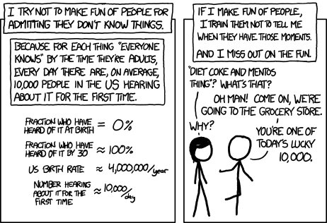

## Open Notebook Research & Scholarly Communication

<div class = rmdnote> _[Launch the 'Make a Research Compendium' notebook](http://mybinder.org/v2/gh/benmarwick/blank-research-compendium/master).<Br> [Launch the 'basic notebook'](http://mybinder.org/v2/gh/o-date/notebooks/master).<br> [Launch the 'archdata' notebook'](https://mybinder.org/v2/gh/o-date/notebooks-archdata/master)_. </div>

Digital archaeology necessarily generates a lot of files. Many of those files are data; many more are manipulations of that data, or data in various stages of cleaning and analysis. Without any sort of version control or revision history (as detailed in the previous section), these files quickly replicate to the point where a project can be in serious danger of failing. Which file contains the 'correct' data? The correct analysis? Even worse, imagine coming back to a project after a few months' absence. Worse still, after a major operating system update of the kind foisted on Windows users from Windows 7 to Windows 10. The bad news continues: magnetic storage can fail; online cloud services can be hacked; a key person on the project can die.

Even if the data make it to publication, there is the problem of the data not being available to others for re-interrogation or re-analysis. Requests for data from the authors of journal articles are routinely ignored, whether by accident or design. Researchers may sit on data for years. We have all of us had the experience of working on a collection of material, and then writing to the author of the original article, requesting an explanation for some aspect of the data schema used, only to find out that the author has either died, kept no notes, left the field entirely, or simply doesn't remember.

There is no longer an excuse for this practice. `Open notebook science` is a gathering movement across a number of fields to make the entire research process transparent by sharing materials online as they are generated. These include everything from the data files themselves, to the code used to manipulated it, to notes and observations in various archives. Variations on this 'strong' position include data-publishing of the materials after the main paper has been published (see for instance [OpenContext](http://opencontext.org) or the [Journal of Open Archaeological Data](http://openarchaeologydata.metajnl.com/)). Researchers such as [Ben Marwick](https://faculty.washington.edu/bmarwick/) and [Mark E. Madsen](http://notebook.madsenlab.org/labnotebook.html) are leading the field in archaeology, while scholars such as [Caleb McDaniel](http://wcm1.web.rice.edu/open-notebook-history.html) are pushing the boundaries in history. The combination of simple text files (whether written text or tabular data such as .csv files) with static website generators (i.e. html rather than dynamically generated database websites like Wordpress) enables the live publishing of in-progress work. [Carl Boettiger](http://www.carlboettiger.info/2012/09/28/Welcome-to-my-lab-notebook.html) is often cited as one of the proponents of this movement. He makes an important distinction:

> This [notebook, not blog] is the active, permanent record of my scientific research, standing in place of the traditional paper bound lab notebook. The notebook is primarily a tool for me to do science, not communicate it. I write my entries with the hope that they are intelligible to my future self; and maybe my collaborators and experts in my field. Only the occasional entry will be written for a more general audience. […] In these pages you will find not only thoughts and ideas, but references to the literature I read, the codes or manuscripts I write, derivations I scribble and graphs I create and mistakes I make. [@boettiger_welcome_0000]

Major funding bodies are starting to require a similar transparency in the research that they support. Recently, the Social Sciences and Humanities Research Council of Canada published guidance on [data management plans](http://www.sshrc-crsh.gc.ca/about-au_sujet/policies-politiques/statements-enonces/edata-donnees_electroniques-eng.aspx):

> All research data collected with the use of SSHRC funds must be preserved and made available for use by others within a reasonable period of time. SSHRC considers “a reasonable period” to be within two years of the completion of the research project for which the data was collected.

Anecdotally, we have also heard of work being denied funding because the data management plan, and/or the plan for knowledge mobilization, made only the briefest of nods towards these issues: 'we shall have a blog and will save the data onto a usb stick' does not cut it any more. A recent volume of case-studies in 'reproducible research' includes a contribution from Ben Marwick that details not only the benefits of such an approach, but also the 'pain points'. Key amongst them was that not everyone participating in the project was on board using scripted code to perform the analysis (preferring instead to use the point-and-click of Excel), the duplication of effort that emerged as a result, and the complexities that arose from what he calls the 'dual universes' of Microsoft tools versus the open source tools. (MARWICK REF). On the other hand, the advantages outweighed the pain. For Marwick's team, because their results and analysis can be re-queried and re-interrogated, they have an unusually high degree of confidence in what they've produced. Their data, and their results have a complete history of revisions that can be examined by reviewers. Their code can be re-used and re-purposed, thus making their subsequent research more efficient. Marwick goes on to create an entire 'compendium' of code, notes, data, and software dependencies that can be duplicated by other researchers. You can generate a research compendium for yourself using [this repository, which can also be launched with Jupyter](https://github.com/o-date/blank-research-compendium).

Ultimately, McDaniels says it best about keeping open notebooks of research in progress when he writes,

> The truth is that we often don’t realize the value of what we have until someone else sees it. By inviting others to see our work in progress, we also open new avenues of interpretation, uncover new linkages between things we would otherwise have persisted in seeing as unconnected, and create new opportunities for collaboration with fellow travelers. These things might still happen through the sharing of our notebooks after publication, but imagine how our publications might be enriched and improved if we lifted our gems to the sunlight before we decided which ones to set and which ones to discard? What new flashes in the pan might we find if we sifted through our sources in the company of others?

A parallel development is the growing practice of placing materials online as pre-prints or even as drafts, for sharing and for soliciting comments. Graham, for instance, uses a blog as a place to share longer-form discursive writing in progress. With his collaborators Ian Milligan and Scott Weingart, he even wrote a book 'live' on the web, warts and all (which you may still view at [The Macroscope](http://themacroscope.org)). Sharing the draft in progress allowed them to identify errors and omissions as they wrote, and for their individual chapters and sections to be incorporated into class syllabi right away. In their particular case, they came to an arrangement with their publisher to permit the draft to remain online even after the formal publication of the 'finished' book - which was fortunate, as they ended up writing another chapter immediately after publication! In this, they were building on the work of scholars such as Kathleen Fitzpatrick, whose [_Planned Obsolescence_](http://mcpress.media-commons.org/plannedobsolescence/) was one of the first to use the Media Commons 'comment press' website to support the writing. Commentpress is a plugin for the widely used Wordpress blogging system, that allows comments to be made at the level of individual paragraphs. This textbook you are currently reading uses another solution, the [hypothes.is](http://hypothes.is) plugin that fosters communal reading and annotation of electronic texts. This points to another happy by-product of sharing one's work this way - the ability to generate communities of interest around one's research. The Kitz et al. volume is written with the [Gitbook](http://gitbook.com) platform, which is a graphical interface for writing using Git at its core with markdown text files to manage the collaboration. The commit history for the book then also is a record of how the book evolved, and who did what, and when. In a way, it functions a bit like 'track changes' in Word, with the significant difference that the evolution of the book can be rewound and taken down different branches when desired.  

In an ideal world, we would recommend that everyone should push for such radical transparency in their research and teaching. But what is safe for a group of (mostly) white, tenured, men is not safe for everyone online. In which case, what we recommend is for individuals to assess what is safest for them to do, while still making use of the affordances of Git, remote repositories, and simple text files. [Bitbucket](http://bitbucket.org) at the time of writing offers free private repositories so that you can push your changes to a remote repository without fear of others looking or cloning your materials. [ReclaimHosting](http://reclaimhosting.com) supports academic webhosting and allows one to set up the private 'dropbox' like file-sharing service [Owncloud](https://owncloud.org/).  

In this exercises below, we will explore how to make a simple open notebook via a combination of markdown files and a repository on Github. Ultimately, we endorse the model developed by Ben Marwick, of creating an entire 'research compendium' that can be installed on another researcher's machine, but a good place to start are with the historian Lincoln Mullen's simple notebook templates. This will introduce to you another tool in the digital archaeologist's toolkit, the open source R programming language and the R Studio 'IDE' (integrated development environment).

Far more complicated notebooks are possible, inasmuch as they combine more features and ways of compiling your research. Scholars such as [Mark Madsen](http://notebook.madsenlab.org/) use a combination of Github pages and the Jekyll blog generator (for more on using Jekyll to create static websites, see Amanda Visconti's [Programming Historian tutorial](http://programminghistorian.org/lessons/building-static-sites-with-jekyll-github-pages).) A simple Github repository and Wordpress blog can be used in tandem, where the blog serves for the _narrative_ part of a notebook, the part that tries to make sense of the notes contained in the repository. This aspect of open notebook science is critically important in that it serves to signal your _bona fides_ as a serious scholarly person. Research made available online is *findable*; given the way web search works, if something cannot be found easily, it might as well not exist.

Ultimately, you will need to work out what combination of tools works best for you. Some of our students have had success using [Scrivener](https://www.literatureandlatte.com/scrivener.php) as a way of keeping notes, where Scrivener writes to a repository folder or some other folder synced across the web (like Dropbox, for instance). In this workflow, you have one Scrivener file per project. Scrivener uses the visual conceit of actual 3 x 5 note cards. Within Scrivener, one would make one card per note, and keep them in a 'research' folder. Then, when it becomes time to write up the project, those note cards can be moved into the draft and rearranged as necessary so that the writing flows naturally from them.

### How to Ask Questions

"I tried it and it didn't work", read the email. Tried what? What didn't work? What did the code actually say? What did you actually type? There is an art to asking questions when code or computing is involved. A lot of the issues involved in trying to get help ultimately stem from our natural reluctance, our natural reticence, to appear foolish or ignorant. Admitting in a public forum, or to a classmate or peer, or professor or colleague that you don't know how to x is intimidating. In which case, we invite you to reflect on this comic by [Randall Munroe](https://www.xkcd.com/1053/):



Learning 'how to ask questions' involves also learning 'how to answer questions'. This in turn is related to what Kathleen Fitzpatrick calls ['Generous Thinking'](http://www.plannedobsolescence.net/generous-thinking-the-university-and-the-public-good/):

> Generous Thinking [begins] by proposing that rooting the humanities in generosity, and in particular in the practices of thinking with rather than reflexively against both the people and the materials with which we work, might invite more productive relationships and conversations not just among scholars but between scholars and the surrounding community - Kathleen Fitzpatrick

This means that when your peer or colleague has a question or issue in their code or their process (or in their journey to become more digitally inflected in their work), you egage with them _at face value_, in the same spirit that the stickpeople in Munroe's cartoon do. Nothing will be more detrimental to the progression of digital archaeology than the appearance of gatekeepeers and hidden knowledge.

When you run into a problem - when you first become aware that something is going awry - stop. Collect your breath. Do not click madly about in all directions, hoping that something might work.

1. Step away from your computer. Shut it down, put it to sleep, go outside. Sometimes, what you need more than anything else is just fresh eyeballs. Come back to the machine after a 30 minute break. You will be surprised at how often all that you really needed was a break.

2. If that doesn't solve the issue, your next step is to help other people **reproduce** what's happening on your machine. There are a variety of ways of doing this. To start, open your text editor and make a new 'date-my-problem.md' file with the following headings:

```
# what I wanted to do
  - include links to any websites or articles you were reading
    # what I did
  - include the history of commands you've typed by passing your command line history to a new text file with $ history > mycommands.txt . Open that file, annotate it / copy and paste it to your problem document
    # expected outcome
  - describe what you think ought to be happening
  - describe or list the software, the libraries, the packages you're working with
  - share the actual code you're using
    # actual outcome
  - what actually seems to be happening.
  - copy all error messages
  - take screenshots and put them online somewhere; include here the URL to the screenshot
  - sometimes even a video can be handy; screen-cast-o-matic.com lets you take a video with narration of what's going on, and can be shared via their servers
```

With time, you will become better at describing the issue succinctly. You will also learn that many of your issues have been encountered before - one good strategy is to Google the actual text of your error message. You will discover [Stack Overflow](stackoverflow.com), who also have [excellent advice on asking for help](https://stackoverflow.com/help/how-to-ask). There is even [code to help you create code](http://reprex.tidyverse.org/) that shows other people what you're experiencing!

Your help query can also go into your open notebook. In this way, your open notebook becomes not just the record of your research, but also an invitation to others to join you.

### Discussion

Questions for Discussion:

1. Search the archaeological literature (via [jstor](http://jstor.org) or [Google Scholar](https://scholar.google.ca/)) for examples of open notebook science 'in the wild'. Are you finding anything, and if so, where? Do there seem to be impediments *from the journals* regarding this practice?
2. What excites you about the possibilities of open notebook archaeology? What are the advantages?
3. What frightens you? What are the disadvantages?
4. Search online for the 'replicability crisis in science'. Is there any such thing in archaeology?
5. Study Marwick's paper REF and compare it to its supporting Github repository. What *new* questions could be asked of this data?
6. In what ways are terms like 'open access', 'open source', and 'open science' synonyms for a similar approach, and in what ways are they different?

### Take-aways

Keeping an open notebook (or if necessary, a closed notebook; see below) is a habit that must be cultivated. As a target to aim for, try to have

- each experiment|project in its own folder
- each experiment|project with regular pattern of subfolders `data` and `figures` and `text` and `bib` etc
- the experiments|projects under version control.
- a plan for data publishing. One option is to submit the repository to [zenodo](http://zenodo.org) or similar to obtain digital object identifiers (DOIs) for the repository
- a plan to write as you go, on a fail log or blog or what-have-you. Obtain a DOI for this, too.

We haven't mentioned DOIs in this section, but when your notebook and your narrative about your research has a DOI, it becomes easier for your colleagues to cite your work - even this work in progress!

### Further Reading

Baker, James. 'Preserving Your Research Data', _The Programming Historian_ [http://programminghistorian.org/lessons/preserving-your-research-data](http://programminghistorian.org/lessons/preserving-your-research-data)


### On Privilege and Open Notebooks

While we argue for open notebooks, there may be circumstances where this is not desirable or safe to do. Readers may also want to explore an Evernote alternative, [Laverna](https://laverna.cc/) which stores your notes in your web-browser's cache hence making them private, but also allows sync to services such as Dropbox (versioning and backup are still absolutely critical). If you work primarily on a Mac computer, [nvAlt by Brett Terpstra](http://brettterpstra.com/projects/nvalt/) is a handy note-taking application that can sync remotely. Similar software exists for PCs.

A final word on the privilege involved in keeping an open notebook is warranted. To make one's research available openly on the web, to discuss openly the things that worked, the things that haven't, the experiments tried and the dead ends explored, is at the current moment something that depends on the perceived race, class, and gender of the person doing it. What passes without comment when I (Shawn Graham, a white, tenured, professor) do something, could attract unwarranted, unwanted, and unfair attention if a woman of colour undergraduate tried. This is not to say this always happens; but disgracefully it happens far too often. It is important and necessary to fight back against the so-called 'internet culture' in these things, but it is not worth risking one's safety. To those who benefit from privilege, it is incumbent upon them to make things safe for others, to recognize that open science, open humanities, represents a net boon to our field. In which case, it is up to them to normalize such practices, to make it safe to try things out. We discuss more in the following section on what [Failing Productively] means, why it matters, and why it is integral not only to digital archaeology, but the culture of academic research, teaching, and outreach more generally.

### exercises

In this series of exercises, we are going to take you through the process of setting up an open research notebook, where you control all of the code and all of the data. A good rule-of-thumb in terms of keeping a notebook is 'one notecard per thought`, here adapted as 'one file per thought, one folder per project'.

1. Launch the [basic ODATE Binder (here is our version again)](http://https://github.com/o-date/notebooks).
2. Create a folder called 'research project'. The simplest open research notebook can then be a series of text files that you create inside that project, where one file = one idea. Each file should have the markdown extension, `.md`. You can then cross-link files by making basic links in the text, eg `I found the ideas in [Graham 2016](graham-2016-reading-notes.md) made me think of...`.
3. You can also create new python or R notebooks within the folder. Create a new R notebook in your `research project` folder. In the first cell, we're going to write some code that lets you install useful packages for R. R is a language that is open and has a very active ecosystem of researchers creating useful packages that do various things. This ecosystem is peer-reviewed. Once a package has been peer reviewed, we can install it in R with the command `install.packages("name-of-the-package")`. But sometimes we want to install something that is not in the formal ecosystem. Right now, we would like to install a useful package by archaeologist Sebastian Heath called 'cawd' ("Collected Ancient World data sets for R."). In the first cell of your new R notebook, type the following:

```
install.packages("devtools")
devtools::install_github("sfsheath/cawd")
install.packages("sp")
```
Select the cell, and hit the `run` button.
4. Let's visualize some of this data. Create a new cell. We're going to tell R to use this new library (this new package) we installed, and we're going to look at some data in it.

```
library("sp")
library("cawd")
par(mai=c(0,0,0,0))
plot(awmc.roman.empire.200.sp)
```

This should plot a map of the Roman Empire's extent in 200. Let's see what other data sets are in here:

```
data()
```

Any of the datasets that end with `.sp` can be plotted the same way as we did above.

Play around with the data; more information about the `cawd` see Sebastian Heath's repo [here](https://github.com/sfsheath/cawd). We're not expecting you to do much yet with this data. Instead, add markdown cells as you play. Because you know how to add links to your markdown, you can also link your work to articles in JSTOR for instance, or other websites - library permalinks, data repositories, and so on. Remember to save your work, and to open the terminal so that you can `git add`, `git commit`, and `git push` your work to your repository.

5. Another option for building your open notebook is to make your markdown files on your own machine, in a text editor like [Atom](http://atom.io/) or [Sublime Text](https://www.sublimetext.com/) , and then putting them online so that a templating engine turns them into a navigable website. In this particular case, we are going to use something called `mdwiki`. [Mdwiki](https://dynalon.github.io/mdwiki/#!index.md) involves a single html file which, when put in the same folder as a series of markdown files, acts as a kind of wrapper to turn the markdown files into pages of a wiki-style website. There is a lot of customization possible, but for now we're going to make a basic notebook out of a mdwiki template.

a. Fork the minimal mdwiki template to your Github account; [md wiki template is linked here](https://github.com/exalted/mdwiki-seed)

b. At this point, any markdown file you create and save into the `mdwiki-seed\ll_CC\` folder will become a webpage, although _the .md extension should still be used in the URL_ . If you study the folder structure, you'll see that there are pre-made folders for pages, for pdfs, for images, and so on (if you clone the repo, you can then add or remove these folders as you like using the file manager). Remembering to frame any internal links as relative links. That is to say, if you saved a markdown file in `ll_CC/pages/observation1.md` but wanted to link to `ll_CC/pages/observation2.md`, it is enough to just add `[Click here](observation2.md)`. Because the `mdwiki-seed` you forked was *already* on a `gh-pages` branch, your notebook will be visible at `YOURUSERNAME.github.io/mdwiki-seed/`. But note: the page will reload and you'll see `#!` or 'hashbang' inserted at the end of the URL. This is expected behaviour.

c. Let's customize this a bit. Via Github, click on the `ll_CC` directory. One of the files that will be listed is `config.json`. If you click on that file, you'll see:

```
{
 "additionalFooterText": "All content and images &copy; by Your Name Goes Here&nbsp;",
 "anchorCharacter": "#",
 "lineBreaks": "gfm",
 "title": "Your wiki name",
 "useSideMenu": true
}
```

Change the title so that it says something like `Your-name Open Research Notebook`. You can do this by clicking on the pencil icon at the top right of the file viewer (if you don't see a pencil icon, you might not be logged into github). Scroll to the bottom and click on the 'commit changes' button when you're done.

d. Let's add notes to this notebook. You can do this in two ways. In the first, you clone your mdwiki-seed via the command line, and use the text editor to create new pages in the appropriate folder (in this case, `ll_CC\pages`), then `git commit`, `git add .`, and `git push` to get your changes live online. You can create a kind of table of contents by directing the `ls` command into a new file, like so:

````$ ls > index.md````

and then editing that file to turn the filenames into markdown links like so: `[display text for link](filename.md)`.

Alternatively, a more elegant approach to use in conjunction with `mdwiki` is to use [Prose.io](http://prose.io) and keep your notebook live on the web. Prose.io is an editor for files hosted in Github. You log into Prose.io with your github credentials, and select the repository you wish to edit, in this case, `mdwiki-seed`. Then, click on the 'new file' button. This will give you a markdown text editor, and allow you to commit changes to your notebook! **Warning** do not make changes to `index.html` when using `mdwiki`. If you want a particular markdown file to appear as the default page in a folder, call it `index.md` instead. You could then periodically update your cloned copy on your own machine for back up purposes.

Either way, add some notes to the notebook, and (with due consideration to your own privacy concerns) make them available online.
