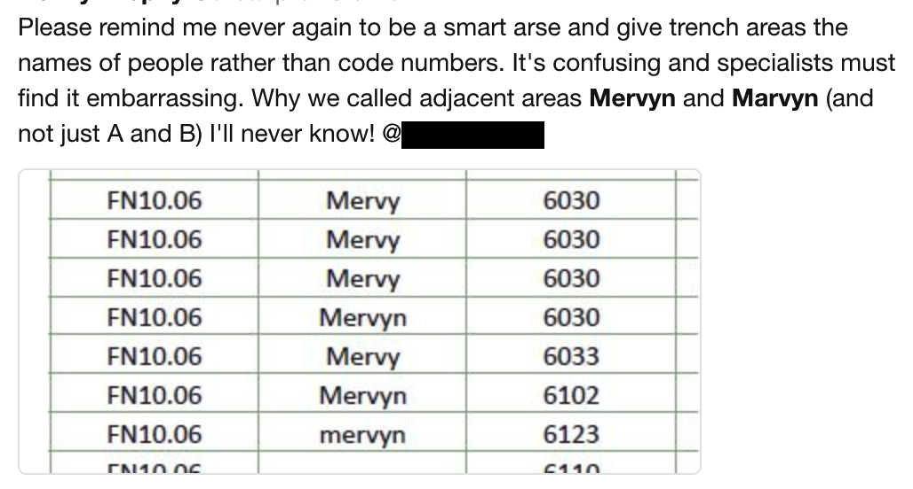
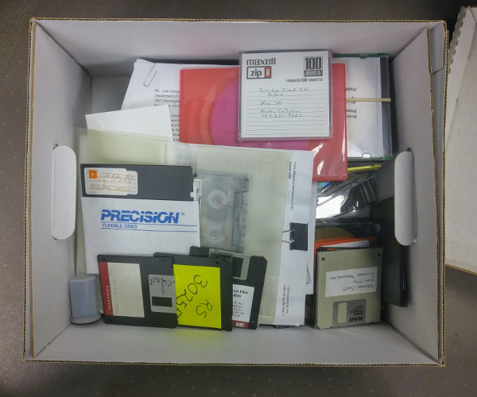

# Making Data Useful  

The single hardest part of making data useful involves disciplining yourself to make your data 'future-proof'. By planning for the long-term at the outset, you also achieve the happy accident of making your data amenable to _re-use_ and distributed collaboration. In this section we walk you through the relevant steps and issues.

## Proper Prior Planning
Prepare yourself for a little journey. In a dreamlike state, you find yourself in a time machine, noticing that you have traveled to a point in the far or not-so-distant future. You arrive in your own lab to find a group of researchers puzzling over the information you created in the time before, trying to reconstruct your conclusions and make some kind of sense of it all.

    "What are these strange codes?"
    "Does this thing go with that? It looks like there's a bit missing, but we can't be sure."
    "What was on all those corrupted flash drives? Does anyone even have a flash-drive-to-skull-jack converter around here?"
    "WHAT WAS THIS PERSON THINKING?"

It doesn't have to be this way. Most archaeological researchers have encountered “bad” data when trying to use someone else's data or reconstruct their conclusions from field notes and excavation reports. What makes a dataset unwieldy? How can we make it better?

*It’s not understandable.* The dataset may be illegible (poor handwriting, or a poor scan of a hard copy document). It might be made up of codes with no way to decipher their meaning. It might be a digital binary file that can no longer be read by available software (or on a physical format that’s now obsolete).

*It can’t be easily accessed.* The dataset might be saved in a format that only expensive, proprietary software can read. It might be comprised of a lot of fascinating information but challenging to extract from a format like PDF.

*It’s difficult to reuse.* The dataset might use inconsistent terminology. The data might be saved as an image (a picture of a table in a PDF), when in fact it's got a structure (easily extractable text and numbers). The data may already be processed in ways that make further analysis impossible.

With these frustrations in mind, the qualities of "good" data become apparent. _Good data are stable, human readable, and accessible_. They can be rearranged and remixed. And maintaining data in this condition can help protect them from the ravages of time.

### Making Data Sensible: Pre-Planning

Creating good data requires planning. It is important to plan the structure of the data, expectations for its use by researchers, and arrange for its storage from the beginning of your research. A reality to confront, however, is that there will be tradeoffs.

Up front, right at the beginning, when you’re working out your research questions and goals, ask yourself some questions: What do I want my data to do? How much detail do I need to collect? Do I have a plan for curating datasets I’ve created? Is there space somewhere to do so? Will I need to be selective?

|Degree of reproducibility|Data|Analysis|Computational environment|Comment|
|---|---|---|---|---|
|Not reproducible|	Summary statistics of the raw data are presented.|	Brief narrative of methods is presented.|	No information is provided.|	The current status quo for scholarly journal articles.|
|Low reproducibility|	The reader invited to contact the author for access to the data.|	Brief narrative of methods is presented, names and version numbers of software are stated.|	No information is provided.|	Frequently seen. Inviting readers to contact the author to access the raw data is no guarantee that the raw data is available.|
|Moderate reproducibility|	The journal article is accompanied by files of raw data tables in PDF or Excel (i.e., binary) files.|	Brief narrative of methods is presented, names and version numbers of software are stated.|	No information is provided.|	Frequently seen. Having the raw data in supplementary material makes it much more accessible compared to when it must be requested from the author. However, extracting raw data from a PDF or other binary file format can be  time-consuming and introduce errors. This presents obstacles to re-use of the data.|
|High reproducibility|	The journal article is accompanied by plain text files (e.g., CSV format) of raw data.|	The journal article is accompanied by script files of R of Python code that demonstrate key parts of the analysis (but do not generate all the results presented in the paper).|	No information is provided.|	Uncommon. Raw data in plain text format makes re-use highly efficient. Script files with code  provide valuable insights into analytical decisions that are not narrated in the text of the article. However, because the code is not complete, substantial effort and skill is required by other researchers to reproduce the results of the article, and to re-use the code in new studies. This presents obstacles to re-use of the code.|
|Very high reproducibility|	The journal article includes DOIs to an open access repository that contains plain text files (e.g., CSV format) of raw data.|	The open access repository linked to from the paper includes version-controlled R package or script files of R or Python code to reproduce all of the analysis output and graphics in the article.|	The open access repository linked to from the paper includes a dockerfile that documents the computational environment of the published analysis, and a docker image that allows another person to use that environment.|	Currently rarely seen. Other researchers should have a good chance to reproduce, re-use and extend the published results with this combination of plain text data files, code that documents every analysis and visualization in the paper, and details of the computational environment of the original analysis. Note that this does not guarantee permanent reproducibility, but it gives the best odds we can currently provide. The use of an open access repository means that researchers can access the files even if they do not have a subscription to the journal, and ensures the availability of the files if the journal website changes.|

_Table reproduced from @marwick_computational_2017 ._

Perfection is unattainable. No dataset will ever be truly “complete.” You could collect, measure, and produce data at finer and finer resolutions, ad infinitum. But you don’t want to do that. And even if you think you're being comprehensive, all data you collect is only a specific, bounded representation of the real world at a particular moment of time. In order to get as close to a perfectly usable and preservable dataset, you should collect both metadata and paradata.

If the concept of metadata is *data about data*, defining attributes and documenting structure, paradata is *data alongside data*, like a data diary [@denard2009london]. You can see paradata in action at events like the [Heritage Jam](@university_of_york_department_of_archaeology_heritage_2017). The concept can be applied broadly to analytical and technical digital projects to great effect. Keeping a paradata file can help to illustrate some of the assumptions we naturally make when producing and grooming data. Under this model, data are never "raw" @gitelman_raw_2013. In the context of an archaeological excavation with published analysis, this information might take the form of sections of a gray literature report or an appendix to a publication. Or it might be a text document that travels along side a collection of data files as a "readme."

Metadata is likewise a critical concept. Some values generated by a machine, like file size or photographic EXIF data, while other *descriptive metadata* is authored by hand. Think of it as the codex that makes the rest of your information useful.

### Making Data Durable: Preservation and Longevity

With forethought directed at topics like format, structure, and descriptions, you can do a lot to extend the life of your work. From the outset, consider whether you intend to prepare your data for ultimate disposition in a [digital repository](https://o-date.github.io/draft/book/introduction-to-digital-libraries-archives-repositories.html), maintain it yourself, or both. In the discipline of digital preservation, the [LOCKSS](https://www.lockss.org/about/principles/) (Lots of Copies Keep Stuff Safe) principle recommends storing data in several locations to ensure redundancy.

Simple formats can allow for easier migration as software and hardware evolve. Understanding the differences between file formats is important in planning for digital preservation. Some data is stored in binary files, only readable by specific programs (like a Microsoft Access .mdb) or completely human-readable (like a .csv format table). Images may be easy to store, but "lossy" when compressed (.jpg files), or larger and "lossless" (.tif files). Many people are suprised to learn that there is no agreed-upon archival format for CAD (computer aided design) files.

*This collection of media resides beneath the author's desk, awaiting processing. Some data will likely be lost forever.*

**Time is your enemy**

Archaeologists are well aware that excavation is a destructive act. Conservation is never forever. When we dig, we participate in a process of rearranging physical material in ways that make it both easier to interpret and more vulnerable to inevitable degradation. In a way, the same can be said about archaeological data. Here are some common risks:

**Deprecated formats:**

After we hit the Save button, it's easy to take for granted that our digital work is safe and sound. But consider file formats. Many of us working with legacy collections and data have come up against old word processing files, databases, or geospatial datasets that just won't open anymore. These are generally binary files [define] in proprietary formats that have since become obsolete. A way to guard against this is to use lossless formats when possible and to regularly convert files to keep up with software versions.

**Bit rot and link rot:**

Some files can themselves deteriorate over time, especially when copied or compressed repeatedly. Links on websites can become broken or "dead" as resources are moved or reconfigured. Defining a migration schedule for files to newer versions can help guard against bit rot (don't just save your files somewhere and expect them to work years later). One way to check on file integrity is to periodically generate *checksums* when you store a file. A checksum is long number calculated based on the contents of the bits in the file itself. For example, even a tiny glitch in the pixels of an image will cause changes to the checksum, so a mismatched value will tell you something went wrong with your file. Link rot can be mitigated by linking to archived sources (the Internet Archive's [Wayback Machine](https://archive.org/web/web.php), for just one example) or DOIs ([digital object identifiers](https://en.wikipedia.org/wiki/Digital_object_identifier)).

Lost institutional knowledge and unconscious assumptions:
What did those codes mean? What unit of measurement is this? How was the equipment calibrated? What were the coordinates of the site datum again? These are critical pieces of information that can all too easily become lost and make related data difficult or impossible to reuse.

**Strategies: Have a Plan**

Good digital preservation takes some thought in advance. Describe what you're trying to preserve, and to what level. Are you preserving supporting data (tables, images, other files), entire documents (reports, publications, theses), or digital projects (websites, interactive content)? All of these types of information will require different consideration for preservation. Are you planing to curate these digital materials yourself? Then research [personal digital archiving](https://library.columbia.edu/locations/dhc/personal-digital-archiving/online-resources.html).

You may also investigate options to find a suitable repository in order to tap into existing infrastructure and expertise. This repository might be part of a university library ecosystem, it might be something specifically designed for archaeological data like [Open Context](https://opencontext.org/) or [tDAR](https://core.tdar.org), or it could be very broadly defined, like [Zenodo](https://zenodo.org/). Your choice of repository may dictate the kind of metadata you collect and the way you collect it, so the sooner in your project lifecycle you consider long-term storage and preservation options, the better.

**Strategies: Create Metadata**

Create thorough metadata, or "data about data," as you go. This will help you, those who use your data in the future, and those who are tasked with curating your datasets. Clear explanations of variables, measurement parameters make up metadata. Well-named columns can aid greatly in reducing confusion. Any codes or abbreviations used should be defined Metatadata can be stored in a separate "readme" document or, depending on the type of file, directly in the application itself. But metadata only works if it's not lost or disconnected.

**Preserving Projects on the Web**  
While web-archiving is a discipline all its own, you can get started with some free available tools. [Webrecorder.io](https://webrecorder.io/) creates a static package of files from any website, even complicated interactive projects, for storage and preservation. If you're building a dynamic web project using a content management system like WordPress or Omeka, you'll learn that updates to the code are frequent and things can start to break over time. Without updates, security vulnerabilities will be introduced. If comments sections aren't well-gardened they can be quickly overrun with spam. The years are not often kind to web projects, so have a sunset plan to shift things to static HTML. Here's a great guide from Ed Summers on [converting an Omeka site into a static site](https://inkdroid.org/2018/07/08/omeka/). [Here's a WordPress plugin](https://wordpress.org/plugins/simply-static/) to convert to a static site. Static sites generally have few dependencies and are less prone to security issues.

### Takeaways

+ Plan for preservation. Files degrade and formats become obsolete.
+ Describe your datasets with metadata, defining abbreviations and assumptions.
+ Proprietary file formats can lead to preservation challenges. Storing data in text files like CSV is a safe bet.
+ Reproducible results are made of useful data. Aiming for reproducibility enhances utility and usability.
+ Leave "breadcrumbs" for future researchers in the form of metadata and paradata.

### Further Reading

For advice on creating and preserving specific types of archaeological, data consult  [*Guides to Good Practice* published by the Archaeology Data Service and Digital Antiquity](http://guides.archaeologydataservice.ac.uk/g2gp/Main), 2011.

For a deeper dive into digital preservation, see Trevor Owens, *The Theory and Craft of Digital Preservation,* @owens_theory_2018. [Full open access preprint available](https://osf.io/preprints/lissa/5cpjt/).

For archaeology-specific recommendations, see the Archaeology Data Service and Digital Antiquity's [Guides to Good Practice](http://guides.archaeologydataservice.ac.uk/g2gpwiki/).
