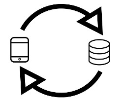
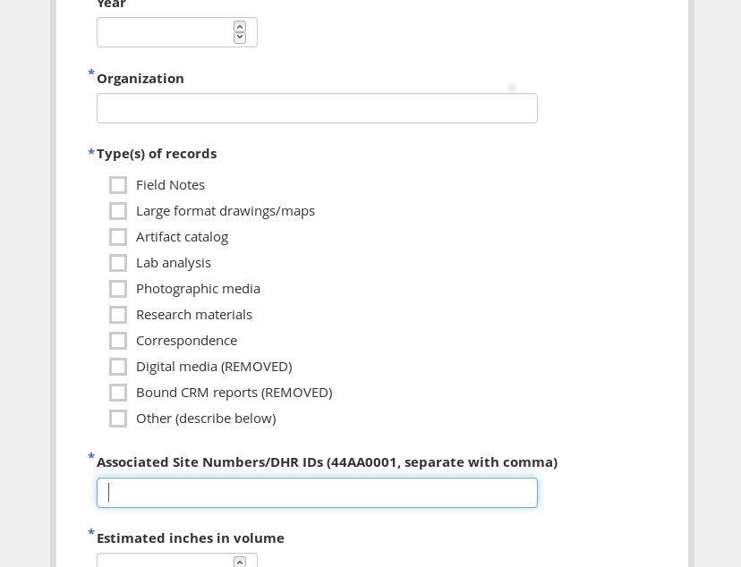

## Designing Data Collection and Curation

In teaching, there is a concept called 'backwards design', where you design your lesson from the end point you wish your students to achieve. The same is true of data. Knowing that archaeology is destructive, and that the processes of archaeology _creates_ new kinds of artefacts (drawings, photos, record sheets, labels, and so on), we need to start at the end. Ideally, it is an end point that will allow someone else to reconsider the archaeological record that you have created. As Gavin Lucas @lucas2012understand writes, the idea of an 'archaeological record' is a three-fold, trinity-like concept-

+ the material culture broadly understood
+ the 'formation theory' of how that material culture came to be
+ and the materialization of the construction of that material culture in the present: our archive

And so, we will begin this section on data collection by thinking through where the _things_ are going to go.

*The design of data collection informs the structure of the database, and the other way around.*

Choices about which fields of data to collect and how to collect them will influence the "shape" of your database, and have consequences for how much cleaning and restructuring you might need to do later.

*This form designed in [KoBoToolbox](https://www.kobotoolbox.org/) includes a text box asking the user to separate multiple values by commas. This is easy for data entry, but has consequences. Learn more in the next section on Cleaning Data.*

**Modes of collection**

While this is, after all, the *Open* ***Digital*** *Archaeology Textbook Environment*, don't discount the option of analog data collection. Like so many other choices you'll make when setting up a digital archaeology project, there's no correct default here; it's dependent on your particular needs and constraints.

**What are you collecting?**  
Much of the following discussion assumes that you are planning for archaeological field data collection. But in digital archaeology and heritage, that might not be the case.

*Paper to digital*

Sometimes the most straightforward way to collect data in the field is to write it on paper. Paper forms can't run out of batteries. Data loss and integrity issues are still real, but massive data loss may be less of a threat when working with paper, depending on backup mechanisms.

It's usually a good choice to mirror the format of the destination database on the input form.

*Born digital*

Collecting your data digitally holds significant advantages. If you've settled on the structure of your destination database, digital data collection can seamlessly integrate information, eliminating extra steps and reducing opportunities for transcription errors.

The landscape for mobile data collection in archaeology has flourished in recent years. Archaeologists now have access to a broad spectrum of data collection options, from off-the-shelf mobile data collection applications custom designed to meet to meet the needs of specific projects and organizations to assembling a suite of free, open source tools as needed.

The trick in designing digital data collection is to set limits without over-constraining. Typing data into fields in an Excel spreadsheet is digital data collection, sure, but setting up controls to standardize data entry with spreadsheet functions can be complicated and fragile. (If you find yourself engineering a complicated spreadsheet with dependent picklists and formulas for relationships, this may be a sign that you're using the wrong tool.)

Whether you're designing data collection on paper or on a device, give yourself time to test it out. A dry run with real (or close to real) data can illuminate pain points for data collection now and analysis later. You  might find that, for your project's specific needs, well-designed paper data collection will do the trick. Or you might combine paper and digital approaches. There's no right answer or perfect software for every project.

**Creating structure**

When we talk about data structure, we're often referring to *databases*, whether they are true relational databases or other collections of project data. [See the following section](/book/arranging-and-storing-data-for-the-long-haul-databases.html) for more discussion on designing a data structure to fit your project.

**Where to put your data**

[Earlier in this section we briefly discussed digital preservation](/book/making-data-useful.html). We covered the basics of what it takes for stable, reusable data, but where will it live? Let's talk about *repositories.* A digital repository can be short-term or long-term.

Questions to consider:

+ If you're planning to curate your own digital materials and hope to keep them safe for a long time, are you prepared to do regular checks and maintenance?
+ What do you want to save? It might not be *everything*.

If you're looking toward an outside repository:

+ Does it have room for your data? Is your research or data within the scope of mission for that repository?
+ Does the repository have special requirements for format or preparation?
+ Does the repository charge a fee to deposit material? Have you built it into your budget?
+ Does the repository itself have a plan for long-term sustainability? What happens to the data if its host organization is dissolved?
+ Does the repository have plans for migrating and maintaining your files?

**Some Existing Repositories for Archaeological Data and/or Digital Projects**  
Each option below meets differing needs.  The world of digital repositories is vast and dynamic and this is just a sampling of possibilities.

+ [Zenodo](https://zenodo.org/)  
Zenodo is a repository for open science data, supported by CERN and the European Commission. Access is currently free and unlimited.

+ [tDAR](https://www.tdar.org/)  
tDAR is an archaeology-specific repository maintained and governed by Digital Antiquity and Arizona State University. tDAR archives a wide variety of archaeological media. Fees apply to deposited data.

- [ADS](http://www.archaeologydataservice.ac.uk/)  
The Archaeological Data Service serves as a repository with a mission to "provide digital archiving facilities for all areas of the world in which UK archaeologists have research interests" [archaeology_data_service_archaeology_2014]. Fees apply.

+ Publishing through [Open Context](https://opencontext.org/) at the California Digital Library  
Open Context is a publisher and not a repository in itself, but it works with the California Digital Library to store organized, linked archaeological data from around the world. Fees apply.

+ [Internet Archive](https://rchive.org/)
Storing a copy of web-based data on the Internet Archive may be a suitable (and free) option. It's free to upload files to Internet Archive that you have the right to share, however they could potentially be removed without notice.

+ University libraries  
If you are affiliated with a university, contact the university library to inquire about digital repository options.  

+ Government archives and libraries  
State, provincial, or local governments may have preservation of archaeological data within scope. For field projects, check with the repository that holds your relevant physical archaeological reports for details.

It is important to understand that just because your information is archived safe and sound in a suitable digital repository does not guarantee that it will be easy to find, reference, or re-use by other researchers. Read on about options for [linked open data and data publishing](/book/linked-open-data-and-data-publishing.html) to learn how to ensure your data are discoverable. There's no "best" repository choice that will work for every field or digital humanities data project, so it's helpful to understand the strengths and drawbacks of each. Repositories have different requirements for preparation and structure of data, so check with each option before attempting to submit material.

### Takeaways
+ The way you set up data collection informs the shape and structure of your final database, and vice versa.
+ Give lots of advanced thought to what you are collecting and why.
+ Consider where your data will go after you're finished, who might use it in the future, and how long you want it to last.
+ Research policies, costs, preparation requirements, and levels of preservation for multiple storage repositories.

### Further Reading
For a great workflow using KoBoToolbox, QGIS, PostGIS, and LibreOffice Base (all free and open source tools), see [this overview from Ben Carter](http://benjaminpcarter.com/digital-data-collection/tools/).
<!-- add more please! -->
