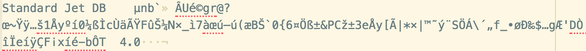

## Arranging and Storing Data for the Long Haul (Databases!)

<div class = rmdnote> _[Launch the Databases Binder](https://mybinder.org/v2/gh/o-date/sqlite/master?filepath=intro%20to%20sql.ipynb)_. </div>

Once you’ve collected data according to your plan and structure, you’ll need a way to connect it all together in a way that allows you and other researchers to use it, hopefully for some time to come. Since this textbook is about "digital archaeology," the nature of your digital data might be highly variable. You could be working with information from a physical excavation, or you might be a few degrees removed from the dig and working to aggregate existing research data. Consider the different framework possibilities as you continue reading.

**So what *is* a database and which kind should you use?**

Choosing a format:  
A lot of people have a lot of opinions on good database platforms, horrible ones, and everything in between. But there is no universally right answer and a lot depends on technical resources and level of experience. That is to say, in many cases, a relational database is the strongest option, but handling information well in spreadsheets may met your needs and the needs of other researchers if implemented well. Our organizations may dictate software platforms we're permitted to use, and often that's Microsoft Access or Excel.

You might make your decision based on the complexity of your data. Are you working with field data with lots of nested information about excavation units, features, and artefacts? Or are you storing a simpler list of values you've collected through research?

There's no perfect format choice that applies to every project, but there are some trade offs to keep in mind. Your choices may take into account things like number of collaborators, internet connectivity, availability of hardware like field tablets, and software compatibility.

### Flat tables ### {-}
The first stop for many people creating digital data is to put collected values into a spreadsheet. Spreadsheets are quick and easy tools to arrange text and numerical values in meaningful ways.

**Excel**  
In field archaeology, it's incredibly common to see excavation data and artefact catalogs stored in Excel spreadsheets. Microsoft Excel comes standard on most PCs and is ubiquitous in many office settings. There's a lot of power in Excel, but watch out for pitfalls.  

*Pros*  
The appeal of Excel and similar spreadsheet applications lies in their expedience. With a very small amount of technical know-how it's possible to create collections of structured data and perform sometimes complex analytical operations through formulas and charts right in a workbook.  

*Cons*  
Excel tries to be clever, and sometimes it goes overboard. A prime example is the tendency for Excel to try to auto-format dates. Excel's way of handling dates is to convert something like 8/1/2018 (August 1 since this author is American) into a serial number, 43311. Weird, right? It gets weirder. Excel uses the 1900 date system to assign those numbers. That serial number represents the number of days between January 1, 1900 and the date entered. This is not only tricky for those of us who work with dates prior to 1900, but it can also cause problems for number values that *look* like those date serial numbers, transforming things that *are not* dates into date values. In fact, Excel looks for all kinds of patterns that might be dates and converts them. This has become a significant problem with data about genetics. See [@ziemann_gene_2016]. A safeguard against this type of error is to manually format any column that might contain values that look like dates to excel to be formatted as text. Or just don't use Excel for anything that important.

Excel makes it tough to constrain or standardize data entry without a lot of formula acrobatics that may break when others try to access the file. Be wary of typos and formatting problems when working in spreadsheets or plain text formats without controls like picklist selections.

While tempting to store meaningful information in formatting like color codes or bolded text, this is a **very bad idea**. Formatting gets easily broken between software versions and applications.

Excel specifically is incredibly hard to version control, or to trace the history of changes over time. Plain text and open formats often allow for much easier version control and metadata about changes that can travel with the data over their lifespan (see the ODATE section on [Git and version control](/book/github-version-control.html) for more).

**Comma or Tab-separated text files (.csv, .tsv, .txt)**  

*Pros*  
These kinds of text files are some of the simplest ways to store data, and thus also some of the most durable. You can open them as tables in a spreadsheet program like Excel or Google Sheets, but all the information is still readable in a plain text editor. Since there's not much complicated underlying structure, these types of plain text files are very easy to *version control,* or retain and view information about changes to a file over its life span. In most cases, if you need to work in and save spreadsheet data, choose one of these formats over Excel or other formats. (If you have dates in your CSV or TSV file and you save using Excel, it may still try to monkey around with the formatting. Make sure your date columns are formatted to Text.)

*Cons*  
To some degree, you might have less control of formatting when using plain text files (but this may be a feature and not a bug.)

For great advice on using spreadsheets to organize data, see this helpful piece in *The American Statistician* by Karl Broman and Kara Woo @broman_data_2018.

Putting your collected data straight into flat tables can be quite easy and efficient. It's quite easy for a human to open a spreadsheet and read it. These are probably the biggest advantages for storing data this way.

However, it can be challenging to convey how data fit together if they are contained in flat files-- metadata explaining each field must be stored in some other file. Data entry can be inefficient and error-prone if there are no checks in place to eliminate inconsistencies. And it's very easy to introduce errors and typos. Note: while you *can* relate values in Excel with functions like VLOOKUP and set constraints with input masks, it doesn't mean you *should*; because of the instability of these types of enhancements. If you find yourself embedding a lot of this kind of behavior, it's a good signal to take a look at other types of databases.


**JSON and XML**  

While you likely won't (and shouldn't) input your research data directly into these formats from the beginning, many web resources rely on [JSON (JavaScript Object Notation)](https://en.wikipedia.org/wiki/JSON) or [XML (Extensible Markup Language)](https://en.wikipedia.org/wiki/XML) documents to store data. JSON and XML are formats for writing plain text documents in ways that allow computers (and people) to understand hierarchy and relationships between data.

JSON looks like this ([source](https://en.wikipedia.org/wiki/JSON)):

```JSON
{
  "firstName": "John",
  "lastName": "Smith",
  "isAlive": true,
  "age": 27,
  "address": {
    "streetAddress": "21 2nd Street",
    "city": "New York",
    "state": "NY",
    "postalCode": "10021-3100"
  },
  "phoneNumbers": [
    {
      "type": "home",
      "number": "212 555-1234"
    },
    {
      "type": "office",
      "number": "646 555-4567"
    },
    {
      "type": "mobile",
      "number": "123 456-7890"
    }
  ],
  "children": [],
  "spouse": null
}
```


XML looks like this:

```xml
<?xml version="1.0" encoding="ISO8859-1" ?>
<CATALOG>
 <CERAMIC_TYPE>
 <NAME>Pearlware</NAME>
 <MATERIAL>Refined Earthenware</MATERIAL>
 <MANU_TECH>Press Molded</MANU_TECH>
 <EXT_INT_SURFACE>Lead Glazed</EXT_INT_SURFACE>
 </CERAMIC_TYPE>

 <CERAMIC_TYPE>
 <NAME>Faience</NAME>
 <MATERIAL>Refined Earthenware</MATERIAL>
 <MANU_TECH>Wheel Thrown</MANU_TECH>
 <EXT_INT_SURFACE>Tin Glaze</EXT_INT_SURFACE>
 </CERAMIC_TYPE>
</CATALOG>
```

Note that you can see some code-like formatting, but you can still read the contents and get a feel for organization.

**Relational databases**  

A relational database consists of many different tables connected together with *relationships* that tell computers how things fit together. Generally, each table represents one 'entity type' (i.e. contexts, artefacts, OSL samples, etc) and consists of rows and columns. Rows represent instances of that type of entity (i.e. context 0321, AR009876, S112), and columns represent values attributed to that instance (i.e. soil texture, date closed, raw material, weathering index, etc). Rows are also called records, and columns are sometimes called variables or attributes.

Most relational databases rely on SQL, or Structured Query Language, to run the show. Each SQL command is essentially a self-contained logical statement that includes all parameters needed to do a particular action. If something doesn’t add up, an error will be reported and nothing will happen.

For example, the following command would retrieve the contents of the two named columns from the specified table:

```
SELECT column1, column2, ...
FROM table_name;
 ```

Desktop SQL office database products like MS Access come with a graphical user interface (GUI) to help set up relationships and form queries. In fact, every task that can be accomplished using the GUI actually masks the implementation of SQL commands hidden from the users' view. As such, it's worthwhile to learn the basics of SQL to better understand how your data is being transformed under the hood. While different database management systems use slight dialects of SQL, they generally apply the same fundamental principles.

Common desktop application options:  

+ Microsoft Access
+ FileMaker Pro
+ Open Office Base

These consumer grade database applications can be a great entry point into SQL databases, they can be incredibly frustrating, and usually they're both. Using these types of applications it's relatively easy to create databases with complex relationships. This type of database is also a great choice because of the ability to create integrated forms that can be used to set constraints on data entry. You can create "authority tables" to populate drop-down lists and set input masks to control for necessary patterning in special ID numbers, dates, etc.  

MS Access is notoriously fragile. Collaboration by multiple users on a single database can be a challenge. Conversion between old and newer software versions can cause unexpected errors.

*Server-based SQL Databases*  

If your application for storing or serving up data runs on the web, your SQL back end is likely something like MySQL, MariaDB or PosgreSQL. The database resides on a server that multiple users can access simultaneously. Data is centralized and unified, and is therefore also consistent among users.

Although SQL databases are made from tables, most of them are stored as binary files. If you try to open them without the correct program to read the data, you get something like this:



They must therefore be opened using software that can parse that information. Users read a database by connecting with the server where the database is stored using a *client*. Users typically enter login credentials granted by the server adminstrator, which are used to manage or restrict access to certain sensitive data, or limit the abilities of unauthorized individuals to edit or modify data. Data entry forms or automatically generated visualizations or reports are generally custom-made to reflect the specific aspects of the databases that they serve.

Some popular open source database clients:

+ MySQL Workbench
+ Sequel Pro
+ Table Plus
+ DBeaver
+ PostgreSQL

**Graph Databases**

A graph database is a relatively new development. Unlike relational databases the graph database records both the object of interest and its relationship to another object of interest. Typically this is demonstrated with reference to people, a person can be objectified as a single point (node), this person can be related to another person (another node). This relationship is modeled as a line (edge), the relationship can be anything you like, Dave is the brother of Sue, Dave is friends with Sue, Sue went to school with Dave.

All three of these examples can be true, but there can also be directional relationships, for instance Dave can be Sue's brother but Sue cannot be Dave's Brother, this is therefore directional. To make it a two-way relationship: Dave is a sibling of Sue, Sue is a sibling of Dave. If Sue has gone to School with Dave then the opposite must also be true, and you would also expect friendships to be two way also. However if Dave liked Sue then the opposite may not be true.

In what is refered to in mathmatics as graph theory, we have two nodes joined together by a single edge. The nodes can represent any object, the object can have attributes, for example: name, age, height, etc. For an archaeological example the object could be an artefact, the attributes should be specific to the artefact, in theory you could have a found by attribute, but it would be better to create a person node and then use a relationship, or edge, to state that the artefact was found by a specific person. If a person found many artefacts then they would be joined to many other artefact nodes.

This is a similar concept that is found in Network Analysis and object orientated approaches which use an object-predicate-subject data structure.

Graph databases have their own query language: cypher. In many ways it is similar to SQL but even simpler. Rather than using SELECT statements graph databases use pattern matching.

``` cypher
MATCH (n)
RETURN n;
```

The simplest pattern is to match all the nodes, once matched they must be returned. This can be developed further to return all the related nodes.

```cypher
MATCH (n)-[r]-()
RETURN n, r;
```

An entry level graph database is [Neo4J](http://neo4j.com). An advanced level graph database is [Agensgraph](https://bitnine.net/agensgraph-2/). Both may be queried with the [cypher query language](https://neo4j.com/developer/cypher-query-language/).

### Takeaways

+ Take time to understand the pros and cons of relational databases and flat data structures.
+ Beware of Excel and spreadsheet software. Sometimes it's appropriate, but risks abound.
+ Lean toward plain text formats like CSV when possible.

### Further Reading

[Data Organization in Spreadsheets for Social Scientists](http://www.datacarpentry.org/spreadsheets-socialsci/), from Data Carpentry

[Data Organization in Spreadsheets for Ecologists](file:///home/jolene/Zotero/storage/TJSS5VHF/spreadsheet-ecology-lesson.html), from Data Carpentry

[SQL for Social Science Data](http://www.datacarpentry.org/sql-socialsci/), from Data Carpentry

[Thinking about Data](https://labs.ssrc.org/dds/articles/6-thinking-about-data/), from SSRC labs


### Exercises

[A Gentle Introduction to SQL](https://mybinder.org/v2/gh/o-date/sqlite/master?filepath=intro%20to%20sql.ipynb)


