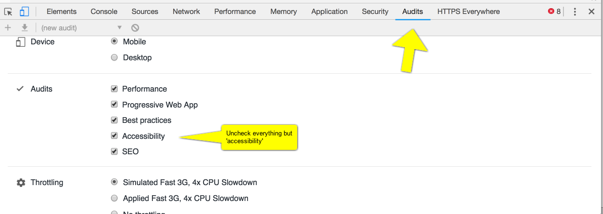

## Designing for Accessibility

Consider library shelving. This is a technological solution to arranging large numbers of books. There is a design decision taken to make the shelves a certain height, to make the aisles a certain width. Consider a person in a wheelchair, who cannot reach the higher shelves, or whose chair cannot navigate the aisles: it is not their condition that makes the library inaccessible. It is the design choices and assumptions about 'ideal users' that creates the disability. 

Similarly, our design choices in digital media do the work of disempowering or disabling our potential users, audiences, researchers.

It does no good to build a website to communicate the compelling story, but neglect significant portions of one's audience through design choices that exclude. As scholars participating in the digital humanities, there is a rhetoric surrounding the use of 'open access' resources that sometimes does not lie congruent with the needs of accessibility. We make sources, code, images, software, and many more resources open. Open access and open source are part and parcel of our lexicon. We create websites and digital tools to democratize the pedagogical landscape. However, we may not be aware of the different ways people access digital content. Merely making material available online - however well intentioned - is not sufficient to democratize learning or to give _actual_ access. What happens if someone who uses a screen reader cannot navigate your website because you do not have proper headers? Or if the contrast between your text and background is too low for someone to read?

Digital archaeologists should be considering accessibility and universal design _from the beginning_ and not after the fact.

Fortunately, many open source platforms (eg. GitBook) are accessible out of the box, or need minor adjustments to meet various accessibility standards. Generally, you only need to make a few changes to the underlying HTML, CSS, and JavaScript to meet accessiblility guidelines. In this section, we will provide several resources, guidelines, and tips to make your digital project more accessible.

To familiarize yourself with accessible web design, review the [W3 Web Content Accessibility Guidelines (WCAG)](https://www.w3.org/WAI/standards-guidelines/wcag/). You should aim to meet these guidelines, if not exceed them with your digital project. 

The [a11y project](https://a11yproject.com/) is another great resource for accessibility tips, common myths, and an overview of different accessibility concerns.

KhanAcademy has an open source tool called [Tota11y](https://khan.github.io/tota11y/), essential for anyone creating an accessible website. When you code the footer of your webpage, you add this line of code:

```html
<script src="tota11y.min.js"></script>
```
and make sure that the file `tota11y.min.js` is in the same directory as your html. When you then serve your website, a button will appear containing tools to help test your website for different accessiblity issues, including text contrast, proper headings, appropriate use of labels, link and alt-text, etc.  You can serve your website either by moving all of your files to a webserver or by starting a server on your computer. If you  have python installed you can start it from your terminal, making sure you're in the directory with your `index.html` file,  with `python -m SimpleHTTPServer 8000` and then putting `localhost:8000` in your browser's address bar.

### Screen Readers, Text Browsers, HTML Labels, and Headings
Before you begin making your website more accessible, download or use your computer's native screen reader. A screen reader is a program a user controls with their keyboard, that reads aloud the text on a computer screen. On Mac OS, hit `Cmd + Option + F5` to open the native screen reader; Windows has an app called [Narrator](https://support.microsoft.com/en-us/help/17173/windows-10-hear-text-read-aloud). When you use a screen reader, you begin to understand how the underlying code is read (quite literally) by a computer.

A text browser is another essential tool to understand the ways people will use your website. Download [Lynxlet (Mac)](https://habilis.net/lynxlet/) or [Links (Windows)](http://links.twibright.com/) and access your website to understand how it appears as a text only website.

Screen readers and text browsers show why it is important to add labels to all hyperlinks, media, and interactive items on your website. For instance, if your webpage has an image without any alternate text, you risk someone missing out on important content that is otherwise only visually available. Screen readers, specifically, use ARIA (Accessible Rich Internet Applications) labels to parse the information on a screen. ARIA labels are added to HTML elements to describe the purpose of an element to screen readers. Review [WCAG's page on ARIA](https://www.w3.org/TR/WCAG20-TECHS/ARIA6.html). 

Screen readers and text browsers also help us understand why to use appropriate descending and ascending HTML headers to break apart text. Headers that follow a logical progression allow screen readers to understand the different levels of content on your webpage. For example, an `<h1>` element should be followed by an `<h2>` element and not an `<h3>` or `<h4>`. Header progression also helps users visually understand the way content is divided on your webpage.

### Contrast and Styles
It is important to ensure all text on your web page is easy to read and exceeds a contrast ratio of 4.5:1. Fortunately, [Tota11y](https://khan.github.io/tota11y/) provides a suggestion of a hex colour value which you can use in your CSS file. [WebAIM also has a contrast checker tool](https://webaim.org/resources/contrastchecker/) you can use to make stylistic choices accessible.

### Font
Your font choice also effects the way users interact with your website. Certain fonts are easier to read than others. Broadly speaking, sans-serif fonts are easier to read than serif fonts in the sense that the [Open Sans font](https://fonts.google.com/specimen/Open+Sans) is generally easier to read than the [Lobster font](https://fonts.google.com/specimen/Lobster). However, this does not mean you should dispose of serif fonts. It is best to understand which font works for your content and your users. There are a variety of fonts you can use - [Dyslexie](https://www.dyslexiefont.com/en/typeface/), for instance, is a font designed specifically to help people with dyslexia read. Review [WebAIM's article on fonts](https://webaim.org/techniques/fonts/) and then use [Typeconnection](http://www.typeconnection.com/index.php) and [Google Fonts](https://fonts.google.com/) to decide which fonts you want to add to your website.

### Going Forward
This section is far from an exhaustive resource on accessible design and more a jumping off point to help you understand the myriad design considerations and ways people access our projects. Accessibility does not end with making everything open, but begins.

Accessible design should not limit your digital project - you do not need to sacrifice stylistic choices for accessibility. Rather, accessible design teaches us to consider that everyone approaches digital content differently. Accessibility pushes us not to design constrained, but to design **better**. 

### Exercises

1. Google's Chrome browser now ships with an accessibility audit built in. Using Chrome, go to the website for a public archaeology project of interest. Right-click on the webpage and select `inspector`. Across the tool-bar that appears, select `audits`.



Uncheck everything except for `accessibility` then scroll down and hit the blue `run audits` button. Chrome will test the page under a variety of conditions (including simulating serving it to a mobile device). The results will look like this:

.

What are the issues with your chosen site? What ought its maintainers do to improve the accessibility of the site? Can you work out which issues result from _design_ choices and which issues emerge from choice of _platform_? Are some platforms more amenable to accessibility than others? Research the company/group who makes the platform. Do you see any issues there that might have an impact on accessibility?

### Further Reading

An introduction to Universal Design in the context of the Digital Humanities is provided by @williams_2012_design. For more on inclusive archaeology in general, see the [Enabled Archaeology Foundation](https://enabledarchaeologyfoundation.org/). For a particular case study, see @omahoney-2016 (which may be downloaded from [Figshare](https://figshare.com/articles/Empowering_Archaeology_What_model_of_disability_do_people_with_dyslexia_in_university_archaeology_courses_experience_/5394382/1).
