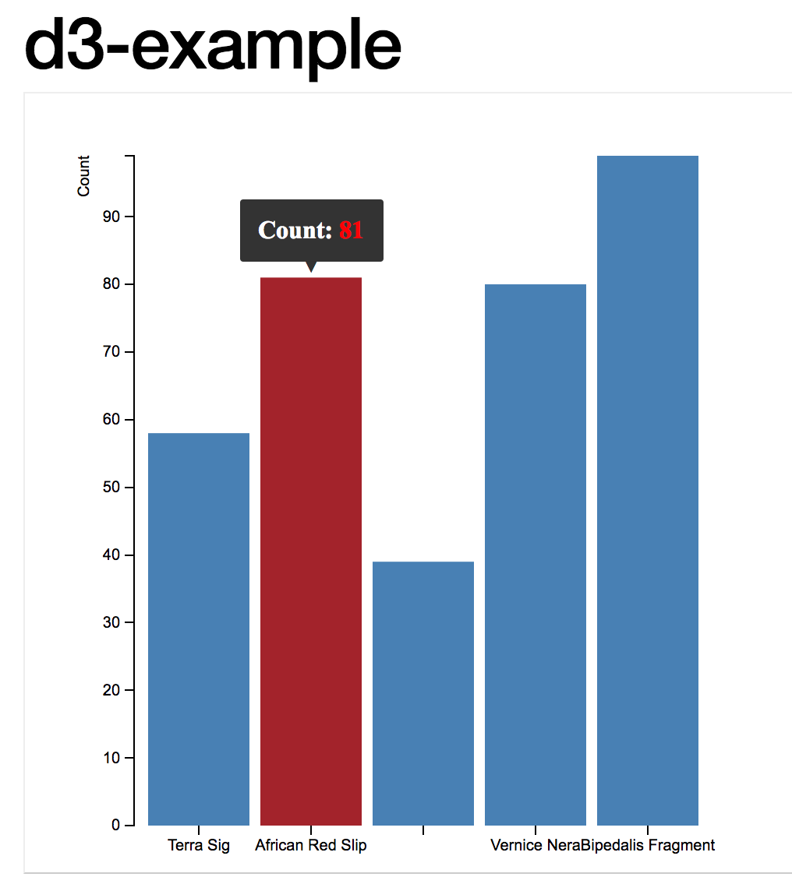

##Data Driven Documents

Given that a lot of archaeological data is represented in JSON format when we retrieve it from an API or from a database, it is worth your time to consider ways of representing this data natively on the web. By 'natively' we mean, as part of the document object model approach that underpins most webdesign. By making the data part of the way the site is generated (and manipulated), we free our data and our visualizations. This opens up the possibility of generating archaeological visualizations (and compelling narratives) on-the-fly as data is updated. It opens up the possibility of remixing the data, or of linking it into other data.

But as Mike Bostock (editor for interactive graphics at the New York Times and creator of [D3](http//:d3js.org)) points out, there is a danger of getting lost in the woods of any one particular technology; we always need to keep in mind,

> The purpose of visualization is insight, not pictures.

- [Mike Bostock](https://medium.com/@mbostock/a-better-way-to-code-2b1d2876a3a0)

In this section, we introduce two approaches to data driven documents: D3.js, and the Processing language.

###D3

Let's make an interactive bar chart of pottery counts using D3.



> D3.js is a JavaScript library for manipulating documents based on data. D3 helps you bring data to life using HTML, SVG, and CSS. D3’s emphasis on web standards gives you the full capabilities of modern browsers without tying yourself to a proprietary framework, combining powerful visualization components and a data-driven approach to DOM manipulation.

What this means is that D3 gives us some pre-packaged tools for taking our JSON file and tying elements of that data to different kinds of graphical elements in the html of a webpage, in a way that is relatively straightforward. Take a few moments to explore the [example gallery](https://github.com/d3/d3/wiki/Gallery) which demonstrates - with the code - ways of achieving various kinds of visualizations (including dynamic and interactive ones).

To use D3.js, we have to specify three particular parts of the puzzle - the data, the styling, and the html that pulls it altogether. Within the html, we use SVG - 'scalable vector graphics' ie mathematical descriptions of the lines, rather than the coloured pixels of raster graphics - to describe how the different elements of the visualization will be built. The _size_ and _placement_ of these elements depends on the aspects of the data.

One way of experimenting with D3 is to use Mike Bostock's [bl.ocks.org](http://bl.ocks.org) service. This site shows off many different kinds of visualizations. To use it for yourself requires us to put our html, css, and json files somewhere where bl.ocks.org can find it - in this case, we will use a Github [gist](http://gist.github.com). A gist is part of the Github website that allows anyone to quickly post a code snippet online, with a url, for sharing. If we are logged in, then the gist ceases to be anonymous - for instance, Shawn's gists are all at [gist.github.com/shawngraham](http://gist.github.com/shawngraham). To run a gist through bl.ocks.org, we copy the URL path _after_ gist.github.com and paste it _after bl.ocks.org_ - hence Shawn's gists could be visualized at `http://bl.ocks.org/shawngraham/<string-of-random-letters-and-numbers-identifying-the-exact-gist`. A gist can have more than one file.

On your own webserver, you would have an `index.html` file, a `style.css` file, and a data file, either in csv, tsv, or in json. Let's build a simple bar chart with an interactive tool tip, that visualizes some pottery counts.

Our pottery counts data is represented by the following .json file:

```JSON
[
  {"PotteryType": "Terra Sig","Count": 58},
  {"PotteryType": "African Red Slip","Count": 81},
  {"PotteryTyp": "Dressel24","Count": 39},
  {"PotteryType": "Vernice Nera","Count": 80},
  {"PotteryType": "Bipedalis Fragment","Count": 99}
]
```

The next step is to create the style sheet. The one we're going to use can be inspected [here](https://gist.github.com/shawngraham/dc506c6be872625101a1163ad59e4d68#file-barchart-css). A stylesheet describes how each element referred to in the html should be rendered. Can you work out which part of the stylesheet is governing the colour for our barchart? Which bit will take care of the axes?

The final step is to create the html that will pull everything together. Because we're going to use the tools in the D3 package to control how this all works, we have to tell this to the html. The opening of our HTML looks like this - see how we're telling the brower where our css is, and where to find the D3? The D3 _could_ live in, for instance, a folder on our own server, but here we're going to use the most up-to-date version available at 3djs.org:

```html
<!DOCTYPE html>
<meta charset="utf-8">
<head>
<link rel="stylesheet" type="text/css" href="barchart.css">
</head>
<body>
    <script src="https://d3js.org/d3.v3.min.js"></script>
     <script src="d3.tip.v0.6.3.js"></script>
<script>
```

Next, we're going to define a series of variables that will control or describe how we want the data to be displayed, and the kind of _interactivity_ that our chart will have. The second script in the html code above calls a related package, 'd3.tip' by Justin Palmer. This is a small bundle that enables mouse-over tool-tips on the elements in our visualization. It's not loading it from somewhere else on the web, but rather from the same location where the index.html file can be found.

In the definition of the variables below, any that begin with `d3` are referring to the D3 package which was loaded by the `<script>`. For more on the wide variety of things D3 can do, we invite you to check out [the D3 tutorials](https://github.com/d3/d3/wiki/Tutorials).

```js
var margin = {top: 40, right: 20, bottom: 30, left: 70},
    width = 460 - margin.left - margin.right,
    height = 500 - margin.top - margin.bottom;

var x = d3.scale.ordinal()
    .rangeRoundBands([0, width], .1);

var y = d3.scale.linear()
    .range([height, 0]);

var xAxis = d3.svg.axis()
    .scale(x)
    .orient("bottom");

var yAxis = d3.svg.axis()
    .scale(y)
    .orient("left")
    .ticks(10, "");
```

This next variable contains the information telling the browser what to do if the user mouses-over one of the bars in our chart. When that happens, the browser is to turn the bar red and to display the value for that bar (which is held in d.Count - look at the JSON again. Do you see the 'Count' data? If you wanted to adapt this chart to show _weights_ of the pottery, what might you have to change?)

```js
var tip = d3.tip()
  .attr('class', 'd3-tip')
  .offset([-10, 0])
  .html(function(d) {
    return "<strong>Count:</strong> <span style='color:red'>" + d.Count + "</span>";
  })
var svg = d3.select("body").append("svg")
    .attr("width", width + margin.left + margin.right)
    .attr("height", height + margin.top + margin.bottom)
  .append("g")
    .attr("transform", "translate(" + margin.left + "," + margin.top + ")");

svg.call(tip);
```

Now we add the actual data:

```js
d3.json("pottery.json", function(error, data) {

  if (error) throw error;

  x.domain(data.map(function(d) { return d.PotteryType; }));
  y.domain([0, d3.max(data, function(d) { return d.Count; })]);
```

We just tell it that the json data is in the `pottery.json` file. If that json file was on the web somewhere, we could just provide the url (as long as it ends in a json file!). Then we map the data in the json file to our x and y axes - PotteryType and Count. This mapping pushes that data to `d.PotteryType` and `d.Count`; anytime we need that data, we can now just refer to those variables.

We finish up by pulling it all together:

```js
  svg.append("g")
      .attr("class", "x axis")
      .attr("transform", "translate(0," + height + ")")
      .call(xAxis);

  svg.append("g")
      .attr("class", "y axis")
      .call(yAxis)
    .append("text")
      .attr("transform", "rotate(-90)")
      .attr("y", -36)
      .attr("dy", ".71em")
      .style("text-anchor", "end")
      .text("Count");

  svg.selectAll(".bar")
      .data(data)
    .enter().append("rect")
      .attr("class", "bar")
      .attr("x", function(d) { return x(d.PotteryType); })
      .attr("width", x.rangeBand())
      .attr("y", function(d) { return y(d.Count); })
      .attr("height", function(d) { return height - y(d.Count); })
      .on('mouseover', tip.show)
      .on('mouseout', tip.hide);
});

```

You can see our gist that contains our interactive bar chart at [https://gist.github.com/shawngraham/dc506c6be872625101a1163ad59e4d68](https://gist.github.com/shawngraham/dc506c6be872625101a1163ad59e4d68) (interestingly, all the files in our gist are listed alphabetically. Scroll down to see all of the files). Let's make this visualization live - pass the filepath to https://bl.ocks.org/ to see the finished result!

(That is, copy the bit _after_ gist.github.com/ and paste it so that it's now after https://bl.ocks.org/ in your browser's address bar.)

### discussion

What might this particular visualization be telling you about this 'site'? How might you integrate this visualizations with other kinds of visualizations (check the [example gallery](https://github.com/d3/d3/wiki/Gallery) for inspiration) to tell a compelling story?

This walkthrough has only barely skimmed the surface of what D3 can do. But now that you know how the different pieces fit together, you can try fitting your own data into the visualizations that _other_ people have made. This can be frustrating - you really have to know how your data is structured, and you must read closely the index.html files of the visualization you want to repurpose to make sure that the code is calling the data correctly. For instance, in our example above, Graham kept getting an error where the bars themselves would not display. He chased this error down by right-clicking on the barchart and selecting 'inspect element'. This opens the browser's inspector tool, and allows us to see what errors are occuring in our html. In Graham's case, the error message was `error invalid value for rect attribute height NaN`.

Error messages are often inscrutable. Copying the error into a Google search usually finds _other_ people who have had the same error and who have posted their problem to sites like [Stack Overflow](http://stackoverflow.com), a coding question and answer site. Reading the responses, graham realized that when he repurposed the example from [this walkthrough](http://www.knowstack.com/different-ways-of-loading-a-d3js-data/) he made the following mistake. Can you spot it?

Original code:
```js
svg.selectAll(".bar")
      .data(data)
    .enter().append("rect")
      .attr("class", "bar")
      .attr("x", function(d) { return x(d.Employee); })
      .attr("width", x.rangeBand())
      .attr("y", function(d) { return y(d.Salary); })
      .attr("height", function(d) { return height - y(d.Salary); })
      .on('mouseover', tip.show)
      .on('mouseout', tip.hide);
```

Graham's mistake:
```js
  svg.selectAll(".bar")
      .data(data)
    .enter().append("rect")
      .attr("class", "bar")
      .attr("x", function(d) { return x(d.PotteryType); })
      .attr("width", x.rangeBand())
      .attr("y", function(d) { return y(d.PotteryType); })
      .attr("height", function(d) { return height - y(d.Count); })
      .on('mouseover', tip.show)
      .on('mouseout', tip.hide);
```

It was very frustrating! It wasn't until he took a break and looked at the code again with fresh eyes that he spotted it. Have you?

### exercises

1. Ben Christensen has a very simple line graph using D3 at [http://bl.ocks.org/2579599](http://bl.ocks.org/2579599), and the source code at [https://gist.github.com/2579599](https://gist.github.com/2579599). Login to Github, and then take a fork (a copy) of his source code. Study the code and make a list, of *every* line you would have to modify in order to turn this graph _with its current data_ into an illustration of archaeological data.

2. Now try to do it. Click the 'edit' button on your gist, and make your changes. To save your changes, you need to hit the green 'commit' button at the bottom of the page. Display your changes using bl.ocks.org. **Nb** Your changes can take a few minutes to show up - it takes time for things to propagate across the web. View your bl.ocks.org in _incognito mode_ so that you're not viewing the cached (old) version of your graph. If your changes show - great! If they don't - use the inspector. What are your errors telling you?

3. Try representing your data in a .json file. Use the examples at the top of this page to guide you. Search for the error messages you will get, and keep track of what you've done, and where you've sought help. This will be more difficult, and frustrating, but you will discover that you are learning throughout.

4. The [Data Visualization Catalogue](https://datavizcatalogue.com/) has a wide variety of examples of different kinds of charts along with suggestions for their most appropriate use-cases. Code examples are provided for all of them, and many use D3. Select an example that might be useful for archaeology, and explore its code. Can you make it work? Where do you run into roadblocks: what kinds of questions would you use to remove the roadblock? The point here is to map out _what you don't know_ so that you can begin to ask the _right_ questions.
