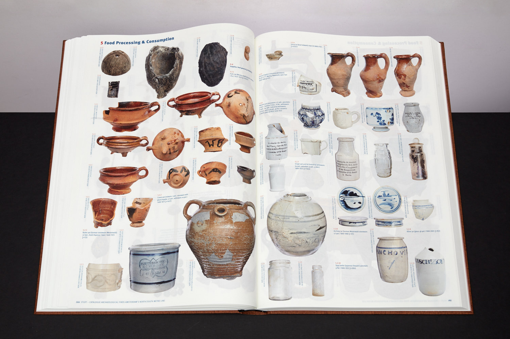
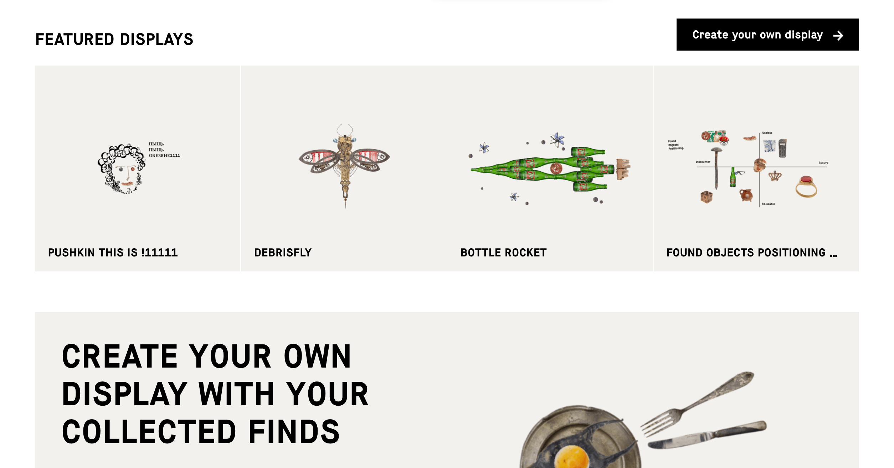
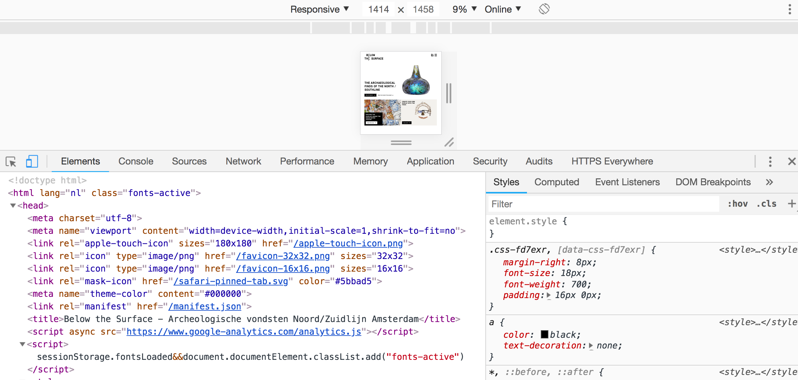

## Storytelling and the Archaeological CMS: Omeka, Kora, and Mukurtu

The city of Amersterdam has been building a new north south metro line, under the Amstel River. This massive infrastructure project of course necessitated an [impressive amount of archaeological research](https://belowthesurface.amsterdam/en/pagina/de-opgravingen-0).

> Rivers in cities are unlikely archaeological sites. It is not often that a riverbed, let alone one in the middle of a city, is pumped dry and can be systematically examined. The excavations in the Amstel yielded a deluge of finds, some 700,000 in all: a vast array of objects, some broken, some whole, all jumbled together. Damrak and Rokin proved to be extremely rich sites on account of the waste that had been dumped in the river for centuries and the objects accidentally lost in the water. 

[@below_the_surface]

The Archaeological Department of the City of Amsterdam has created an impressive website that showcases the 700 000 plus finds, but they've done it in an intriguing way. There is a beautiful photo-catalogue called _Stuff_ [(details here)](https://belowthesurface.amsterdam/en/pagina/spul). There is a [documentary](https://belowthesurface.amsterdam/en/pagina/documentaire). 

They are also in the progress of making all of their data downloadable (check in [with their dataset page](https://belowthesurface.amsterdam/en/pagina/publicaties-en-datasets)). But what is fundamentally important for the _public communication_ of the compelling stories of their work is the interactive component of their site. Their site allows the visitor to arrange one's own display and narrative.

Every object is available, in high-resoultion photography, with associated metadata. The interface allows the visitor to position interesting items in ways to tell a story - for example, a story of ['useless versus re-usable'](https://belowthesurface.amsterdam/en/vitrine/a9c3cbada3) objects.

By encouraging visitors to adopt the role of curator in a light and engaging way, the site is an excellent example of a 'rabbit hole' down which one begins to really engage with the way the Amstel River is not just an archaeological site but a human dump. It invites the visitor to reflect on ways we humans use and abuse our environment, and the long time-depth of humanity's impact on the environment.

### The Content Management System

How did they build this site? If you right-click on the site in whatever browser you are using, one of the option in the pop-up menu will be something like 'Inspector'. The Inspector tool lets you explore (and modify if you wish) the underlying code. It gives us a peak under the hood at what is driving and building a particular site.

_Below the Surface_ is, it appears, custom coded. Can we do that? Yes.... for a given value of 'yes'. Modern websites are a combination of html, css, and js for the most part. When developing a site, a developer will create a 'document object model' that represents programmatically the different parts of a website. The css - cascading style sheet - describes how the different elements of the DOM will look when they become rendered in the browser, and the JS - javascript - does the heavy lifting of retrieving the content that gets inserted into the DOM to create the site. For us, as archaeologists, we will rarely have the luxury of designing and building a site like _Below the Surface_. But fortunately there are 'Content Management Systems' that allow us to create these public-facing sites with a minimum of fuss. If you've ever blogged using [Wordpress.com](http://wordpress.com) or built a website for a class using a free website builder, then you've used a content management system.

Wordpress for instance uses [PHP](https://secure.php.net/manual/en/intro-whatis.php), a scripting language, to create a 'back-end' that allows users to focus on writing blog posts or pages. When a user posts a new blog post, the text of that post is retrieved from a SQL database and is rendered in the browser via those PHP scripts. Wordpress has a wide variety of themes or pre-built templates of CSS and PHP. Posts can be tagged or categorized in various ways, and template pages can be set up to only display materials that meet certain tags or categories.

Many well-developed archaeological projects use Wordpress as a system for managing their content. The [Day of Archaeology](http://www.dayofarchaeology.com/) used Wordpress; incidentally, because of the way the particular theme used by _Day of Archaeology_ worked, which organized content in logical and regular ways in terms of the _page paths_ (not all themes do this!) Ben Marwick was able to script a series of analyses using R to understand just [what do archaeologists talk about when they talk about their work](https://github.com/benmarwick/dayofarchaeology).

### Omeka

Omeka is a Swahili word meaning to display or layout wares; to speak out; to spread out; to unpack; it was chosen by the team at the Roy Rosenzweig Center for History and New Media, George Mason University to describe their project. At the time of its creation, there was a lack of CMS that managed cultural heritage materials. Omeka was built around the metaphor of the archive and the item within that archive. Instead of an editor for making blog posts that are tagged or categorized, Omeka uses [Dublic Core metadata](http://dublincore.org/) to describe individual items from a collection. Then, the user could combine these items to make exhibits, to make webpages, or to make browsable collections. It's worth keeping in mind that _displaying_ materials is not the same thing as _exhibiting_ materials; there's an element of narrative involved in an exhibition. The back-end structure of Omeka makes exhibits and the items or collections within those exhibits highly discoverable and citable (in contrast to Wordpress). [The Programming Historian](https://programminghistorian.org) currently has [three lessons](https://programminghistorian.org/en/lessons/) on working with Omeka. Omeka is customizable with a wide variety of themes; becaus it is open source, it can also be hacked to (relatively) easily to improve its [visual attractiveness](https://electricarchaeology.ca/2018/03/09/using-a-static-site-generator-to-make-a-nicer-omeka-front-page/).

### Kora

Another open-source content management system of interest to archaeologists is [Kora](http:// kora.matrix.msu.edu/), developed by [Matrix: The Center for Digital Humanities & Social Sciences](http://www.matrix.msu.edu/) in the [Anthropology Department at Michigan State University](http://anthropology.msu.edu/). Kora allows for a wider variety of metadata schemes, and the use of different ontologies to describe cultural heritage materials. There is a further elaboration of Kora called [mbira](http://mbira.matrix.msu.edu/), currently in 'open beta' (meaning, you can use it but you will encounter bugs) that enables one to build mobile (and geolocated) experiences on your collection.

### Mukurtu

[Mukurtu](http://mukurtu.org/) is a content management system _explicitly_ designed to foreground indigenous ontologies and classificatory schemes. It is managed by [the Center for Digital Scholarship and Curation](http://cdsc.libraries.wsu.edu/) at [Washington State University](http://wsu.edu/). It too is open source.

> In 2007, Warumungu community members collaborated with Kim Christen and Craig Dietrich to produce the Mukurtu Wumpurrarni-kari Archive. Mukurtu is a Warumungu word meaning ‘dilly bag’ or a safe keeping place for sacred materials. Warumungu elder, Michael Jampin Jones chose Mukurtu as the name for the community archive to remind users that the archive, too, is a safe keeping place where Warumungu people can share stories, knowledge, and cultural materials properly using their own protocols. Growing from this community need, Mukurtu CMS is now an open source platform flexible enough to meet the needs of diverse communities who want to manage and share their digital cultural heritage in their own way, on their own terms. - (Mukurut, ['About'](http://mukurtu.org/about/))

Mukurtu puts the emphasis on what it calls the ['3cs'](http://support.mukurtu.org/customer/en/portal/articles/2794448-getting-started-with-mukurtu-cms), the 'three structural elements [that] are required to create digital heritage items. You will need at least one community, one cultural protocol within that community, and one category before you can start working with content'. By defining and building the cms around communities, Mukurtu builds in control and knowledge-keeping around the needs of those groups, who then define the [cultural protocols](http://support.mukurtu.org/customer/en/portal/articles/2430071-what-is-a-cultural-protocol-).

> There are two types of cultural protocols: open and strict. Digital heritage items within an open protocol can be viewed by anyone (including anonymous site visitors), while items within a strict protocol can only be viewed by members of that protocol. Multiple protocols can be layered to ensure that users can only view items appropriate for them, and to provide very granular access. For example, if an item is part of the two strict protocols ‘Women Only’ and ‘Elders Only,’ then only users who are members of both the ‘Women Only’ and ‘Elders Only’ protocols can view that item.

> Some examples of cultural protocols could be gender-based (male only, female only), age-based (elders only, no youth), seasonal access only, clan or tribal affiliation, secret/sacred, community only, or public access/open.

### Exercises

Content management systems make it much easier to mount cultural heritage materials in various ways online by separating the tasks of hosting and displaying materials from the questions of narrative or access. 

1. Search out examples of archaeological, anthropological, or cultural heritage projects using Wordpress, Omeka, Kora, and Mukurtu. Contrast and compare the ways the _platforms_ are constraining or enabling access, control, and narrative.
2. Miriam Posner has two lessons at the Programming Historian on using [Omeka.net](http://omeka.net) to mount an exhibit (Omeka.net is a free, hosted version of Omeka). Follow those two lessons ([first](https://programminghistorian.org/en/lessons/up-and-running-with-omeka);[second](https://programminghistorian.org/en/lessons/creating-an-omeka-exhibit)) to mount an exhibit on the material culture in the room in which you are currently sitting. How do the metadata categories and the exhibition templates constrain what story you can tell? How do they push your story in particular ways?
3. If you have access to your own webspace, you can install any of these content management systems yourself. (If you don't have access to your own webspace, one good option is [Reclaim Hosting](http://reclaimhosting.com) which also has one-click installs for many different CMS). Select one of these CMS and install it, keeping careful notes about all the _tacit_ assumptions about your background knowledge concerning the web. Where are the hidden 'gotchas'? What do these imply about the ability for different groups to take control of their own cultural heritage on the web?