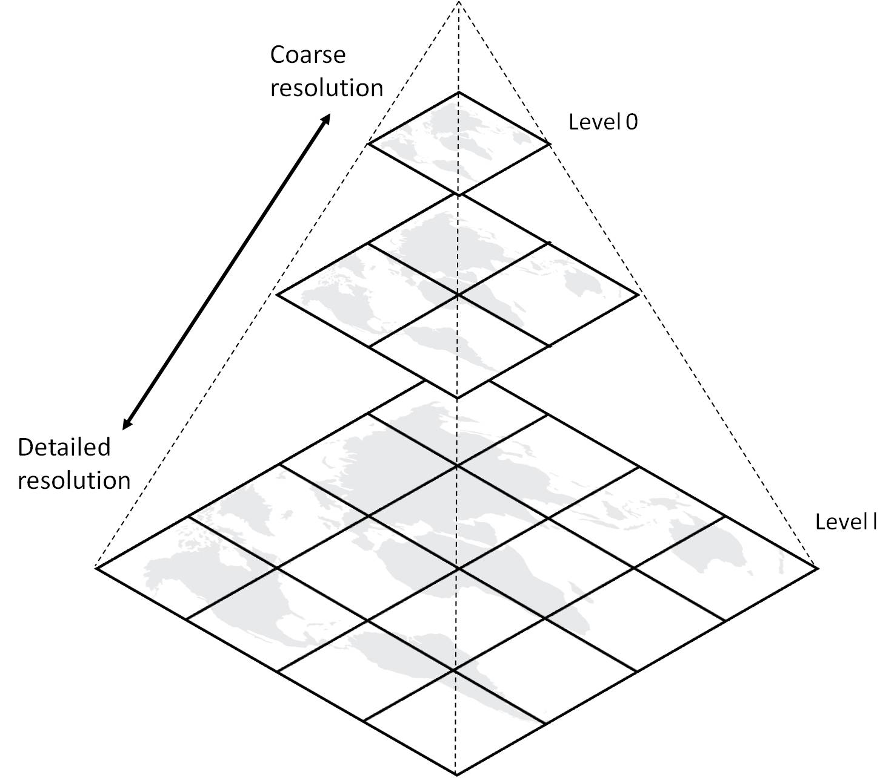
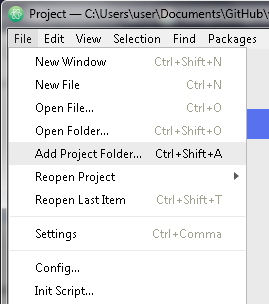
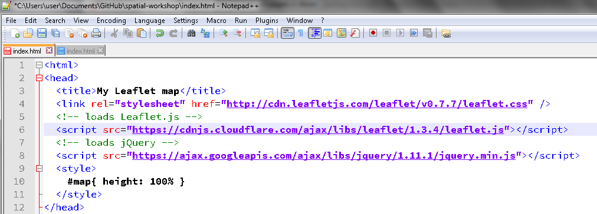
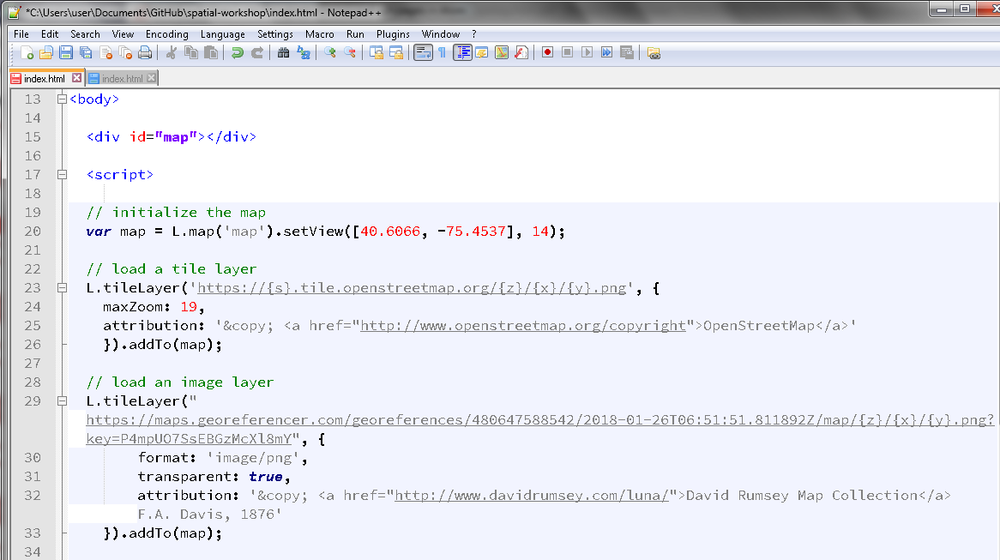
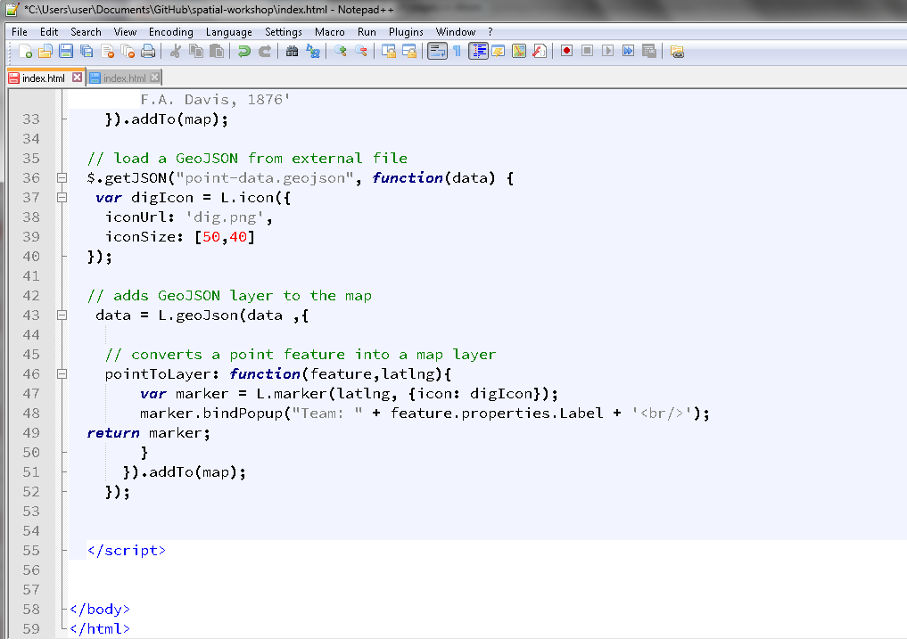

## What is Web Mapping?

<div class = rmdnote> _See also the [Working with Spatial Data Binder](https://mybinder.org/v2/gh/shawngraham/spatialarchaeology/master)_. </div>

<div class = rmdnote> _See also the [LiDAR Binder](https://mybinder.org/v2/gh/o-date/lidar/master)_. </div>

A web map is a geographic visualization that is supported by computational infrastructures. This form of mapping is fundamentally *powered* by the Web [Axismap, 2018](http://www.axismaps.com/guide/web/what-is-a-web-map/). It should come as no surprise that the ubiquity of web maps correlates with the development of Web 2.0, a marked transformation in the way that that we engage with the Internet [@Aced2013].

As Darcy DiNucci remarked in 1999, content loading into a browser as 'static screenfuls is only an embryo of the Web to come' [@DiNucci1999]. Web 2.0, thus is characterized by 'interactivity', 'two-way communication' often through devices that are 'Internet-enabled' and a greater awareness amongst developers of 'user experience' and 'interface'. These interests are correlated with the diversification of screen sizes on mobile hand-held devices such as smart phones, tablets and laptops, all of which require responsiveness, appropriate scaling for size and interaction primarily through touch and swipe. Whereas the first iteration of the Web required advanced training to create a website, Web 2.0 as is often claimed, requires little or no expert knowledge to make a Web-ready 'thing' such as a website, a blog, or a Wiki. This is the context in which web mapping, that is the Web-based visualization of geographic information became popularized.

One can argue that web maps narrow the distance between professional map makers and non-specialist makers; yet some scholars have expressed concerns on the quality of geographic data that are now frequently and widely shared on the Web [@Exel2010]. Collaborative online platforms such as [OpenStreetMap](https://www.openstreetmap.org), for example, have drawn attention to the social dimension of knowledge making; how accurate is information that a lay-person or particular interest community has uploaded? Can we make real-world decisions based on those data? Begin et al. suggest that volunteered geographic information reflects 'contributors’ motivation and individual preferences in selecting mapped features and delineating mapped areas', a situation that can enable scholars in examining and assessing the quality of those data [@Begin2013].

For archaeologists, web maps and publishing geographic information present challenges and opportunities. Archaeologists are aware that the data they collect through field studies often contain sensitive location information. These concerns are sometimes heightened in contexts where there are tensions between archaeologists and local communities or ethnic and linguistic minorities who might be socially, politically and economically marginalized in that society. Archaeologists often express concern that publishing location information on sites of archaeological and historical interest can facilitate, if not result in, the destruction of those sites through looting. Looting and illegal trafficking of archaeological artefacts and human bones is an issue observed in many places [@Brodie2001, @Huffer2017].

Recent developments in geovisual analytics that leverage the spatial dimension in data suggest that scholars can work with, and meaningfully analyze these data even where they contain sensitive location information [@Andrienko2007]. This situation opens enormous opportunities for archaeologists to develop tools that are appropriate for meaningful analysis and publication of archaeological data. In the next section, we build upon the ethos of 'openness' and present an overview of map services, followed by a guide to making an interactive web map with the Leaflet library. For an example of a Leaflet web map, check out [Open Context](www.opencontext.org).

### Overview of Map Services
Tiled map service and [Web Map Service](http://www.opengeospatial.org/standards/wms) are two forms of Web-based mapping. A WMS is an interface that enables us (the clients) to request specific maps i.e. visual representations of geographic information from a geospatial database. The WMS server is called via a Universal Resource Link (URL) on an Internet-enabled desktop GIS. A request typically consists of the geographic layer (e.g. theme) and geographic area of interest. The response to a request results in *geo-registered map images* that are displayed and queried within a browser. Because the map is dynamically drawn upon request, and because the server typically uses the most current information from several layers in the geospatial database, WMS maps tend to load slowly. [Toporama](http://wms.ess-ws.nrcan.gc.ca/wms/toporama_en)  is an example of a WMS server for Canadian topographic themes. (add image for WMS architecture?)

Tile map services such as [TillMill Project](http://tilemill-project.github.io/tilemill/docs/crashcourse/introduction/), [OpenStreetMap](https://www.openstreetmap.org/), [CartoDB](www.carto.com), and [Stamen](http://maps.stamen.com) all use one or more vector layers that have been rasterized into an image. This rasterized image is divided into 256 x 256 adjacent pixel images or 'tiles'. This is usually the base layer in a web map.

Each tile is an image on the Web, which means that you can link to it. For example, the following URL points to a specific tile on the Web:

```html
 https://tile.openstreetmap.org/7/63/42.png
```

The three elements in the URL are:
1. ```tile.openstreetmap.org```, the tile server name;
2. `7`, the zoom level or `z` value of the tile; and finally
3. `63/42`, the `x` and `y` values in the grid where the tile lives

The z value has a range between 0 and 21, where 21 returns a tile with greatest detail (and smallest sized tile).



Once generated, the set of tiles are stored on disk, ready to be distributed rapidly to large numbers of simultaneous requests. Tiled maps load quickly precisely because they are pre-generated. They shift attention to map aesthetics and smooth map navigation, trading in functionality such as layer order, map scale and projection. [Alex Urquhart](http://alexurquhart.github.io/free-tiles/) maintains a list of tile services.

Data layers are typically added on top of the base layer. Data layers can be points, lines and polygons. These data layers are saved as [GeoJSON](http://geojson.org/), a format designed for representing on the Web, geographic features with their non-spatial attributes.

### Making a web map with Leaflet
[Leaflet](http://leafletjs.com/) is a JavaScript library developed by [Vladimir Agafonkin](https://vimeo.com/106112939) for use with tiled maps. Launched in 2008, Leaflet has become widely used in tile web mapping because the library's low-barrier customization and interactivity with map elements, and because of its simplified setup when compared to a WMS served map. Moreover, Leaflet's compatibility with other Web 2.0 technologies and code-sharing platforms such as [GitHub](www.github.com) has encouraged an active community of 'makers'.

In keeping with this e-book's ethos of 'openness' and with a motivation to encourage low-cost and low-barrier web mapping, below is an outline to get started on our own interactive web map with Leaflet. We will need:

1. some point data, ideally geocoded (lat/long) data saved as CSV;
2. a text editor installed on local machine, such as Atom;
3. a hosting service, such as GitHub (public account);
4. a tile map service, such as OpenStreetMap, MapBox (free account) or other;
5. a curious you

### Exercises
Making a 'digital thing' can be exciting and intimidating, and yet seeing one's creation on the Web can be gratifying. It is important to realize that much of the work to make that happen takes place on a local machine. Therefore, setting up a local environment with the tools we need is highly encouraged. We recommend installing a local web server such as [MAMP](https://www.mamp.info/en/) for Macs or [WampServer](http://www.wampserver.com/en/) for Windows for regular use.

For this exercise, we'll use [Prepros](https://prepros.io/), a temporary preprocessor application that reloads our local browser as we make changes to our HTML file, and enables us to see what's happening without installing a dedicated web server.

#### A simple Leaflet web map
1. Download [web-map](https://github.com/dngupta/web-map) and unzip to a known location. Which files and folders do you see? It is helpful to see files and sub-folders within their hierarchical structure before we start editing. Bring the web-map folder into Atom. We do this by 'Add a Project Folder'.



2. Locate the file named `index.html` and open it. What do you see in the file? The first line <!DOCTYPE html> tells us that this document written in **html**, a language for creating web pages.

Go ahead and change the title

```html
<title>title when you hover over tab</title>
```


3. We now want to have a look at our web page on a local browser. Let's fire up Prepros (this may take a few minutes) to get a preview. Add the web-map folder as a project, either by drag and drop or use the + at the bottom left of the Prepros window.

Right click on the folder to 'Enable Live Preview'. Then click on the globe icon to see the web page in the browser.

4. On the `index.html`, locate the tag `<head>` and `<body>`. In the anatomy of a web page, these sections are most important for creating and loading content.

Within our `<head>` section, we have added two tags, `<link>` and `<script>` to the Leaflet library. You will notice that the URL points to `CDN` or a Content Delivery Network. These are servers that host Web content based on our geographic location. In this case, we request a specific hosted CSS or Cascading Style Sheet for Leaflet and the Leaflet script that adds interactivity to the web map.

The CSS gives us pre-defined styles and elements to format the content of a webpage i.e. we get the look and feel of a Leaflet map. It includes fonts, size, colour, line spacing, and Leaflet elements like the map, and an icon for zoom.

**It is key that that CSS loads before the script, and that both of them are within the ```<head></head>``` tags.**

Your file should read this way at this stage:



5. Next, in the `<body>` section of our web page, we add a `<div>` element that will contain a thing called `map`.

```html
<div id="map"></div>
```

We then call the `<script>` and initialize our map using `L.map`.

Examine the code

```html
<script>
var map = L.map('map').setView([40.5931,-75.5265], 12);
```

`.setView` centers our web map on specific coordinates and at a particular zoom level. Change the coordinates and hit save. Have a look at the live preview. What do you see?

6. We now want to load a tile server for our base map, using `L.tileLayer`

```html
L.tileLayer('https://{s}.tile.openstreetmap.org/{z}/{x}/{y}.png', {
	maxZoom: 19,
	attribution: '&copy; <a href="http://www.openstreetmap.org/copyright">OpenStreetMap</a>'
    }).addTo(map);
</script>
```

This code tells us the following:
1. ```https://{s}.tile.openstreetmap.org```, tile server we want,
2. ```19```, the maximum zoom level, and
3.```'&copy; <a href="http://www.openstreetmap.org/copyright">OpenStreetMap</a>'``` the attribution for that tile provider

Take note of `.addTo(map);` that actually adds the layer to our web map, and the `</script>` closes this particular script. To load additional layers or attribute data, we would add our code within the tags `<script></script>` which we outline in the next subsection.

At this stage your html reads like this:



Congratulations! We have our first Leaflet map. Examine the map in the Prepros preview window.

#### Loading point data onto a Leaflet map
Now that we have a base map set up, we want to load some feature data i.e. points, lines, polygons, onto it. We have a few different ways to add feature data. They can be loaded as a Common Separated Value (CSV) file or a GeoJSON.

In this exercise, we will work with a GeoJSON, a small file (point-data.geojson) with about 20 potential excavation sites. The original CSV had four fields, all of which were converted into GeoJSON using an online tool [here](http://www.convertcsv.com/csv-to-geojson.htm/).

1. Fire up a text editor and examine the contents of `point-data.geojson`. What do you see? Take note of **type**, **geometry**, and **properties**. How many properties or attributes are there, what are they?

2. Next, open `index.html`. We will now add several lines of code that enable us to grab our GeoJSON data, load them and represent them as markers.

Locate the `<head>` tag, and the script for loading Leaflet. Below it, add a script called jQuery. This Javascript library is widely used to enable interactivity, animations, plug-ins and widgets. We load jQuery on our web page using the following code after Leaflet.js :

```html
  <!-- loads Leaflet.js -->
  <script src="http://cdn.leafletjs.com/leaflet-0.7.3/leaflet.js"></script>
  <!-- loads jQuery -->
  <script src="https://ajax.googleapis.com/ajax/libs/jquery/1.11.1/jquery.min.js"></script>
```

3. We are now ready to add a few lines to get our GeoJSON (point-data.geojson). In the `<body>` section, let's add the following code below your tile layer:

```html
// load a tile layer
  L.tileLayer('https://{s}.tile.openstreetmap.org/{z}/{x}/{y}.png', {
	maxZoom: 19,
	attribution: '&copy; <a href="http://www.openstreetmap.org/copyright">OpenStreetMap</a>'
    }).addTo(map);

// load GeoJSON and save it as a thing called `data`
  $.getJSON("point-data.geojson", function(data) {
```

followed by :

```html
// adds GeoJSON objects to layer
   data = L.geoJson(data  ,{

// converts point feature into a map layer
    pointToLayer: function(feature,latlng){
	  return L.marker(latlng);
      }
    }).addTo(map);
  });
```

4. Save the file and preview it in the browser. Congratulations! We've added our own point feature data to a Leaflet map.


5. It would be great to have interaction beyond panning and zooming on our web map. One way is to add pop-ups to each of our markers that we can click on.

Locate `pointToLayer` which we called passed a function. We will create a variable called marker and bind a pop-up to each marker:

```html
// creates a variable called marker
pointToLayer: function(feature,latlng){
var marker = L.marker(latlng);

// binds a popup to marker, assigns properties to display
  marker.bindPopup(feature.properties.Label + '<br/>');
  return marker;
}
}).addTo(map);
    });
```

At this stage, your html will look similar to this:



6. That's it! We've created a web map with our own point data, and we have markers with pop-ups to click on.

###Resources

Below are examples in archaeology that use Leaflet that you can try out, and that have repositories that you can fork for your own projects:

1) The Digital Atlas of Ancient Egypt developed at the Department of Anthropology, Michigan State University: https://msu-anthropology.github.io/daea/

Repository: https://github.com/msu-anthropology/daea

2) TOMB: The Online Map of Bioarchaeology developed by Lisa Bright (Michigan State University): http://brightl1.github.io/TOMB/

Repository: https://github.com/brightl1/TOMB/

3) MINA | Map Indian Archaeology developed by Dr Neha Gupta (Memorial University of Newfoundland): http://dngupta.github.io/mina.github.io/

Repository: https://github.com/dngupta/mina.github.io
