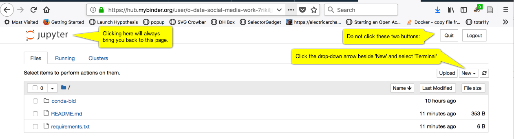
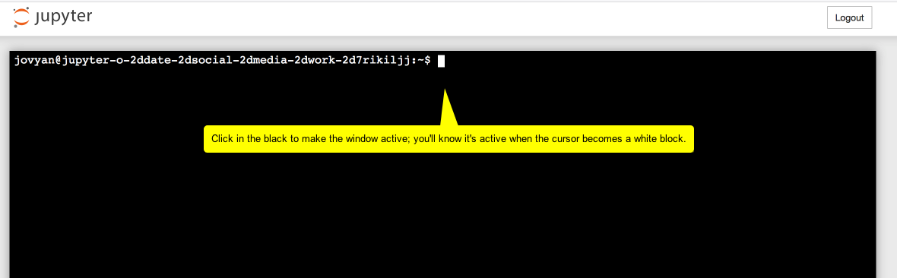
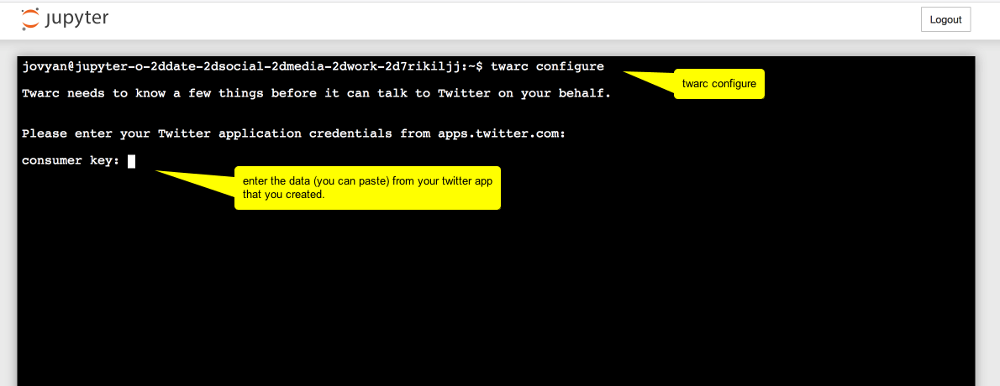
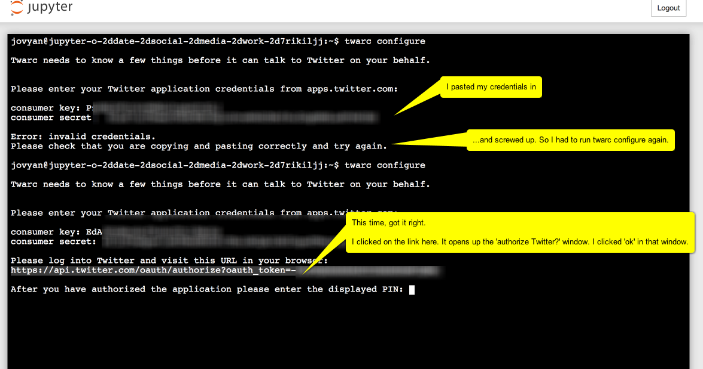
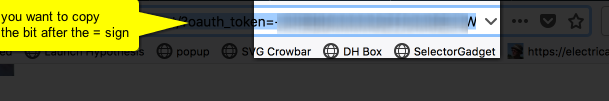
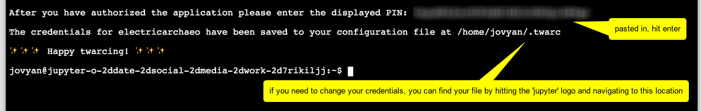
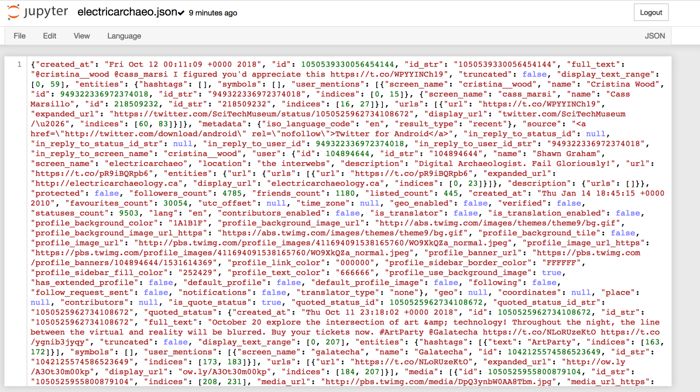
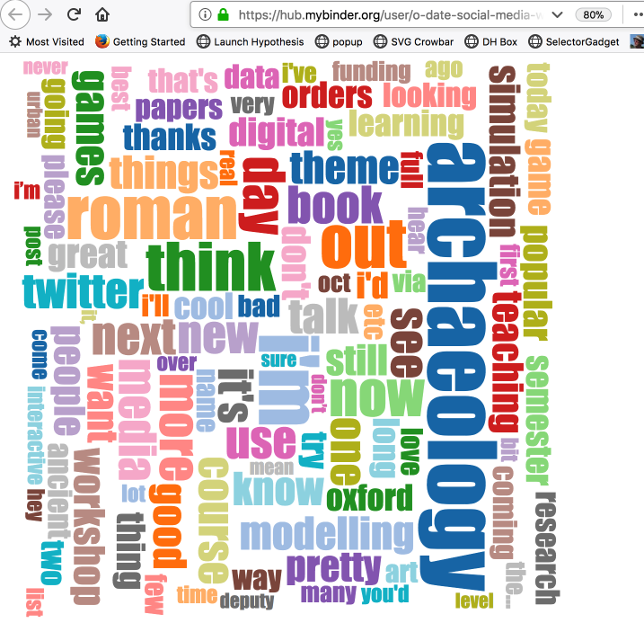
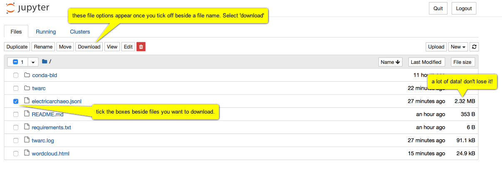

## Social Media as Public Engagement & Scholarly Communication in Archaeology

 _This section is under development_. 

 _[Launch the TWARC Binder](https://mybinder.org/v2/gh/o-date/social-media-work/master)_. 

Social media - that is to say, websites that facilitate quick posts that are pushed into other users' feeds (and so we can continue to include 'blogs') - are nominally thought of in archaeology as a vector for disseminating information _about_ archaeology. However, creative use of social media can make social media a location for _doing_ archaeology. On some platforms, autonomous agents impersonate humans or are in other ways implicated in _shaping_ opinions or fostering/promoting points of view, and so their code and actions are entirely appropriate objects for archaeological study. Indeed, one can make the argument that the affordances of the platform naturally distance us from our humanity, and make us perform more bot-like interactions (which one of us argued in the first [Public Archaeology Twitter Conference](https://shawngraham.github.io/talk/bots-of-archaeology/), an act of meta-archaeology.)

In this section we'll discuss how to make effective use of social media as an outreach strategy; ways of using social media to keep you up to date on research; and how to determine the likely truth content of a post. In the next section on [computational creativity](computational-creativity.html) we will show you a way of creating your own automated social media bots.

### Social Media as Outreach

day of archaeology article; lorna richardson body of work; mapping the blogosphere; IA special issue on blogging in archaeology from a few years back

- how to be professional on social media
  - sara perry article

### Social Media to Keep Current on Research

### Four Moves, or, Getting at the Truth

So much information swamps us every day. 'Fact checking' does not defeat lies because the act of debunking simply draws more attention to the lie, thus pushing it deeper into public consciousness. The more it is repeated, the more it is seen as having some sort of truth. What then can we do, when confronted by a new piece of information on social media? Then, having determined for ourselves the veracity of a claim, what can we do to counter disinformation or falsehoods on social media?

In the excellent open-access book, ["Web Literacy for Student Fact Checkers"](https://webliteracy.pressbooks.com/), Michael A. Caulfield lays out what he calls the 'four moves' or 'things they can do to get closer to the truth'. The four moves are:

> + Check for previous work: Look around to see if someone else has already fact-checked the claim or provided a synthesis of research.
> + Go upstream to the source: Go “upstream” to the source of the claim. Most web content is not original. Get to the original source to understand the trustworthiness of the information.
> + Read laterally: Read laterally.[1] Once you get to the source of a claim, read what other people say about the source (publication, author, etc.). The truth is in the network.
> + Circle back: If you get lost, hit dead ends, or find yourself going down an increasingly confusing rabbit hole, back up and start over knowing what you know now. You’re likely to take a more informed path with different search terms and better decisions.

[Caulfield 2017](https://webliteracy.pressbooks.com/chapter/four-strategies/)

One of the most critical pieces of advice that Caulfield shares is to 'check your emotions', to develop a habit of **stopping** when you encounter a piece of social media that triggers a strong emotional response. As he points out, there is ample evidence that online propagandists understand that material that hits us emotionally is less likely to be questioned. It hits our buzzers, it slips through our defenses. If you find yourself having a strong emotional reaction to material, that is the time when the four moves are most necessary: "Use your emotions as a reminder. Strong emotions should become a trigger for your new fact-checking habit. Every time content you want to share makes you feel rage, laughter, ridicule, or even a heartwarming buzz, spend 30 seconds fact-checking.  It will do you well." [@caulfield_2017, Chp 3]

Caulfield's book has sections for each of the four moves, with detailed advice and places to go to, tools to use, in order to work out the veracity of a claim. We strongly recommend spending time reading through that book. Then, take a look at the [Four Moves Blog](https://fourmoves.blog/). Each post contains a screenshot of a tweet, Facebook post, meme, or other piece of digital ephemera. These are collected together to enable you to practice your four moves, paying particular attention to one or more moves in particular. Try to fact-check some of them. 

At this point, you will encounter the problem of how to communicate what you have found. Merely debunking a falsehood does not rob the falsehood of its power; it can in fact increase it. There is no good answer or method yet developed (and until that happens, we are all of us in danger), but one approach is the ['truth sandwich'](https://www.washingtonpost.com/lifestyle/style/instead-of-trumps-propaganda-how-about-a-nice-truth-sandwich/2018/06/15/80df8c36-70af-11e8-bf86-a2351b5ece99_story.html) which works be denying oxygen to the falsehood. Begin by stating the truth; discuss the falsehood; conclude by restating the truth. Do not repeat the lie in a post title or tweet or headline. 

Archaeology is not immune to the wave of 'big lies' currently at work in the world; lies about race continue to use imagery from Greco-Roman antiquity to support odious claims. Do not repeat the lies, but use the four moves to work out the truth and counter them with a truth sandwich.

### exercises

We're going to mine Twitter for tweets, photos, etc, connected to digital archaeology.

This requires two things:

1. a twitter account
2. python installed on your machine

But - we'll use a virtual computer that already has Python and the `Twarc` (TWitter ARChiver) package already installed. Twarc was created by Ed Summers, who is heading a project called [Documenting the Now](https://www.docnow.io/) to create the tools necessary to keep track of all the ways our media are disseminating (and distorting!) the truth. It's a rapid-response suite of tools to capture events as they happen.

What we're going to do is set up some credentials with Twitter that give you access to the underlying data of the tweets. Then, the Twarc packages has a bunch of functions built in that lets you search and archive tweets.

#### Part One: Instructors: Setting up your Twitter Credentials

:::warning
**update oct 12** Your professor or instructor will need to set themselves up as a developer with Twitter for education first.
:::

**READ THROUGH FIRST, THEN START**

1. First of all, you need to set up a Twitter account, if you haven't already got one (Go to [twitter.com](http://twitter.com). Do so, but make sure to minimize any personal information that is exposed. For instance, don't make your handle the same as your real name.

    + Turn off geolocation. Do not give your actual location in the profile.

    + View the settings, and make sure all of the privacy settings are dialed down. For the time being, you do have to associate a cell phone number with your account. You can delete that once you've done the next step.

2. Your professor will need to set themselves up as a 'developer' on Twitter. They should go to the [Twitter apps page - https://developer.twitter.com/](https://developer.twitter.com/) and apply. This process will involve giving information about _why_ they wish to be a developer. Twitter has guidance on the [Twitter for Education](https://developer.twitter.com/en/docs/basics/developer-portal/guides/twitter-for-education.html) about how to do this. It will take about 24 hrs for a new developer account to get processed and set up. 

3. Go to the new application page to create a new 'app'. Give the app a name like `my-twarc` or similar. For website, use a website domain that you control.

4. Continue on to the next page (tick off the box saying you’ve read the developer code of behaviour). This next page shows you all the details about your new application.

5. Click on the ‘Keys and Access Tokens’ tab.

6. Copy the consumer key, the consumer secret to a text file.

7. Click on the ‘create access tokens’ button at the bottom of the page. This generates an access token and an access secret.

8. Copy those to your text file, save it. **Do not put this file in your repo or leave it online anywhere**. Otherwise, a person can impersonate you!

Share the consumer key and the consumer secret with your students in class. 

---

#### Part Two for Students: Firing Up Your Virtual Computer

1. _Right-click_ and select 'open in new tab' this: 

2. Wait. It is setting up your new virtual computer. When it's loaded up, it will look like this:

3. Click the 'New' button, and select 'Terminal'. You should see this:

**WARNING. You have to interact with the virtual computer - type a command, click on something - within ten minutes or it shuts down and you lose everything**.

**Pro tip** you can always type `pwd` into the terminal as a way of keeping the thing alive. This command Prints the Working Directory, eg, tells you what folder you're in.

4. Type the command: `twarc configure`

And in the next screenshot, read the annotations from top to bottom:

But where is this 'displayed pin'? It's in the window in your browser where the 'authenticate twitter?' dialogue was displayed. Instead of the twitter page, the URL the professor entered for the app in part one step 3 has now been loaded and the information you need is indicated with `oauth_token=`. **You need the bit after the `=` sign**. 

It'll look something like this: `-bBafl42aabB...` etc, a long string of numbers and letters. Copy that.

Then paste it in:

And you're ready to data mine twitter!

#### Part Three: Find some data

On the [Twarc readme page](https://github.com/DocNow/twarc) there are examples of how to use twarc to search for information.

If you typed in `twarc search digiarch` and hit return, the terminal window would fill with tweet metadata and data (Here's [a video of this in action searching for user 'electricarchaeo'](https://screencast-o-matic.com/watch/cF6lVjY05K)). But *this is only the last week or so of information!*. You can save this information to a file instead of your terminal window like so:

`twarc search digiarch > digiarch.jsonl`  (that's an 'el' at the end of .json, meaing 'javascript object notation lines' format.)

If you then right-click on the 'jupyter' logo at the top of the screen and open the link in a new window, you'll be back at the file explorer. One of the files listed will be the new `digiarch.jsonl` file you made:

So what can we do with this information? Quite a lot, but for now, let's make a basic wordcloud of the text of the tweets.

We're going to need some utilities that Ed Summer has written, some extra python programs that can work with this information. Back in the terminal window, type the following:

`git clone https://github.com/DocNow/twarc`

This tells the `git` program that's already installed to go to github and get the source code for Twarc. One of the folders it is going to grab is called `utils` and that has the utility program for making a word cloud that we will use.

So we'll type in the location and name of the program we want to use, followed by the data to operate on, followed by the name of the output file we want to create, like so:

`twarc/utils/wordcloud.py digiarch.jsonl > wordcloud.html`

And when you press enter, nothing seems to happen. But go back to the list of files (right-click the jupyter logo, open in new tab) and one of the files listed will be `wordcloud.html`. Click on it...

(If you reload the page, the word-cloud will regenerate, with different colours, and the words in positions.)

#### Download the data you collected.

Once this virtual computer shuts down, all of that data you collected will be lost. Click on the jupyter logo, select the files you want to keep, and hit download:

Depending on your browser, you might get a warning, asking if you're sure you want to download. Say yes.

#### Other things you could do

Descriptions of what the other utilities do can be found on the [twarc page](https://github.com/DocNow/twarc).

Go, play! Once you've got that jsonl file, you could convert it to csv and then import it into a spreadsheet file. This [website](https://json-csv.com/) can do that for you. Warning: there's a 1 mb limit for using that tool. If your data is too big, you'll need to find something - a bit of code, a utility- that you can use on the command line (maybe [this](https://medium.com/@gabrielpires/how-to-convert-a-json-file-to-csv-python-script-a9ff0a3f906e)). 
With a bit of effort, you can make a network graph of who responds to who. Or explore tweeting by gender. Or map tweets. Or... or... or.

Probably the easiest thing you could do, once you've converted to csv (again, [this site can do that](https://json-csv.com/)), is to copy the column of tweet text itself into say [Voyant](http://voyant-tools.org). Why not give that a try? 

What you do really depends on what kinds of questions you're hoping to answer. Now that you have access to the firehose of data that is Twitter, what kinds of things might you like to know? How do people talk about archaeology? 