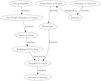

## Computational Creativity

<div class = rmdnote> _[Launch the Creativity Binder](https://mybinder.org/v2/gh/o-date/creativity/master)._ </div>

<div class = rmdnote> _[Laucn the Sonification Binder](https://mybinder.org/v2/gh/o-date/sonification/master)._ </div>

Once archaeological data becomes digital, it can escape the narrow purview of scholarly, academic engagement. Should it? Once it's out in the world, we lose our academic authority over it because it can be remixed, re-assembled, and taken to pieces for various ends - not all of them politically, ethically, or morally valid. But given that so much of archaeology is publicly funded, we have to recognize that these things will happen, and that we *should* be equipping our readers, our publics, to engage with these materials in ways that do justice to the peoples of the past, and also, the needs of the future. One way that this can be accomplished is to provide data and tools so that this archaeology can become fodder for art or activist inspired work.

This is part of the rationale for the open access journal [_Epoiesen: A Journal for Creative Engagement in History and Archaeology_](https://epoiesen.library.carleton.ca/about/). From its _about_ page, we learn:

> There is a perception that archaeology is for the archaeologists, history for the historians. On our side, there is perhaps a perception that speaking to non-expert audiences is a lesser calling, that people who write/create things that do not look like what we have always done, are not really 'serious'. In these vacuums of perception, we fail at communicating the complexities of the past, allowing the past to be used, abused, or ignored, especially for populist political ends. The ‘know-nothings‘ are on the march. We must not stand by.

> In such a vacuum, there is a need for critical creative engagement with the past. In _Succinct Research_, Bill White reminds us why society allows archaeologists to exist in the first place: 'it is to amplify the whispers of the past in our own unique way so they can still be heard today'. We have been failing in this by limiting the ways we might accomplish that task.

In this section, we explore ways of using generative computational approaches to remix archaeological data in a variety of ways - from a whimsical archaeological Twitterbot, to sonification, to glitch photograph, to world building.

To close this introduction to creative engagement, we shall leave the final word to James Ryan. Ryan is a PhD student at the University of California Santa Cruz who is using similar methods to generate a podcast that tells the story of a fictitious town in 'Sheldon County'. A good discussion of his project can be found on [eurogamer.net](https://www.eurogamer.net/articles/2018-07-14-the-us-town-ruled-by-an-ai-storyteller). Ryan says,

>  I view coding as a kind of literacy that works a lot like regular literacy: just as writing enables modes of human expression that span from the boring, mundane, functional to the creative, poetic, profound, coding does as well. So, to me, creative coding is to coding as creative writing is to writing. 
> I try to make sure that each day I spend working on a simulation leads to interesting new possibilities being generable by the time I stop working that day. Again, the whole process feels kind of like sculpting to me, as opposed to writing, for instance, where the work is more linear. The artist is simply working in a different material context. Working with oil paints is a lot different than working with clay which is a lot different than working on a typewriter, and all of these are different than working with code.
> But these are all tools of expression."

What could creative engagement and expressive use of coding with digital archaeological data, in terms of the ways the public learns about archaeology? Or how to view the world through an archaeological lense?

### Twitterbots with Tracery

_this section reuses, adopts and modifies portions of Graham's [Programming Historian lesson on Tracery](https://programminghistorian.org/en/lessons/intro-to-twitterbots)_

Strictly speaking, a twitter bot is a piece of software for automated controlling a Twitter account. When thousands of these are created and are tweeting more or less the same message, they have the ability to shape discourse on Twitter which then can influence other media discourses. Bots of this kind [can even be seen as credible sources of information](http://www.sciencedirect.com/science/article/pii/S0747563213003129). Projects such as [Documenting the Now](http://www.docnow.io/) are creating tools to allow researchers to create and query archives of social media around current events - and which will naturally contain many bot-generated posts. Here we demonstrate how one can build a simple twitterbot using the [tracery.io generative grammar](http://tracery.io) and the [Cheap Bots Done Quick](http://cheapbotsdonequick.com/) service. Tracery exists in multiple languages and can be integrated into websites, games, bots. You may fork it [on github here](https://github.com/galaxykate/tracery/tree/tracery2). 

The impetus for building a Twitterbot (or any social media automation) in this way is to use the affordances of digital media to create _things_ that could not otherwise exist to move us, to inspire us, to challenge us. Archaeologist Sara Perry for instance is leading the '[Emotive: Storytelling for cultural heritage](https://www.emotiveproject.eu/)' project that makes use of bots to such ends. In the uses of such automatons, there is room for satire; there is room for comment. With Mark Sample, we believe that there is a need for '[bots of conviction](https://medium.com/\@samplereality/a-protest-bot-is-a-bot-so-specific-you-cant-mistake-it-for-bullshit-90fe10b7fbaa)'.

These are protest bots, bots so topical and on-point that they can’t be mistaken for anything else. Per Sample, such bots should be

**topical** – “They are about the morning new - and the daily horrors that fail to make it into the news.”

**data-based** – “They draw from research, statistics, spreadsheets, databases. Bots have no subconscious, so any imagery they use should be taken literally”

**cumulative** – “The repetition builds on itself, the bot relentlessly riffing on its theme, unyielding and overwhelming, a pile-up of wreckage on our screens.”

**oppositional** – “protest bots take a stand. Society being what it is, this stance will likely be unpopular, perhaps even unnerving”

**uncanny** – “The appearance of that which we had sought to keep hidden.”

What would such protest bots look like, from an archaeological perspective? Historian Caleb McDaniel's [_every 3 minutes_](https://twitter.com/Every3Minutes) bot shames us with its unrelenting reminder that every three minutes, a human being was sold into slavery in the Antebellum South.

Individuals on Twitter who responded to a query about what the bots of conviction for archaeology might look like suggested some ideas:

> \@electricarchaeo a bot tweeting full-resolution images of cultural heritage locked behind tile viewers and fraudulent copyright claims by their holding inst?
— Ryan Baumann (\@ryanfb) April 22, 2017

> \@electricarchaeo A bot tweeting pictures of Native American sacred places that have been desecrated in the name of corporate greed.
— Cory Taylor (\@CoryTaylor_) April 22, 2017

> \@electricarchaeo A bot tweeting the identities of historical assets given inheritance #tax exemption because they are "available" to public view
— Sarah Saunders (\@Tick_Tax) April 22, 2017

> \@electricarchaeo Every time someone says "since the beginning of time, humans have" automatically responding BULLSHIT
— Colleen Morgan (\@clmorgan) April 22, 2017

Given that so much historical or archaeological data is expressed on the web as [JSON](http://json.org/), a bit of digging should find you data that you can actually fold into your _own_ bot. Graham has built several bots powered by different services. He writes,

> My most successful bot has been [\@tinyarchae](http://twitter.com/tinyarchae), a bot that tweets scenes from a horrible dsyfunctional archaeological excavation project. Every archaeological project deals with problems of sexism, abuse, and bad faith; \@tinyarchae pushes the stuff of conference whispers to a ridiculous extreme. It is a caricature that contains a kernel of uncomfortable truth. Other bots I have built glitch [archaeological photography](https://twitter.com/archaeoglitch); one is actually useful, in that it is [tweeting out new journal articles in archaeology](https://twitter.com/botarchaeo) and so serves as a research assistant. (For more thoughts on the role bots play in public archaeology, see this [keynote](https://electricarchaeology.ca/2017/04/27/bots-of-archaeology-machines-writing-public-archaeology/) from the [Public Archaeology Twitter Conference](https://publicarchaeologyconference.wordpress.com/)).

#### Planning: What will your bot do?

We begin with pad and paper. As a child in elementary school, one activity we often did to learn the basics of English grammar was called 'mad-libs' (as in, 'silly - mad - ad libs'). The teacher performing this activity would ask the class to, say, list a noun, then and adverb, then a verb, and then another adverb. Then on the other side of the sheet there would be a story with blank spaces like this:

"Susie the \_noun\_ was \_adverb\_  \_verb\_ the \_noun\_."

and students would fill in the blanks appropriately. It was silly; and it was fun. Twitterbots are to madlibs what sports cars are to horse and wagons. The blanks that we might fill in could be values in svg vector graphics. They could be numbers in numeric file names (and thus tweet random links to an open database, say). They could be, yes, even nouns and adverbs. Since Twitterbots live on the web, the building blocks that we put together can be more than text (although, for the time being, text will be easiest to work with).

We are going to start by sketching out a _replacement grammar_. The conventions of this grammar were developed by Kate Compton ([\@galaxykate](https://twitter.com/galaxykate) on Twitter); it's called [Tracery.io](http://tracery.io). It can be used as a javascript library in webpages, in games, and in bots. A replacement grammar works rather similarly to the madlibs you might remember as a child.

*In order to make it clear what the _grammar_ is doing, we are going to _not_ create a working bot for the time being. We are making clear first what the grammar does, and so we will build something surreal to surface how that grammar works.* 

Let's imagine that you would like to create a bot that speaks with the voice of a potted plant - call it, _plantpotbot_. What kinds of things might _plantpotbot_ say? Jot down some ideas-

- I am a plant in a pot. How boring it is!
- Please water me. I'm begging you.
- This pot. It's so small. My roots, so cramped!
- I turned towards the sun. But it was just a lightbulb
- I'm so lonely. Where are all the bees?

Now, let's look at how these sentences have been constructed. We are going to replace words and phrases with _symbols_ so that we can regenerate the original sentences. There are a number of sentences that being with 'I'. We can begin to think of an 'being' _symbol_:

```bash
"being": "am a plant","am begging you","am so lonely","turned towards the sun"
```

This notation is saying to us that the symbol "being" can be replaced by (or is equivalent to) the phrases "am a plant", "am begging you" and so on.

We can mix symbols and text, in our bot. If we tell the bot to start with the word "I", we can insert the _symbol_ 'being' after it and complete the phrase with "am a plant" or "turned towards the sun" and the sentence will make _grammatical_ sense. Let's build another symbol; perhaps we call it 'placewhere':

```bash
"placewhere": "in a pot","on the windowsill","fallen over"
```

("placewhere" is the _symbol_ and "in a pot" and so on are the _rules_ that replace it)

Now, in our sentences from our brainstorm, we never used the phrase, 'on the windowsill', but once we identified 'in a pot', other potential equivalent ideas jump out. Our bot will eventually use these _symbols_ to make sentences. The symbols - 'being', 'placewhere' - are like our madlibs when they asked for a list of nouns, adverbs and so on. Imagine then we pass the following to our bot:

```bash
"I #being# #placewhere#"
```

Possible outcomes will be:

- I am so lonely on the windowsill
- I am so lonely in a pot
- I turned toward the sun fallen over

With tweaking, and breaking the units of expression into smaller symbols, we can fix any expressive infelicities (or indeed, decide to leave them in to make the voice more 'authentic'.)

#### Prototyping with a Tracery editor

There is a Tracery editor at [www.brightspiral.com/tracery/](http://www.brightspiral.com/tracery). We will use that to work out the kinks in _plantpotbot_. The editor visualizes the way the symbols and rules of the grammar interact (how they are nested, and the kinds of output your grammar will generate). Open the editor in a new window. 

The dropdown menu at the top-left, marked 'tinygrammar', has some other example grammars that one can explore; they show just how complicated Tracery can become. For the time being, remain with 'tinygrammar'. One of the nice things about this editor is that you can press the 'show colors' button, which will color code each symbol and its rules, color-coding the generated text so that you can see which element belongs to what symbol.

If you double-click on a symbol in the default grammar (`name` or `occupation`) and hit your delete key, you will remove the symbol from the grammar. Do so for 'name' and 'occupation', leaving only 'origin'. Now, add a new symbol by clicking on the 'new symbol' button. Click on the name (`symbol1`) and rename it `being`. Click the `+` sign and add some of our rules above. Repeat for a new symbol called `placewhere`.

As you do that, the editor will flash an error message at the top right, 'ERROR: symbol 'name' not found in tinygrammar'. This is because we deleted `name`, but the symbol `origin` has as one of its rules the symbol `name`! This is interesting: it shows us that we can _nest_ symbols within rules. Right? We could have a symbol called 'character', and character could have sub-symbols called 'first name', 'last name' and 'occupation' (and each of these containing an appropriate list of first names and last names and occupations). Each time the grammar was run, you'd get e.g. 'Shawn Graham Archaeologist' and stored in the 'character' symbol

The other interesting thing here is that `origin` is a special symbol. It's the one from which the text is ultimately generated (the grammar is _flattened_ here). So let's change the `origin` symbol's rule so that _plantpotbot_ may speak. (When you reference another symbol within a rule, you wrap it with `#` marks, so this should read: `#being# #placewhere#`).

It still is missing something - the word 'I'. You can mix ordinary text into the rules. Go ahead and do that now - press the `+` beside the rule for the `origin` symbol, and add the word 'I' so that the origin now reads `I #being# #placewhere#`. Perhaps your plantbot speaks with a poetic diction by reversing `#placewhere# #being#`.

If you press 'save' in the editor, your grammar will be timestamped and will appear in the dropdown list of grammars. It's being saved to your browser's cache; if you clear the cache, you will lose it.

Before we move on, there is one last thing to examine. Press the JSON button in the editor. You should see something like this:

```JSON
{
	"origin": [
		"I #being# #placewhere#"
	],
	"being": [
		"am so lonely",
		"am so lonely",
		"am begging you",
		"am turned towards the sun"
	],
	"placewhere": [
		"in a pot",
		"in a windowsill",
		"fallen over"
	]
}
```

Every Tracery grammar is actually a JSON object consisting of key/value pairs, which is what Tracery calls symbols and rules. (For more on manipulation JSON, please see [this tutorial by Matthew Lincoln](/lessons/json-and-jq)). This is the format we will be using when we actually set our bot up to start tweeting. JSON is finicky. Note how the symbols are wrapped in `"` as are the rules, but the rules are also listed with commas inside `[` and `]`. Remember:
```JSON
{
  "symbol": ["rule","rule","rule"],
  "anothersymbol": ["rule,","rule","rule"]
}
```

(of course, the number of symbols and rules is immaterial, but make sure the commas are right!)  

It is good practice to copy that JSON to a text editor and save another copy somewhere safe.

#### Exercise

1. Build a grammar for your bot, following the sequence above. Save the .json file that expresses your bot. Remember that some of the power of Twitterbots comes from their serendipitous placement with other tweets in _your_ timeline, _and others'_. The potential for juxtaposition of your bot's message(s) against other people's tweets will also influence the relative success of the bot. How can you plan for these collisions?

2. Get a twitter account for your bot and connect it to Cheap Bots Done Quick

You can plumb a bot into your own, current, account, but you probably don't want a bot tweeting _as_ you or _for_ you. In which case, you need to set up a new Twitter account. When you set up a new Twitter account, Twitter will want an email address. You can use a brand new email address, or, if you have a Gmail account, you can use the `+tag` trick, ie instead of 'johndoe' at gmail, you use `johndoe+twitterbot` at gmail. Twitter will accept that as a distinct email from your usual email.

Normally, when one is building a Twitterbot, one has to create an app on twitter (at [apps.twitter.com](http://apps.twitter.com)), obtain the consumer secret and key, and the access token and key. Then you have to program in authentication so that Twitter knows that the program trying to access the platform is permitted. 

Fortunately, we do not have to do that, since George Buckenham created the bot hosting site '[Cheap Bots Done Quick](http://cheapbotsdonequick.com/)'. (That website also shows the JSON source grammar for a number of different bots, which can serve as inspiration). Once you've created your bot's Twitter account - and you are logged in to Twitter as the bot account-  go to Cheap Bots Done Quick and hit the 'sign in with Twitter' button. The site will redirect you to Twitter to approve authorization, and then bring you back to Cheap Bots Done Quick.

The JSON that describes your bot can be written or pasted into the main white box. Take the JSON from the editor and paste it into the main white box. If there are any errors in your JSON, the output box at the bottom will turn red and the site will try to give you an indication of where things have gone wrong. In most cases, this will be because of an errant comma or quotation mark. If you hit the refresh button to the right of the output box (NOT the browser refresh button!), the site will generate new text from your grammar.

Underneath the JSON box are some settings governing how often your bot will tweet, whether your source grammar will be visible to others, and whether or not your bot will reply to messages or mentions:

Decide how often you want your bot to tweet, and whether you want the source grammar visible. Then... the moment of truth. Hit the 'tweet' button, then go check your bot's twitter feed. Click 'save'.

Congratulations, you have built a Twitterbot!

3. Tracery can power more than bots. This site: [https://lovecraftian-archaeology.glitch.me/](https://lovecraftian-archaeology.glitch.me/) uses Tracery to generate archaeological site reports to lovecraftian effect. The source code is at [https://glitch.com/edit/#!/lovecraftian-archaeology](https://glitch.com/edit/#!/lovecraftian-archaeology). Here, the grammar is in the file `grammar.js`. In this grammar, we are generating site names and other names that we want to reuse across the generated story. Beginning with the `origin`, diagram out how the elements interrelate to create the site report. Then, once you see how the grammar is working, adapt the code to create your own work of fiction-meets-archaeology.

#### Good bot citizenship

As Cheap Bots Done Quick is a service provided by George Buckenham out of a spirit of goodwill, do not use the service to create bots that are offensive or abusive or that otherwise will spoil the service for everyone else. As he writes,

> If you create a bot I deem abusive or otherwise unpleasant (for example, \@mentioning people who have not consented, posting insults or using slurs) I will take it down

Other pointers for good bot citizenship are provided by Darius Kazemi, one of the great bot artists, are discussed [here](http://tinysubversions.com/2013/03/basic-twitter-bot-etiquette/).

### Chatbots

Chatbots are conversational robots designed to mimic human interaction - with varying degrees of success.The [EMOTIVE](https://www.emotiveproject.eu/) project at York University is exploring such chatbots for the purposes of storytelling and cultural heritage. The poet and programmer Allison Parish, of New York University, designs and builds various algorithmic explorations of language including such chatbots. In the [creativity binder](https://github.com/o-date/creativity) there is a notebook by Parrish ("semantic_similarity_chatbot") that walks you through programming such a chatbot by training it on a database of movie dialogue. It works by calculating the 'semantic similarity' between what you type and what exists in its database of similar responses. 

The notebook is very well commented out and takes you through the concepts in some detail. At the end of the notebook, Parrish makes some suggestions on where to take it next- 

> Use the metadata file that comes with the Cornell corpus to make a chatbot that only uses lines from a particular genre of movie. (How is a comedy chatbot different from an action chatbot?)
Use a different corpus of conversation altogether. Your own chat logs? Conversational exchanges from a novel? Transcripts of interviews on news programs?

#### Exercise

1. Train the chatbot on 'archaeological' movies. What does this say about the public consciousness of archaeology?
2. Train the chatbot on a corpus of writing by a particular archaeologist. Explore the responses - what does your virtual archaeologist reveal about their practice?

### Sonification

_this section resuses, adopts and modifies portions of Graham's [Programming Historian lesson on the sound of data](https://programminghistorian.org/en/lessons/sonification)_

While there is a lot of research into archaeo-acoustics (much of which involves digital manipulation of the sound files), in this section we want to take the opposite tack - of _creating_ aural representations of our data.

Pleasing or discordant sound from data can be used to signal many different things - from warning tones that something is wrong, to artistic interventions meant to draw attention to [environmental degradation](https://datadrivendj.com/tracks/louisiana/), to [economic inequality over space](https://datadrivendj.com/tracks/subway/). Sonifying archaeological materials could be an effective strategy in a work of public archaeology or advocacy. 

To begin with, sonification is a useful exploratory technique to make your data unfamiliar again. By translating it, transcoding it, [remediating](http://blog.taracopplestone.co.uk/making-things-photobashing-as-archaeological-remediation/) it, we begin to see elements of the data that our familiarity with visual modes of expression have blinded us to. This deformation, this deformance, is in keeping with arguments made by for instance Mark Sample on [breaking things](http://www.samplereality.com/2012/05/02/notes-towards-a-deformed-humanities/), or Bethany Nowviskie on the ‘[resistance in the materials](http://nowviskie.org/2013/resistance-in-the-materials/)’. Sonification moves us along the continuum from data to capta, social science to art, [glitch to aesthetic](http://nooart.org/post/73353953758/temkin-glitchhumancomputerinteraction). So let’s see what this all sounds like.

Sonification is the practice of mapping aspects of the data to produce sound signals. In general, a technique can be called ‘sonification’ if it meets certain conditions. These include reproducibility (the same data can be transformed the same ways by other researchers and produce the same results) and what might be called intelligibility - that the ‘objective’ elements of the original data are reflected systematically in the resulting sound (see [Hermann](#Hermann) [2008](http://www.icad.org/Proceedings/2008/Hermann2008.pdf) for a taxonomy of sonification). [Last and Usyskin](#Last) [(2015)](https://www.researchgate.net/publication/282504359_Listen_to_the_Sound_of_Data) designed a series of experiments to determine what kinds of data-analytic tasks could be performed when the data were sonified. Their experimental results (Last and Usyskin 2015) have shown that even untrained listeners (listeners with no formal training in music) can make useful distinctions in the data. They found listeners could discriminate in the sonified data common data exploration tasks such as classification and clustering. (Their sonified outputs mapped the underlying data to the Western musical scale.) 

Last and Usyskin focused on time-series data.  They argue that time-series data are particularly well suited to sonification because there are natural parallels with musical sound. Music is sequential, it has duration, and it evolves over time; so too with time-series data [(Last and Usyskin 2015: 424)](https://www.researchgate.net/publication/282504359_Listen_to_the_Sound_of_Data). It becomes a problem of matching the data to the appropriate sonic outputs. In many applications of sonification, a technique called ‘parameter mapping’ is used to marry aspects of the data along various auditory dimensions such as [pitch](#pitch), variation, brilliance, and onset. The problem with this approach is that where there is no temporal relationship (or rather, no non-linear relationship) between the original data points, the resulting sound can be ‘confusing’ (2015: 422). 

In the [notebook](https://mybinder.org/v2/gh/o-date/sonification/master) on sonification, we walk through the process of mapping time-series data against the 88 key keyboard. In the code, you will see a number of different methods that can be used.

The data are represented in json:

```JSON
my_data = [
    {'event_date': datetime(1792,6,8), 'magnitude': 3.4},
    {'event_date': datetime(1800,3,4), 'magnitude': 3.2},
    {'event_date': datetime(1810,1,16), 'magnitude': 3.6},
    {'event_date': datetime(1812,8,23), 'magnitude': 3.0},
    {'event_date': datetime(1813,10,10), 'magnitude': 5.6},
    {'event_date': datetime(1824,1,5), 'magnitude': 4.0}
]
```

The name of the second value here is 'magnitude', but it could be anything - counts, percentage, averages. The first value, in the sample code, uses python's `datetime` format and so has to be written as in the example. Unfortunately, `datetime` only works for dates from 1 CE onwards. This means that for any dates of interest to many archaeologists, this approach would either seem to be not useful, or require too much bother in order to get the dates correctly expressed.

This is not as big a problem as it first may appear. The actual calendar date is not important; it's the internal relationship that matters. That is to say, we're interested in the evolution over time as represented by the evolution of the sonification as we listen to it. In which case, say we had the following data we wanted to sonify:

```JSON
Phase 1: 234 sherds of pottery A
Phase 2a: 120 sherds of pottery A
Phase 2b: 45 sherds of pottery A
Phase 3: 47 sherds of pottery A
Phase 1: 120 sherds of pottery B
Phase 1: 34 sherds of pottery B
Phase 2a: 200 sherds of pottery B
Phase 2b: 180 sherds of pottery B
Phase 3: 87 sherds of pottery B
```

and we know that there are approximately 20 years between Phases 1 and 3, for pottery A we could express this like so:

```JSON
my_data = [
    {'event_date': datetime(1010,1,1), 'magnitude': 234},
    {'event_date': datetime(1020,1,1), 'magnitude': 120},
    {'event_date': datetime(1025,1,1), 'magnitude': 45},
    {'event_date': datetime(1030,1,1), 'magnitude': 47}
]
```

...run the code, save the output, and then do the same thing again for pottery B.

#### Exercise

1. Collect some data that you would like to sonify. Construct an array as above to express each potential 'voice' in your final composition. What do you think you might 'hear'?
2. Try the [Programming Historian sonification tutorial using Musicalgorithms](https://programminghistorian.org/en/lessons/sonification#musicalgorithms) to represent that data. What is the key difference between that approach, and the approach detailed here using miditime? How does it differ, and what does that _sound_ like? Try sketching out how you could use these differences to explain key concepts in archaeology to a public audience.
3. Launch the [jupyter notebook](https://mybinder.org/v2/gh/o-date/sonification/master) to explore miditime's approach to sonifying time-series data. Build mutliple voices, and mix them together using Garageband or [Audacity](https://www.audacityteam.org/). What creative decisions do you have to take in order to make this work? How do they change the data, or what you are able to hear? What *do* you hear - and *what* might it mean?


### Worldbuilding

<div class = rmdnote> _Launch the [Binder on World-Building](https://mybinder.org/v2/gh/o-date/creativity2/master)_. </div>

There is an approach to video games called 'procedural content generation' to create the world of the game so that it is always unique when you play it. _Minecraft_ is one game that uses procedural content generation; _No Man's Sky_ is another. In the [creativity2 binder](https://github.com/o-date/creativity2) there is a subfolder called 'WorldBuilding' that contains a notebook, 'model demo'. This notebook builds a world by simulating certain environmental processes, where the terrain is modeled as a series of Voronoi polygons with elevation and simulated water erosion along the edges, after [Martin O'Leary](https://twitter.com/mewo2)'s tutorial on [Creating Fantasy Maps](http://mewo2.com/notes/terrain/). Nomads move into this terrain and travel around it, from which movement trails and cities emerge. These cities then interact following the well known [Axelrod Tribute Model](http://www-personal.umich.edu/~axe/research/Building.pdf). The final elements of this demonstration generate a kind of chronicle that tells the 'history' of this world. 

Another kind of procedural history generator can be found in the same binder in the 'history generator' folder, which also permits the visualization of the 'history', like so:



This script contains a very simple model of state formation, fusion and fision. It also incorporates a Tracery grammar to 'liven up' the resulting chronicle. As a final feature, it uses the graphviz library to visualization the relationships through time.

#### Exercises

1. Examine the underlying models for interaction. What are their theoretical underpinnings? What would have to be modified to make these generative worlds/histories more 'real'?
2. How could such generative histories be used for public archaeology?

