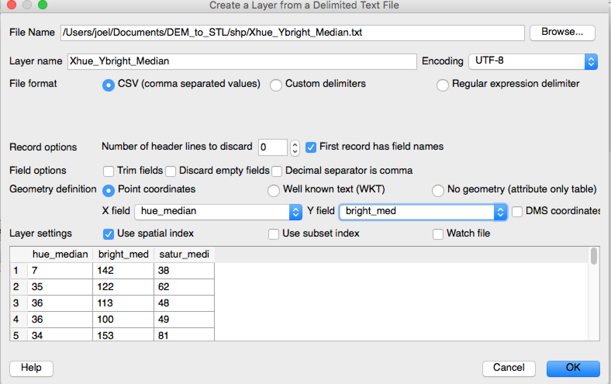
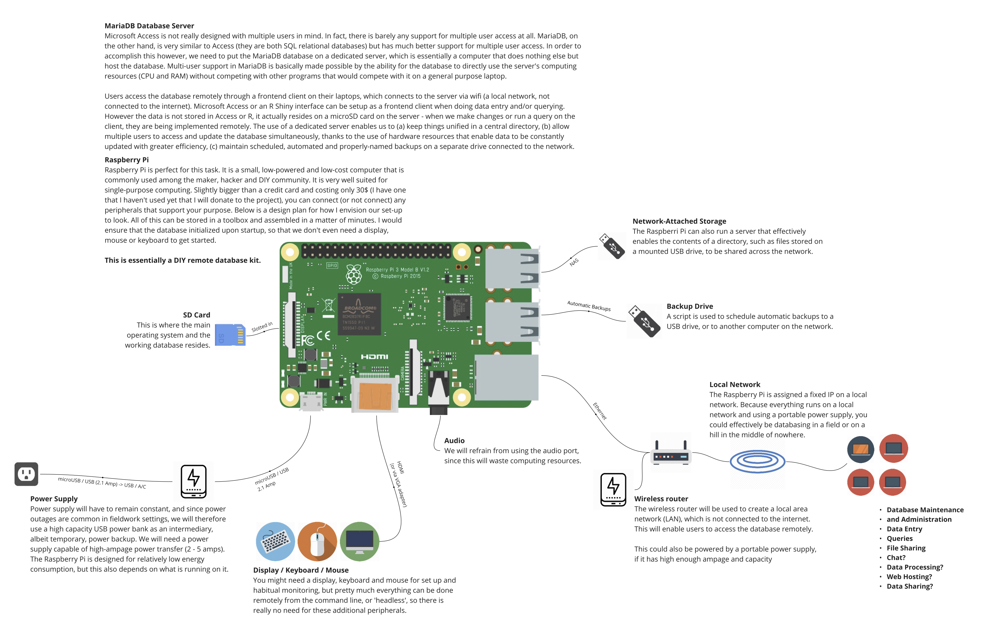
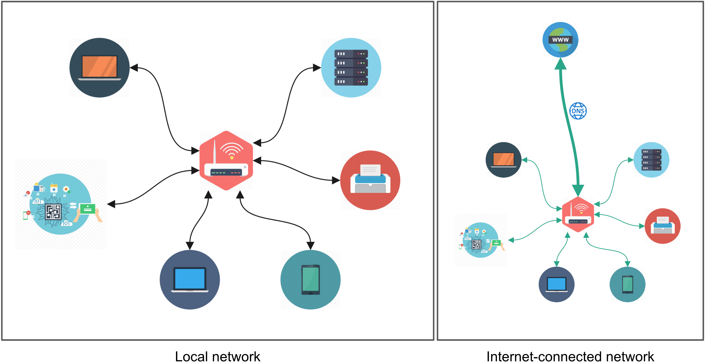
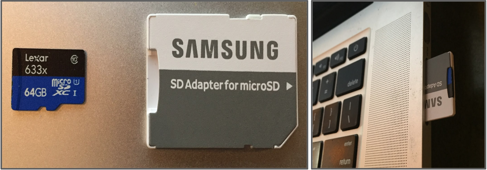
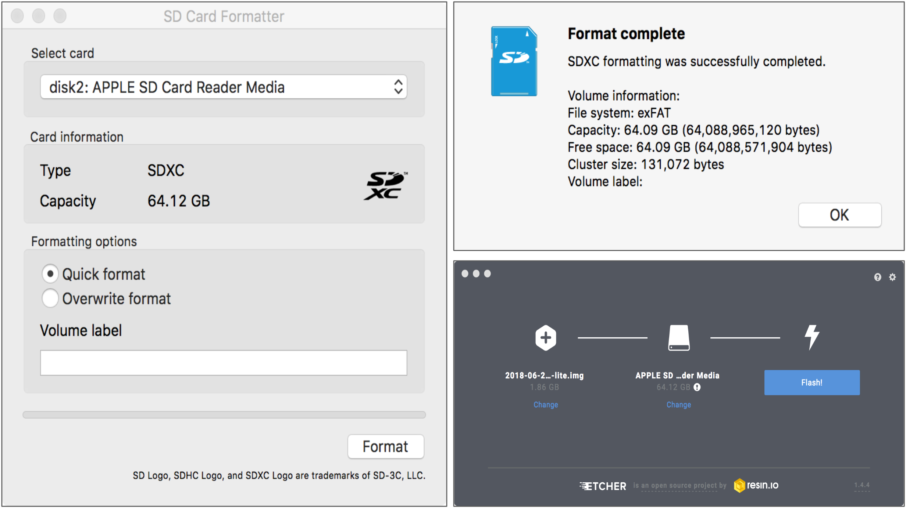
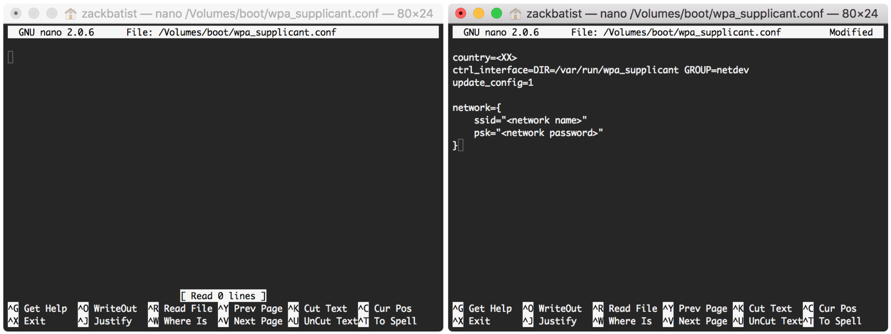
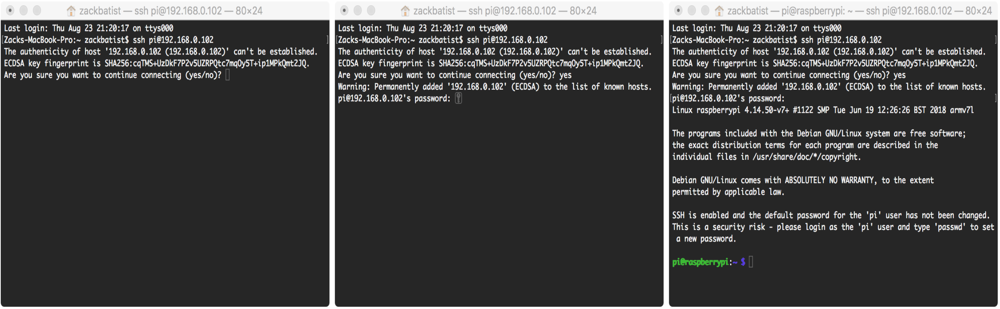
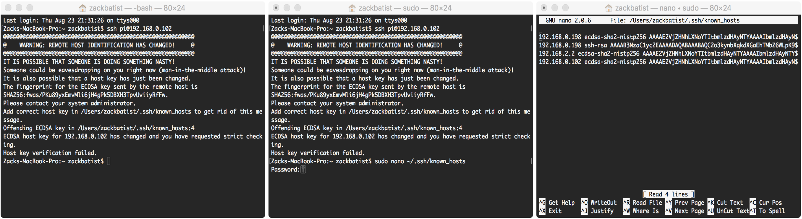

## 3D Printing, Raspberry Pi and “Maker” Archaeology

<div class = rmdcaution> _This section is under development_. </div>

### Overview
A 'maker' approach, in general terms, is a creative process of on-the-fly craftwork that involves learning and contributing towards the development of neat things. It's an inclusive, community driven movement that recognizes the capabilities for anyone to learn or do anything (but never everything!). Makers share their tools and experiences through direct dialogue and by making alongside others, by posting code and resources online in accessible formats, and by nurturing open and supportive ecosystems of information exchange. Failing is considered to be part of making by providing unique opportunities to learn from.

Although making often involves digital technology, it's incredibly open-ended. Crafts like pottery, needlework, mushroom foraging, birdwatching, woodworking, improv entertainment and even archaeological excavation subscribe to similar tenets, and sometimes cross-pollinate with computer tech in fun and functional ways. In this chapter we guide the reader through the use of 3D printing and Raspberry Pi microcomputers in an open-ended way, enabling you to continue on with this work on your own and apply what you learn in various circumstances.

### 3d Printing - a Workflow

In the workflow described below, it is entirely possible to 3d print a wide variety of data that are not, strictly speaking '3d' in the sense of existing in three dimensions in the 'real world'. For instance, one could extract the hue, colour, and saturation values of a collection of site photographs and 3d print an object that represents several hundred photographs as a surface where x = hue, y = colour, and z = saturation. 


Users will obtain values for x,y,z and represent those values as points using the values from x,y. The z value will remain in the attribute table and will be used later. Once the points are represented in x,y space, we'll create a digital elevation model (DEM). This essentially will take the x,y points and interpolate or mathematically guess all of the values between the points while assigning a pixel value to each location from the z attribute table. Typically this z value represents elevation (hence the name of the DEM), but this is typically colour coded in various shades of grey/black/white. The last step will be to use a tool in [QGIS](https://www.qgis.org/en/site/) to convert the DEM to an STL file, which is a standard 3d object file format that is used for makerbot. This will create the 3D object, which can then be printed using the 3D printer.

Let's walk through the process.

You have data values that you'd like represent in a 3D space. To display values into 3D space, you'll need values inputed in x,y and z. x,y will represent your data in a 2D space, while the addition of the z value will add the 3rd dimension. The method outlined below is typically done to display geographic data, but it can also be used with other types of data. The method below will use non-geographic data to create a 3D object file.

The software used in this workflow is QGIS. QGIS is a free open source desktop geographic information systems (GIS) application that allows users to view, edit and analyze geographic information. Users can [download the tool for Windows, MAC OS X or Linux at the following website.](http://www.qgis.org/en/site/forusers/download.html "download") The workflow below was done using QGIS 2.14.

#### Create a point shapefile

1. Collect or ensure that you have a comma-separated file (.csv) with values of x,y,z. This is displayed in a text editor, but it can also be viewed as tabular data. 

.

2. Open QGIS and in the menu, click on Layer > Add Layer > Add delimited text layer... This will allow us to add our .csv file in QGIS 

.

You should now see some points displayed in QGIS. You'll notice in the layers panel on the left that there is a point file. This point file is considered to be a vector feature with its geometry represented as a point. If you can't see the Layers Panel, select in the menu View > Panels > Layers Panel. In the layers Panel, turn the layer on/off by clicking on the box next to it. Keep in mind that this point file is only temporary and should now be saved properly.

3. In the Layers Panel, right click on the file and select Save as... and change to the settings as outlined in the screenshot. Ensure that you change the CRS to EPSG 3857 WGS 84 / Pseudo Mercator.

4. In the Layers Panel, remove the temporary point file by right clicking on the file and clicking remove. You'll want to have only the pointfilepseudo in the Layers Panel.

Your data is now viewed in 2D space and represented as points. Each point (x,y) has a z value associated to it, even if we can't see it. You can view this z value by clicking on identify tool in QGIS and then clicking on a point. The underlying attribute table will appear, indicating the value of x,y and most importantly the z.

#### Create a Digital Elevation Model

Our next step is to fill in the gaps between the points. To do so, we'll convert the vector point geometry to raster pixels while we use interpolation tools in QGIS to do this. This is quite common in a GIS software, where users attempt to interpolate the elevation of the area with use the spot height points. The output product from this operation is called a digital elevation model (DEM).

  1. In QGIS, click on View > Panels > Toolbox. This will open up the Processing Toolbox window on the right. We'll be using one of the interpolation tools from this toolbox to create our Digital Elevation Model (DEM).
  2. In the search box, type v.surf. This will bring up various interpolation tools that can be used for your interpolation with the use of GRASS tools. GRASS (Geographic Resources Analysis Support System) are open source tools that can be used in QGIS or as a standalone application. In this case, we're using the GRASS tools in QGIS.
  3. Double click on the v.surf.idw - surface interpolation by...The idw in this particular case refers to the interpolate method of Inverse-Distance Weighted. This method essentially gives less weight to known points that are furthest when trying to interpolate values.
  4. Fill in the information as seen in the screenshot. The algorithm will process and your output will be added to the Layers Panel.

  You'll see various shades of grey/black/white sections when looking at the DEM raster in QGIS. Each shade of grey represents a different value of z.

#### Create a 3D object (.stl)

For 3D printing, users must have specific file formats. An .obj or .stl are some of the common formats that can be used to create 3D models. Meshlab is a free tool that can be used to view and convert between multiple types of 3D object formats. In our particular case, we'll be printing our final 3D object on a makerbot printer. We'll need the file format to be in .stl. Luckily for us, QGIS can export directly from a DEM to STL file.

  1. In QGIS, click plugins > Manage and Install Plugins...
  2. In the search box, type DEMto3d. This should bring up the plugin that's required for our conversion. Click on the plugin and install it. Exit the plugins menu when complete.
  3. In the QGIS menu, click on Raster > DEMto3D > DEM 3D Printing. Select the InterpolateIDW layer and the remainder of the settings as outlined in the screenshot below. Once complete, click on Export to STL. Once prompted to save the file, select the appropriate directory.

#### Print 3D object or create AR

This will export an stl file that is rather large in file size. This stl file can be used to print a 3D representation of the model or can be used to view the model as an augmented reality object.

### Using Raspberry Pi in the Field
Archaeology is an inherently collaborative process that happens in various places simulataneously. It is therefore often challening to ensure that archaeological databases, which serve to store and organize inter-related information obtained through various methods and practices, are kept up to date and syncronized across research environments. In order to deal with these challenges it might be necessary to set up a database hosted on a network, which would enable multiple users to simultaneously engage with the database while ensuring that the data remains orderly and complete.

In order to implement such a system we need to set up a network, set up a server, set up a database along with user-friendly interfaces, and ensure that the system is aligned with and contributes positively to the goals of the overall project.

The system that we're going to build will look something like this:


It consists of:

- a local network generated and managed by a wireless router
- a Raspberri Pi mini-computer upon which the database will reside and be served to other devices across the network
- the software configured to host the database and ensure that the data is secured and backed up
- user interfaces that talk to the database and that encourage desired user behaviour
- other useful services such as a file sharing server and data visualization portal that may help encourage collaborative and informed research

The system that we're going to build may be suitable for some, but not for others. It is therefore important to remember that this all requires some degree of flexibility so that what you make suits the overall goals of the project you're contributing to. So you may copy these instructions directly or tinker around to suit your needs!

**Some Notes on Hardware:**
This is meant to be a very portable, low energy use and inexpensive setup. While I recommend that you use a dedicated server - a computer that is configured to run the database server, and only the database server - you can actually host the database on a regular laptop that you also serves as the client. I will be including notes on how to configure this to work all on one device, but I recommend that you use this kind of setup for educational and testing purposes only, and not in a production environment.

Raspberry Pi is available online for around 45$ CAD at https://www.raspberrypi.org/products/, but your local library or makerspace will likely be happy to lend you one to play with. You will also need a SD card with a capacity of at least 8GB and with adequate read/write speeds (see https://www.raspberrypi.org/documentation/installation/sd-cards.md for more info), a wireless router (this one is 40$ and tiny - perfect for portability! https://amzn.to/2HoOM6W), a power source that is capabale of high-ampage output of at least 2.4A (a wall socket will suffice, but in the field I recommend an external battery pack to be used, to allow for increased portability and as a safeguard against power failures - I use this one at 43$: https://amzn.to/2Ht8quv) and a couple USB flash drives with varying storage capacities that suit your needs.

This guide is designed with unix-users in mind - so those who use MacOS or Linux. Sorry Windows users :(

#### Networking Basics
The goal of this project is to enable multiple computers to communicate with a database on a central server. In order to accomplish this we first need to set up a network, which enables this communication to happen. **A network is a set of interconnected computers, which communicate with each other using cables or wireless connections as well as protocols that manage the connections.**

The internet is one kind of network that relies on immense cabling infrastructure and DNS protocols that have global reach (DNS, or Domain Name Servers, distribute codes to every computer on the internet, which are comparable to phone numbers in a phone network). However in our case we are going to set up a local network (also known as a local area network, LAN or intranet) that has a limited scope and range. **A local network distributes IP addresses to connected devices that enable them to communicate with each other, but it does not necessarily connect these computers to the outside world of the internet.** It can be imagined as a neighbourhood with roads and walkways of its own that serve the local community; the neighbourhood may be connected to the rest of the world via a regional or national highway. **The local network is managed by a router, which is a specialized computer that assigns local IP addresses and also helps direct traffic to and from the broader internet.** You can think of the router as a local post office, which receives mail directed to the town and distributes the mail to every household.



Other kinds of specialized buildings might exist in the town as well. You might do all sorts of things in your home, such as cook, water the garden, wash the dog, or host a party, which each consume varying degrees of food and water (including some waste) but services like grocery store or water reclamation plants need to be streamlined and focused in order to keep up with the inflow and outflow of material that they need to process, which is immense because they engage with each and every household in town. These represent specialized computers on a network called servers (also referred to as hosts, clusters or 'the cloud'). **Servers are centralized computers that manage and distribute information to and from clients across the network. They are designed to be as lightweight and efficient as possible,** such as by minimizing flair in user interfaces to enable more effective use of computing resources directed towards the task at hand, or by keeping the temperature cool to prevent shutdowns and slowdowns due to overheating. The hardware places hard limits on how efficient a computer may operate, but configuring the software can go a long way in stretching a computer's capabilities.

Finally, **a user (also referred to as a client, terminal or workstation) is any other computer on the network that is served information or passes along information to be served to others.** The things that they do on their own computer are local relative to other computers on the network. The terms 'local' and 'remote' are therefore commonly used to designate things that occur close to home base, and things that occur further away, respectively.

#### Raspberry Pi and Raspbian
Raspberry Pi is an open source, inexpensive and low-power mini-computer that includes all the necessary components needed to do a wide variety of creative things. It's very popular among makers and DIY/DIWO hackers due to its extensibility and flexibility of use. Raspberry Pi has its own Linux distribution called Raspbian OS, which is designed to be lightweight and consume relatively little power.

While you _could_ connect a display, keyboard and mouse to the Raspberry Pi and interface with it directly, **it's actually very common to run it 'headless' - by running commands via the command line or terminal over a network, without the use of a visual user interface**. We do this by establishing a SSH connection, by typing commands in a terminal window on a remote computer that are actually implemented on the local computer. The network setup enables all of this to happen.

It may seem a little intimidating, but using the terminal is actually quite easy and systematic once you get the hang of it - it just takes some getting used to! Moreover, experimenting with a Raspberry Pi is arguably the best way to learn how to do this, since the operating system can be wiped and reinstalled very easily. So if you mess up (as everyone does at some time or another) you'll be back up and running in a matter of minutes!

So let's get started by installing Raspbian on a SD card. Start by inserting the SD card into your computer using an adapter (these tend to come with the microSD card if you just bought a new one, but makerspaces and photographers may have one lying around for you to borrow). Once it's in it will mount automatically and you should see it pop up on your finder or file explorer. It might have a different name, but be sure you are able to identify it and associate it with what you just inserted into your laptop or desktop computer.



Now we'll have to wipe and format the microSD card using an SD Card Formatter tool. Use the one made available by the SD Association, available at: https://www.sdcard.org/downloads/formatter_4/.

Once the microSD card is wiped and formatted, we want to etch the Raspbian operating system onto the card. First, download Raspbian OS from https://www.raspberrypi.org/downloads/raspbian/, and then use Etcher (available at https://etcher.io/) to write it to the microSD card. This may take a few minutes. Notice that the mounted volume is re-named as 'boot'.



There are a couple other things that we need to do to ensure that we can interface with the Raspberry Pi headless. First we need to create a file in the OS that enables SSH interface. Open terminal (/Applications/Utilities/Terminal.app, or by hitting `Command+Space` and then typing Terminal.app) and type the following command, then hit enter:

```bash
touch /Volumes/boot/ssh
```

This command (`touch`) creates an empty text file in a location specified after the space. In this case, we are creating a text file called 'ssh' in the main directory of the boot volume. What this file does, in simple terms, is [specify that it's okay to allow other computers to interface with the Raspberry Pi over the network.](https://www.raspberrypi.org/documentation/remote-access/ssh/README.md#3-enable-ssh-on-a-headless-raspberry-pi-add-file-to-sd-card-on-another-machine)

So now that we've specified that it's okay to enable SSH connections over a network, we need to enable the Raspberry Pi to connect to the network in the first place. If we were using a graphical user interface, we would go to a menubar, select the network and input the password. Only then would we be able to  connect to the Raspberry Pi headless. However because we are not using a graphical user interface, we need to devise a way to make the Raspberry Pi connect to the network automatically, without prior intervention on our part. We can do this by creating another file, `wpa_supplicant.conf`, similarly to how we made the `ssh` file above. However we want to edit this file to include our network's login credentials. We'll use a terminal-based text editor called `nano` instead of `touch` to simultaneously create and edit the file.

```bash
cd /Volumes/boot
nano wpa_supplicant.conf
```

The `cd` command moves you around directories. Check what files and sub-directories are in your current directory with `ls`. See the cheatsheet provided by the Raspberry Pi Foundation that lists some common terminal command and explains how to use them: https://www.raspberrypi.org/documentation/linux/usage/commands.md

After the `nano` command you should see a blank file. Type the following into ```wpa_supplicant.conf```. Remember to change the generic country code, network SSID and network password, including the <> characters, to suit your setup. The quotes should remain in place.
```bash
country=<XX>
ctrl_interface=DIR=/var/run/wpa_supplicant GROUP=netdev
update_config=1

network={
    ssid="<network name>"
    psk="<network password>"
}
```



**Note:** this is a relatively insecure method, since we are writing out our network credentials in plain text. Anyone who has read access to this file can see this information. I recommend that you not use login credentials that are personal to your university account, since they are typically used to access other crucial university or employee services. Ask your network administrator or IT department to create a new generic or institutional user and password combination for such testing and tinkering experiences! [See the Raspberry Pi documentation on this topic for further information.](https://www.raspberrypi.org/documentation/configuration/wireless/wireless-cli.md)

Exit nano by hitting `control + x`, and then pressing the `y` key when asked if you'd like to save the buffer (which means save the file). This should return you to the normal terminal window.

Now eject the microSD card, place it in the Raspberry Pi and boot it up. Wait a couple minutes for it to finish booting up. The red LED light specifies power consumption (solid means power is flowing, flickering means inadequate power supply, i.e. needs a supply with better ampage), and the green LED light specifies data processing. The operating system will be finished installing once the green LED calms down.

Now that we've installed the OS and enabled network-based control of it, let's go ahead and establish such a connection. [This is called SSH, or Secure SHell connection](https://www.raspberrypi.org/documentation/remote-access/ssh/). To establish an SSH connection we will need to know the location of the target computer on the network. We can do this by going into the router's settings and checking all connected computers' IP addresses.

Once you determine the target computer's ip address, we can type the following command, replacing the generic placeholder (including the <> characters) with the actual address:

```bash
ssh pi@<ip address>
```

You will be prompted for a password. The default password on fresh installations of Raspbian is 'raspberry'. No astericks will be visible as you type it, just hit enter when you are finished. Your window should look something like this:



Congratulations, you're in! 🎉

In the command we just ran, 'pi' and 'raspberry' specify the default username and password on the host computer, and the host computer itself is specified by the IP address that locates it on the network.

This terminal window should now be considered a remote client to the raspberry pi. More specifically, everything that you do run that follows `pi@raspberrypi:` in the terminal window is being implemented on the Raspberry Pi. If you were to close the terminal window, you will be prompted to end the session - this is fine, but the Raspberry Pi will still be running, without any SSH connections still active. You will need to re-establish a new SSH connection to get back in control of the host computer, and to shut it down.

You may also get the following warning when trying to establish an initial connection via SSHL:

```bash
@@@@@@@@@@@@@@@@@@@@@@@@@@@@@@@@@@@@@@@@@@@@@@@@@@@@@@@@@@@
@    WARNING: REMOTE HOST IDENTIFICATION HAS CHANGED!     @
@@@@@@@@@@@@@@@@@@@@@@@@@@@@@@@@@@@@@@@@@@@@@@@@@@@@@@@@@@@
IT IS POSSIBLE THAT SOMEONE IS DOING SOMETHING NASTY!
Someone could be eavesdropping on you right now (man-in-the-middle attack)!
It is also possible that a host key has just been changed.
The fingerprint for the ECDSA key sent by the remote host is
SHA256:/1AS9um/kBFfaIf0vny7UX8YyDP3nTCZhd2H5FAv2VY.
Please contact your system administrator.
Add correct host key in /root/.ssh/known_hosts to get rid of this message.
Offending ECDSA key in /root/.ssh/known_hosts:1
  remove with:
  ssh-keygen -f "/root/.ssh/known_hosts" -R 192.168.1.234
ECDSA host key for 192.168.1.234 has changed and you have requested strict checking.
Host key verification failed.
```

This is triggered because each remote computer that establishes an SSH connection with a specific target is identified using a cryptographic key, for security reasons. When you re-install Raspbian on the same microSD card, the old key slot is removed and replaced with a new one. However, when your remote laptop tries to enter the computer located on the same location on the network it reaches for the old key that works with the lock that has since been removed. We therefore need to delete the old key and replace it with a new one that fits the new lock.

To do this, navigate to the file where the keys are stored, and edit the file to delete the corresponding keys:
```bash
sudo nano ~/.ssh/known_hosts
```
Remove all the data stored in this file by going to the end and holding backspace, then save and exit with `control + x` and then `y`. See [https://www.raspberrypi.org/forums/viewtopic.php?t=40037](https://www.raspberrypi.org/forums/viewtopic.php?t=40037) for more info.



**SSH via direct ethernet connection (MacOS):**
Raspbian is configured by default to receive an IP address from a DHCP server, a role that is typically fulfilled by a wireless router. This can be done without a router by connecting the Raspberry Pi to the client computer using an ethernet cable, but it is necessary to configure the sharing options in MacOS in order for this to work. From System Preferences, go to the Sharing window. From the box on the left, enable 'Internet Sharing'. You may have to select 'Thunderbolt Ethernet' under the Wi-Fi dropdown before checking off the 'Internet Sharing' box.

Then in terminal, use `ifconfig` to get information about your computer's networking configuration. Find the header `bridge100`, note the IP address after `inet`, which is most likely `192.168.2.1`. Add one to the final digit to determine the likely IP address of the Raspberry Pi (`192.168.2.2` in this case).

**Note:** This will not work if the wireless network is secured by a 802.1x firewall, which are commonly implemented by most university, hospital and government networks.

For more information, visit:
* https://medium.com/@tzhenghao/how-to-ssh-into-your-raspberry-pi-with-a-mac-and-ethernet-cable-636a197d055
* https://www.jeffgeerling.com/blog/2016/ssh-raspberry-pi-only-network-cable-using-os-xs-internet-sharing

Now that we are in the remote host, let's install updates. This requires that the local network be connected to the internet.

```bash
sudo apt-get update -y
sudo apt-get upgrade -y
```

Linux software is installed and managed through the use of package managers, in this case one called apt. `apt-get update` updates the listing of software (along with version numbers and compatibility info) that is managed on a trusted and audited series of servers out on the internet. `apt-get upgrade` installs updates to outdated software on your device based on comparisons of the local version numbers with those on the external listing. Including the `-y` flag is optional, and specifies that any prompt to confirm an update with a yes/no response should always respond with 'yes'.

For the purpose of this tutorial it is not necessary to update the kernel or firmware. The most up-to-date versions are included in the raspbian disk images. Using `sudo rpi-update` may install bleeding-edge updates or untested firmware that might break our intended setup.

**Note:** There is no power switch on the Raspberry Pi, and power-supply can therefore be a bit finicky. **You will have to shut down the computer by running a specific command. DO NOT JUST UNPLUG THE POWER CORD! That can corrupt the SD card and you'll have to re-image it and re-install the OS, and all data will be lost in the process!**

To shut down the Raspberry Pi, use the following command:

```bash
sudo shutdown -h now
```

To restart the Raspberry Pi, simply re-connect the power source.

#### Setting up Static IP Addresses
To make our lives a little easier, especially when working on a network that many other devices will be connected to, it will be helpful to configure a static IP address for the Raspberry Pi on the network. Each device connected to the network is assigned a unique IP address, typically as a sequence following the order in which they connected. So the router might have IP address `192.168.0.100`, and subsequently connected computers will have `192.168.0.101`, `192.168.0.102`, `192.168.0.103`, etc. Most routers enable up to 200 connections by default, distributing IP addresses up to `192.168.0.199`. In order to maintain consistency when connecting to the Raspberry Pi (which may be necessary when writing instructions for others to follow, or when pre-configuring connections to the Raspberry Pi on others' computers), we can reserve an IP address from the upper end of the range, such as `192.168.0.198`. You will no longer have to lookup the target computer's IP address in the router options or via the terminal - you could simply run `ssh pi@192.168.0.198` to establish a connection to the Raspberry Pi from any remote computer on the network.

In order to do this we will have to find some information about the network configuration. Start by SSH-ing into the Raspberry Pi.

We first need to get the Raspberry Pi's IP address on the network, on both wifi and ethernet interfaces.

```bash
ip -4 addr show | grep global
```

The output should look something like this:
```bash
inet 169.254.39.157/16 brd 169.254.255.255 scope global eth0
inet 192.168.0.102/24 brd 192.168.0.255 scope global wlan0
```

`eth0` refers to the ethernet interface, and `wlan0` refers to the wireless interface. Information pertaining to the ethernet interface will not appear if the Raspberry Pi is not currently connected to the router via an ethernet cable.

Next we need to determine the router's gateway:
```bash
ip route | grep default | awk '{print $3}'
```

The result should look something like this:
```bash
192.168.0.1
```

Then we need to determine the DNS server or namespace, which is often the same as the router's gateway:
```bash
cat /etc/resolv.conf
```

The result should look something like this:
```bash
# Generated by resolvconf
nameserver 192.168.0.1
```

Finally, we have to add this retrieved information to the file located at `/etc/dhcpcd.conf`:
```bash
sudo nano /etc/dhcpcd.conf
```

**ProTip:** when editing system files or doing anything that reconfigures the computer setup in a serious way, you will have to include the `sudo` before the command. This grants 'super user' privileges, which are required for system adminstration.

Add the following, substituting the `static routers` and `static domain_name_servers` values with the one's that were just determined above. The values for `static ip_address` should be our new consistent IP address. For the numbers following the `/`, use the values from the IP addresses we identified above.

```bash
interface eth0
static ip_address = 192.168.0.197/16
static routers = 192.168.0.1
static domain_name_servers = 192.168.0.1

interface wlan0
static ip_address = 192.168.0.198/24
static routers = 192.168.0.1
static domain_name_servers = 192.168.0.1
```

Save and close the file, and you should be good to go! You might have to re-establish the connection, however, since the host may now be situated at a different location on the network. Further information: [http://raspberrypi.stackexchange.com/a/37921/8697](http://raspberrypi.stackexchange.com/a/37921/8697)

**ProTip:** You may need to make a direct connection with your computer to download updates (When in the field, I tend to tether my cullular connection to my laptop and share the connection over ethernet). In such cases, you will need to edit `dhcpcd.conf` and comment out the `eth0` specifications to enable an alternative ethernet interface with your laptop that is not specific to the router that it is normally connected to. You may not even need an `eth0` static IP, but it helps to have that direct ethernet connection in place if you are using the Pi as a network attached storage (NAS) device, i.e. sharing files over the network, as this gives a significant speed boost to file transfers.

#### Setting up the database management system
Now that we have the Raspberry Pi set up, let's set up a database management system (DBMS for short). We're going to be using MariaDB, which is for all intents and purposes identical to MySQL ([MariaDB is a fork of MySQL that is more committed to open source principles](https://www.tecmint.com/the-story-behind-acquisition-of-mysql-and-the-rise-of-mariadb/)). In fact, [all MySQL commands work in MariaDB](https://mariadb.com/kb/en/library/mariadb-vs-mysql-compatibility/), and the community of users cross-polinate and use the terms synonymously in their documentation and troubleshooting. We will be using many commands that were designed for use in MySQL and which were ported over to MariaDB when it was forked.

In our current application, we will be installing a database server on the Raspberry Pi, which hosts one or more databases. The database, and all information stored within it, resides on the SD card slotted into the Raspberry Pi, which users connect to over the network as clients. The fact that the database exists in one centralized place ensures that the information accessed by clients is constantly up to date and consistent. In order to connect to the database as a client, users will have to know the server's IP address, the port that is used by MariaDB on the server, the name of the database to be accessed, and the users' login credentials to access the database.

To install MariaDB Server, first SSH into the Raspberry Pi and then use `apt-get` to install `mariadb-server` from the package manager:

```bash
sudo apt-get install mariadb-server
```

Once it is installed, you will have to re-configure a configuration file to enable access to the database across the network. First access the config file:

```bash
sudo nano /etc/mysql/mariadb.conf.d/50-server.cnf
```

Find the line that configures `bind-address` to `127.0.0.1` and change its value to `0.0.0.0`. [This changes the addresses that the MariaDB server will listen to for connections](https://mariadb.com/kb/en/library/server-system-variables/#bind_address). If we had left it at `127.0.0.1`, which is typically synonymous with `localhost`, only modifications made by the Raspberry Pi's local users would be able to access any of the databases managed by the MariaDB server. By changing the value to `0.0.0.0` we enable the server to accept connections from any computer on the network, if they have valid credentials. You can also configure specific IP addresses in order to allow only computers with those locations on the network to access the database server.

Once your changes are made, save the file using `control + x` and then restart the MariaDB service:

```bash
sudo service mysql restart
```

**Installing and running MariaDB locally on MacOS:**
It is possible to install the MariaDB DBMS locally on your laptop, which means that your laptop would serve as both the server and the client at the same time. This is useful if you want to create and manage a database locally before migrating it to a server, or if you don't have a Raspberry Pi on hand but want to learn more about database adminstration.

To onstall MariaDB on a mac, we need to first install a paclage manager called homebrew, similar to apt, that is designed specifically for MacOS. To install homebrew, open terminal and then run the following command to download the installation files and build the program:
```bash
/usr/bin/ruby -e "$(curl -fsSL https://raw.githubusercontent.com/Homebrew/install/master/install)"
```

Then update the index of retrievable packages and upgrade any installed packages:
```bash
brew update
brew upgrade
```

Nowe install MariaDB via homebrew:
```bash
brew install mariadb
```

Once installed, to start the MariaDB server use the following:
```bash
mysql.server start
```

It is also important to stop the server when you are finished using it in order to ensure that your computer is not constantly using up resources when they are not needed:
```bash
mysql.server stop
```

Once the database server is installed and running up, let's login to the server so that we can create a database. By default there is only one user named 'root', whose password is blank. Root has the broadest set of privileges, and can create or drop databases and users freely. You can only log in as root on the machine on which the MariaDB server resides; you can not log in as root from a remote connection. After establishing a SSH connection to the Raspberry Pi, initiate the server and login as root:

```bash
sudo mysql
```

You'll notice that the terminal window looks a little different. We are now in the MariaDB server environment, and we will have to escape it in order to run commands outside of it. The command to escape is `control + c`. You can also establish another SSH connection in a new terminal window so that you can use one window for database management tasks, and the other for working with other aspects of the operating system.

MariaDB commands are SQL, or Structured Query Language. They are generally written using upper case letters, and every command must end with a semicolon. The semicolon essentially indicates the boundaries of a SQL statement, which is essentially a self-contained logical statement. If you do hit enter after an incomplete statement is input then any further input will be tacked on to the end of the incomplete statement. The semicolon indicates that the statement is finished and ready to be executed.

Now let's create a database called `odate1`:

```sql
CREATE DATABASE odate1;
```

Next create a new user named `lara` with password `croft`:

```sql
CREATE USER 'lara'@'localhost' IDENTIFIED BY 'croft';
```

We can also make a restriction that would only recognize a user named lara if she attempts to access the server from a specific IP address by replacing `localhost` with the IP address that you are expecting her to connect from:

```sql
CREATE USER 'lara'@'12.34.56.78' IDENTIFIED BY 'croft';
```

Different users can have different [permissions](https://mariadb.com/kb/en/library/grant/) granted to them. Groups of specific permissions can be lumped together and labelled as [roles](https://mariadb.com/kb/en/library/roles_overview/), which can also be assigned to users, which may make database management slightly easier. In this tutorial we will not fret too much with permissions or roles (see [https://mariadb.com/kb/en/library/grant/](https://mariadb.com/kb/en/library/grant/) for more information), and we will simply assign all permissions to our user lara:

```sql
GRANT ALL PRIVILEGES ON odate1.* TO 'lara'@'%' IDENTIFIED BY 'croft';
FLUSH PRIVILEGES;
```

We could also restrict lara's permissions to specific tables on the database by replacing the `*`, which means 'any' or 'wild card' in logical or boolean terms, with the name of a specific table contained within the database.

Now let's close the MariaDB service (using `control + c`) and try logging in as lara:

```bash
mysql -u lara -p
```

The -p flag indicates that the terminal should prompt us for a password. As lara, if we try creating a database we will get an error because lara does not have permission to do so.

Creating or dropping tables, columns, indexes and relationships, as well as selecting, inserting, updating and deleting rows, is done via SQL. More comprehensive guides on SQL can be found at [w3schools](https://www.w3schools.com/sql/sql_intro.asp) (among other great learning resources that they offer) and the [MariaDB Knowledge Base](https://mariadb.com/kb/en/library/mariadb-basics/), but here are a few useful snippets that you can try out.

To create a table:
```sql
CREATE TABLE `odate1`.`contexts` (
`id` INT(11) UNSIGNED NOT NULL AUTO_INCREMENT,
`Context` VARCHAR(255) DEFAULT '',
`Trench` VARCHAR(255) DEFAULT '',
`ContextDescription` VARCHAR(255) DEFAULT '',
`Munsell` VARCHAR(255) DEFAULT '',
`SedimentColour` VARCHAR(255) DEFAULT '',
`NumberOfBuckets` INT(11) DEFAULT 0,
PRIMARY KEY (`id`)
);
```

To insert data into the table:
```sql
INSERT INTO `odate1`.`contexts` (Context, Trench, ContextDescription, Munsell, SedimentColour, NumberOfBuckets) VALUES (0001, 001, "The first context of the season. Loamy sand, very herbaceous, characteristic of a typical surface layer.","5YR 3/3",NULL,3);
```

to select data from the table:
```sql
SELECT `Context`, `Munsell`, `SedimentColour` FROM `contexts` WHERE `contexts`.`Trench` = 001;
```

To update data in the table (https://www.w3schools.com/sql/sql_update.asp):
```sql
UPDATE `odate1`.`contexts` SET `SedimentColour` = "Dark Brown" WHERE `Munsell` = "5YR 3/3";
UPDATE `odate1`.`contexts` SET `SedimentColour` = "Brown" WHERE `Munsell` = "5YR 4/3";
UPDATE `odate1`.`contexts` SET `SedimentColour` = "Brown" WHERE `Munsell` = "5YR 5/4";
UPDATE `odate1`.`contexts` SET `SedimentColour` = "Reddish Yellow" WHERE `Munsell` = "5YR 7/6";
```

To delete data from the table (https://www.w3schools.com/sql/sql_delete.asp):
```sql
DELETE FROM `contexts` WHERE `Context` = "0005";
```

To make a relationship between two tables:
```sql
CREATE TABLE `odate1`.`trenches` (
`id` INT(11) SIGNED NOT NULL AUTO_INCREMENT,
`Trench` VARCHAR(255) DEFAULT '',
`Supervisor` VARCHAR(255) DEFAULT '',
`Reason` VARCHAR(255) DEFAULT '',
`LocalDatum` VARCHAR(255) DEFAULT '',
PRIMARY KEY (`id`)
);

ALTER TABLE `odate1`.`contexts` ADD CONSTRAINT `FK_contexts_Trench` FOREIGN KEY (`Trench`) REFERENCES `odate1`.`contexts` (`Trench`) ON DELETE CASCADE ON UPDATE CASCADE;
```

To run a join query (https://www.w3schools.com/sql/sql_join.asp):
```sql
SELECT `contexts`.Context, `contexts`.`Trench`, `contexts`.`NumberOfBuckets`, `Trench`.`Reason` FROM `contexts` INNER JOIN `trenches` ON `contexts`.`Trench` = `trenches`.`Trench`;
```

- do all this from the command line but show how it can also be done from a GUI like [Sequel Pro](https://www.sequelpro.com/) or [SQL Workbench](https://www.mysql.com/products/workbench/), which actually shows the queries being run

#### Accessing the database from a client
Manipulating a database can be done from the command line or from a graphical user interface running on a remote client. There are a wide variety of database client software available (either open source or proprietary) but I highly recommend Sequel Pro (mac only) and MySQL Workbench (cross platform).

As mentioned above, in order for a client to access a database on a remote server they will need the following information:
* the server's IP address
* the port on which MariaDB listens to connections
* the database's name
* a user's username and password

Assuming that the Raspberry Pi has the static IP we assigned to it earlier, we can access our test database using the following information:
* IP address: 192.168.0.198
* Port: 3306 (this is the default for MariaDB and MySQL)
* Database: odate1
* User: lara
* Password: croft

Everything that happens in this interface can be expressed as a logical SQL statement, which is passed on to the server and executed there as if it were done in the terminal, as demonstrated above. In MySQL Workbench this is explicitly shown to the user so that they may verify the actions that they take.

It is also possible to generate your own interfaces and data entry forms using Microsoft Access, PHP or R. In broad terms, a connection to the database is established using the same information just listed above, and buttons next to text fields or table renderers are used to execute SQL statements that insert, update, select delete or otherwise query the database accordingly.

For more information on how create data entry forms using Microsoft Access, PHP and R Shiny, please refer to the following links:
* Microsoft Access: https://dev.mysql.com/doc/connector-odbc/en/connector-odbc-examples-tools-with-access-linked-tables.html
* PHP: https://www.taniarascia.com/create-a-simple-database-app-connecting-to-mysql-with-php/
* R: https://mariadb.com/kb/en/library/r-statistical-programming-using-mariadb-as-the-background-database/, https://shiny.rstudio.com/articles/overview.html, https://github.com/MangoTheCat/dtdbshiny

#### Scheduling automatic backups
It is wise to backup your databases regularly, but this is often overlooked. Thankfully we can automate this process! We accomplish this by running a basic script that wraps the database as a single file and copies it over to a specified directory that corresponds with a folder on a mounted USB storage drive.

First we will have to configure the system so that the USB storage device is mounted consistently and automatically each time the device is connected. While Raspberry Pi does support auto USB mounting when starting the machine, it can be a bit flaky. Therefore we will use the device ID (referred to as UUID in the linux system) to ensure that there is more certainty of a proper mount. So we need to determine the UUID of the USB device by first inserting it in the Raspberry Pi and then cross-checking the outputs of the following commands:
```bash
ls -al /dev/disk/by-uuid
lsblk
```

Infer the correct UUID based on the drive's capacity and through elimination of other possibilities, and note it down somewhere.

Now create the directory where we want to mount the drive:
```bash
sudo mkdir /media/backup
```

Give the directory adequate permissions:
```bash
sudo chmod -R 777 /media/backup
```

**Note:** This command gives unrestricted read, write and execute permissions to all users! Configure your permissions to suit your needs! Further information: [https://www.guru99.com/file-permissions.html](https://www.guru99.com/file-permissions.html), [https://chmod-calculator.com/](https://chmod-calculator.com/)

Next open the `fstab` file, which is a system file that handles the way Raspbian mounts USB devices:
```bash
sudo nano /etc/fstab
```

At the end of that file, add the following command, replacing the UUID with the one pertaining to the specific device and the directory with the intended mount point:
```bash
UUID=783A-120B /media/backup auto noatime,nofail,umask=000 0 0
```

Further information: (https://www.raspberrypi.org/documentation/configuration/external-storage.md)[https://www.raspberrypi.org/documentation/configuration/external-storage.md]

**Note:** This is the correct code for FAT32/exFAT formatted drives only. FAT32/exFAT handles permissions is a slightly different way than NTFS and linux-based filesystems (i.e. ext4) and you will need to configure them accordingly. However, I recommend the use of FAT32/exFAT in general, since it is interoperable between virtually all operating systems, whereas others are not, and zipped archaeological databases probably won't be more than 4GB each, which is the file size limit for FAT32/exFAT-formatted devices.

Now the USB drive will be auto mounted and ready to use. Don’t forget to restart your Raspberry Pi to test it out:
```bash
sudo shutdown -h now
```

After you have gotten the USB drive to mount automatically, we need to create a script called `dbbackup.sh` in the home directory:
```bash
cd ~
sudo nano dbbackup.sh
```

In that file, enter the following:
```bash
#!/bin/bash
$OUTPUT_FILE = /media/backup/mysqldump/odate1_$(date +"%Y%m%d_%H%M%S").gzip
$USERNAME = lara
$PASSWORD = croft
$DATABASE_NAME = odate1

sudo mysqldump -u$USERNAME -p$PASSWORD $DATABASE_NAME | gzip > $OUTPUT_FILE
```

The username, password, database name and file path can also be modified to suit your unique situation. Ensure that the permissions are properly set to allow you to write to the specified directory.

Then we need to set the script to be executable:
```bash
sudo chmod 755 dbbackup.sh
```

Now we need to automate the execution of this script using `cron`. `cron` is a time-based scheduling utility in Unix/Linux operating systems such as Raspbian. It reads a configuration file, commonly referred to as `crontab` where jobs are scheduled using a special syntax. To access and edit the crontab simply enter `sudo crontab -e` and add a line at the end of the file to schedule a job.

To run dbbackup.sh every 30 minutes, add the following line at the end of the crontab:
```bash
*/30 * * * * /home/pi/dbbackup.sh
```

**ProTip:** [crontab.guru](https://crontab.guru/) is a great resource for determining the correct syntax for cron schedules.

For more information, please refer to the following link:
[https://www.codingepiphany.com/2013/06/12/raspberry-pi-lamp-server-tuning-and-automated-db-backup/
](https://www.codingepiphany.com/2013/06/12/raspberry-pi-lamp-server-tuning-and-automated-db-backup/)

#### Configuring a file sharing server
It may be useful for participants on a project to assemmble photos, spreadsheets, reports or various other digital files with minimal hassle. Luckily, the Raspberry Pi can also be used to set up a network attached storage (NAS) device. In simpler terms, network-connected users can transfer files between their own computers and a USB storage device connected to the Raspberry Pi. This effectively renders a USB storage drive as a wireless drive.

To begin, the system must be confured to automount the USB drive. Instructions on how to do this have been provided in section 4.2.2.5. I recommend that you use a separate USB drive than the one used for backups. For the purpose of this tutorial, I will assume that the file sharing drive is mounted at `/media/FileShare`.

We will be using a software package called Samba to enable the primary NAS functions. Install Samba using the following command:
```bash
sudo apt-get install samba samba-common-bin
```

Next, edit the Samba configuration file:
```bash
sudo nano /etc/samba/smb.conf
```

Add the following at the end of the file:
```bash
[FileShare]
Comment = Pi shared folder
Path = /media/FileShare
Browseable = yes
Writeable = Yes
only guest = no
create mask = 0777
directory mask = 0777
Public = yes
Guest ok = yes
```

Ensure that `Path =` the directory you want to share, such as the mount point of an external drive.

This configuration allows anyone to read, write, and execute files in a volume named share, either by logging in as a Samba user or as a guest. If you do not want to allow guest users, omit the `guest ok = yes` line.

Please refer to [this resource](https://www.raspberrypi.org/magpi/samba-file-server/) for further information, as well as the [Samba documentation](https://www.samba.org/samba/docs/) in order to set up usernames and passwords. The method just described allows free-for-all access, and it should be communicated to users that they can add, delete or modify any file in the shared directory, for better or worse. You may feel inclined to schedule automated backups of your shared drive to yet another connected drive, though this may congest the network and occupy lots of disk space, depending on the size of the shared directory. You may wish to schedule such backups during off-hours, when volumes of traffic across the network are expected to be low.

### Discussion
These guides and workflows are meant to emphasize the open-ended opportunities that 3D printing and low-power portable computing afford. They are not definitive instructions to be copied and pasted to obtain the same result, but instead should be considered as ideas to tinker with. To meet the expectations of stakeholders involved in a project, it will be necessary to read the room and get others involved in the making process, in ways that meet their needs and capabilities. The maker community is generally very friendly supportive; help is only a google search away.


