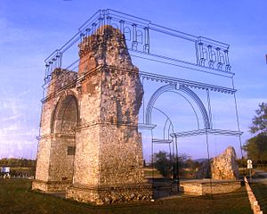

## Place-based Interpretation with Locative Augmented Reality

 _This section is under development_. 

Augmented reality is the use of various technologies to overlay data onto one's visual or aural perception of the environment. Augmented reality does not need to be a digital technology - it can be as simple as a sheet of plexiglass/perspex framing a view of an archaeological site, etched so that the 'missing' structure(s) can be seen, as at Carnuntum in Austria.

(Image Wikimedia Commons, by user [Gryffindor](https://commons.wikimedia.org/wiki/User:Gryffindor))

Augmented reality does not need to be a visual technology, either. @poole_2018 demonstrate a use of audio-based augmented reality to create 'soundpools' or areas of physical space that trigger a 'time radio' into playing snippets of overheard conversations and soundscapes that are combined with a choose-your-own-adventure game mechanic. Called 'Ghosts in the Garden', the experience was meant to give visitors to a historic site the tools for constructing their own understanding of the place. 

<iframe width="560" height="315" src="https://www.youtube.com/embed/MsbBkcfdmbw" frameborder="0" allow="autoplay; encrypted-media" allowfullscreen></iframe>

@poole_2018 define three major uses for augmented reality in the context of heritage places:

> as an augmented guidebook and information resource, as a tool for enhanced simulation, and (less frequently) as a tool for changing the rules by which we construct and define historical knowledge at heritage sites.

Most archaeological applications of AR tend to fall into those first two categories, although there are individuals and teams who are pushing the boundaries. Consider the following two videos which were winning entries in the [HeritageJam](http://www.heritagejam.org/) at York University in recent years: 

https://youtu.be/wAdbynt4gyw
<iframe width="560" height="315" src="https://www.youtube.com/embed/wAdbynt4gyw" frameborder="0" allow="autoplay; encrypted-media" allowfullscreen></iframe>

https://youtu.be/Y_yE-TkDn5I

<iframe width="560" height="315" src="https://www.youtube.com/embed/Y_yE-TkDn5I" frameborder="0" allow="autoplay; encrypted-media" allowfullscreen></iframe>

The first uses an aural AR approach to challenge our understanding of the space of a cemetery, while the second uses AR to enhance our archaeological eye for the purposes of research and study. Both of these approaches require a fair degree of technical fluency and require constant maintenance as platforms and devices cycle through their planned obsolescences.

Augmented reality currently requires the user to hold a smartphone or some other device to enable the 'magic' to happen. An effective experience then should account for the *why* of the device. Why are you looking through it at a page, or a bill board, or a magazine, or what-have-you? It’s not at all natural. The various headset devices like the Oculus (when in see-through mode) or the Hololens are an improvement, in that they free the hands. In _Ghosts in the Gardens_ experience, this problem of the device becomes part of the story, and so the break-in-presence that a smartphone might create is avoided. The device _feels right_. The device helps the visitor _hear_ beyond the confines of this world.
 
Without the clear coupling of story with the device, the AR is just a gimmick. It’s somehow not authentic. It may well be that this is one of the reasons various museum apps that employ AR tricks haven’t really taken off. The corollary of this observation is that AR can’t be divorced from the tools and techniques of game based storytelling (see the sections [on archaeogaming](archaeogaming.html) and on [virtual archaeology](virtual-archaeology.html)).

> The frightening news is that we are living in a story. The reassuring part is that it’s a story we’re writing ourselves. Alas, though, most of us don’t even know it – or are afraid to accept it. Never before did we have so much access to the tools of storytelling – yet few of us are willing to participate in their creation.

– @rushkoff_2005, 415

'Ghosts in the Garden' also makes us think of hauntings. A number of years ago, Mark Sample developed a kind of game that intersects with augmented reality in the way it integrated the idea of 'heteropia', called 'Haunts':

> Haunts is about the secret stories of spaces.

> Haunts is about locative trauma.

> Haunts is about the production of what Foucault calls “heterotopias”—a single real place in which incompatible counter-sites are layered upon or juxtaposed against one another.

> The general idea behind Haunts is this: students work in teams, visiting various public places and tagging them with fragments of either a real life-inspired or fictional trauma story. Each team will work from an overarching traumatic narrative that they’ve created, but because the place-based tips are limited to text-message-sized bits, the story will emerge only in glimpses and traces, across a series of spaces.

– @sample_haunts_2010

So much about what we find in archaeology is about trauma. Houses burn down: archaeology is created. Things are deliberately buried: archaeology is created. Materials are broken: archaeology is created.

Sample’s _Haunts_ then provides a potential framework for doing one kind of archaeological AR. He goes on to write:

> The narrative and geographic path of a single team’s story should alone be engaging enough to follow, but even more promising is a kind of cross-pollination between haunts, in which each team builds upon one or two shared narrative events, [exquisite corpse](http://en.wikipedia.org/wiki/Exquisite%20corpse) style. Imagine the same traumatic kernel, being told again and again, from different points of views. Different narrative and geographic points of views. Eventually these multiple paths could be aggregated onto a master narrative—or more likely, a master database—so that Haunts could be seen (if not experienced) in its totality.

From simple overlays to exquisite corpses, the full possibility of augmented reality has not even been scratched yet; but the simple problem of _the device_ is currently the single greatest impediment to archaeological augmented reality. That is to say, any experience has to either explicitly or implicitly make the case for **why** this device. A powerful story can be one way. Another way can be to remove the device altogether from the hands of the user.

### Projection Mapping

Projection mapping is a kind of AR that uses digital video projectors and specialized software on your computer to block out areas of light so that the different areas show different videos or images at the same time. Instead of a rectangle of light, one can 'map' the boundaries of the projection areas to match the architecture of a building facade (for example). Other terms for this include 'spatial augmented reality' or 'video mapping'.

The artist [Craig Winslow](http://craigwinslow.com/work/lightcapsules/) used the technology to bring the faded historic signage of Winnipeg's downtown back to life. History MA student Cristina Wood used it to reintroduce the social history of a district of the City of Ottawa into the massive construction site it has since become in [Picturing Lebreton Flats](http://picturinglebretonflats.ca), using the open source [Mapmap](https://mapmapteam.github.io/) toolkit. While Mapmap can be a bit fiddly to install, using it is similar in concept to inserting media into a powerpoint presentation. One defines areas of the projection into which one can insert video, images, and sound. The projection areas can be dragged and distorted to align with the architecture onto which one is projecting. Once everything is aligned, it can be locked in place. Then, when it is time to perform the projection mapping, one just has to set the projector back in place and hit play. 

An android app by the projector manufacturer Optoma, ["optoma projection mapper""](https://play.google.com/store/apps/details?id=com.reotek.projectionmappergoogle&hl=en_US) can be more intuitive to use when starting out, but we note that the support website for this app no longer resolves and so we cannot endorse this product, although we have used it in our teaching.

### exercises

1. The best introduction to producing augmented reality is currently Jacob Greene's [Creating Mobile Augmented Reality Experiences in Unity](https://programminghistorian.org/en/lessons/creating-mobile-augmented-reality-experiences-in-unity#setting-up-unity-for-ar-development) at the [Programming Historian](https://programminghistorian.org). In this tutorial, he demonstrates how to use the built in features of the [Unity 3d](https://unity3d.com) game engine to create smartphone AR applications. Complete the tutorial, and then extend the application by adding 3d models (there are creative-commons licensed models at [Sketchfab](https://sketchfab.com) in their 'cultural heritage' category) to it. **Be explicit** about the story, the framing, so that you can address the question of _why this device_.
2. The interactive fiction engined [Twine](https://twinery.org) can be hacked to create webpages that only display certain text passages or audio or images if the user is standing in a particular location. See the [Twine Cookbook's](https://twinery.org/cookbook/) 'Geolocation' section. A walk through of using this feature is [here](https://github.com/shawngraham/ar-archaeology/blob/master/workshop%20materials/Hacking%20Twine%20to%20make%20a%20location-based%20game.md). Play with this to plan out a hand-held guide to your campus.

