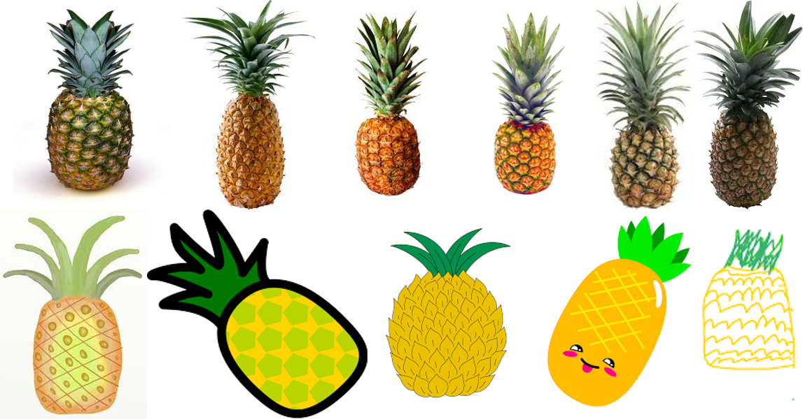
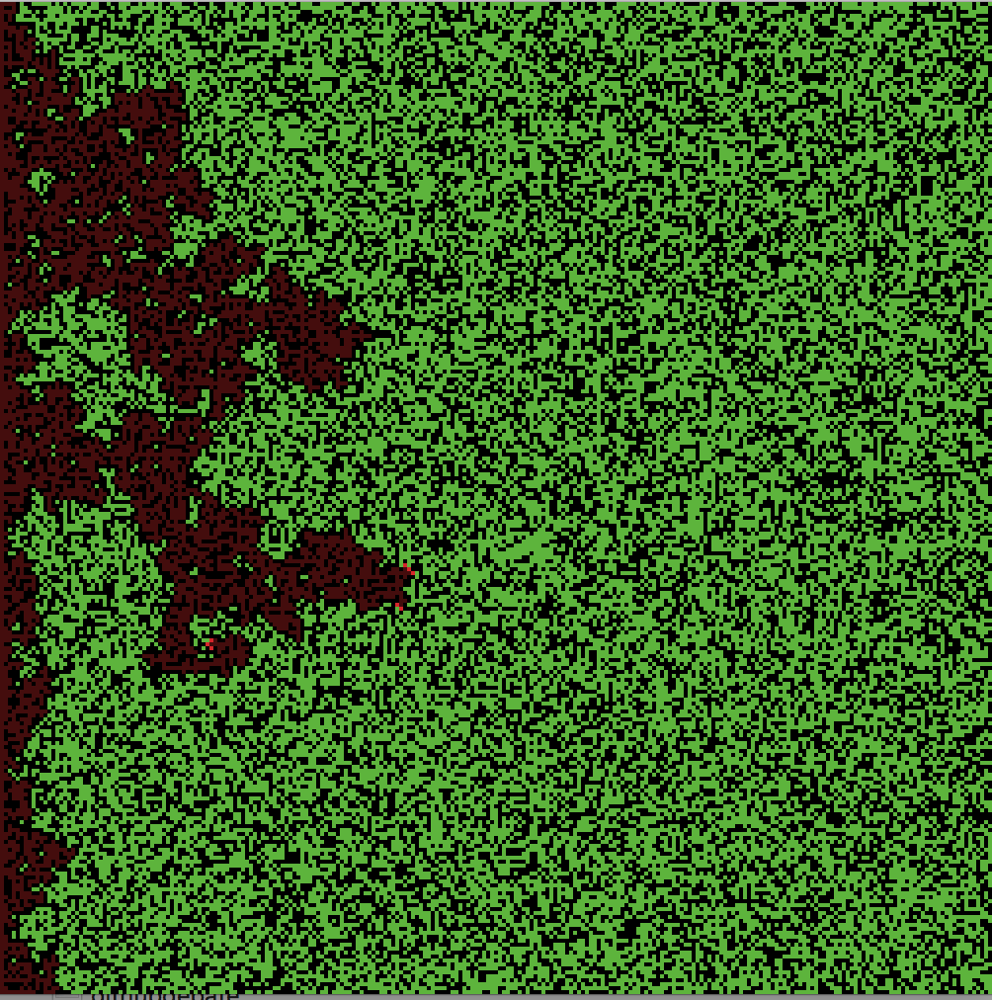
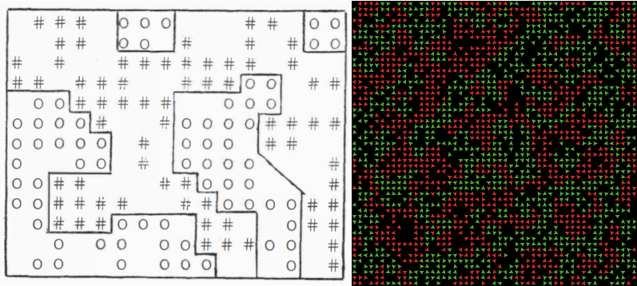
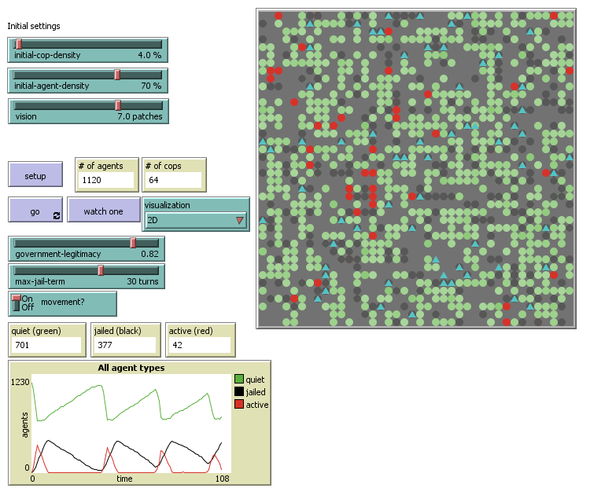
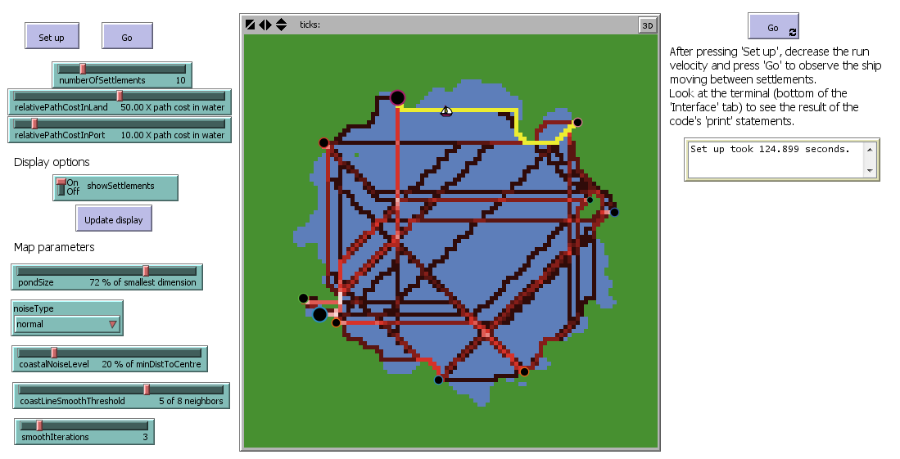
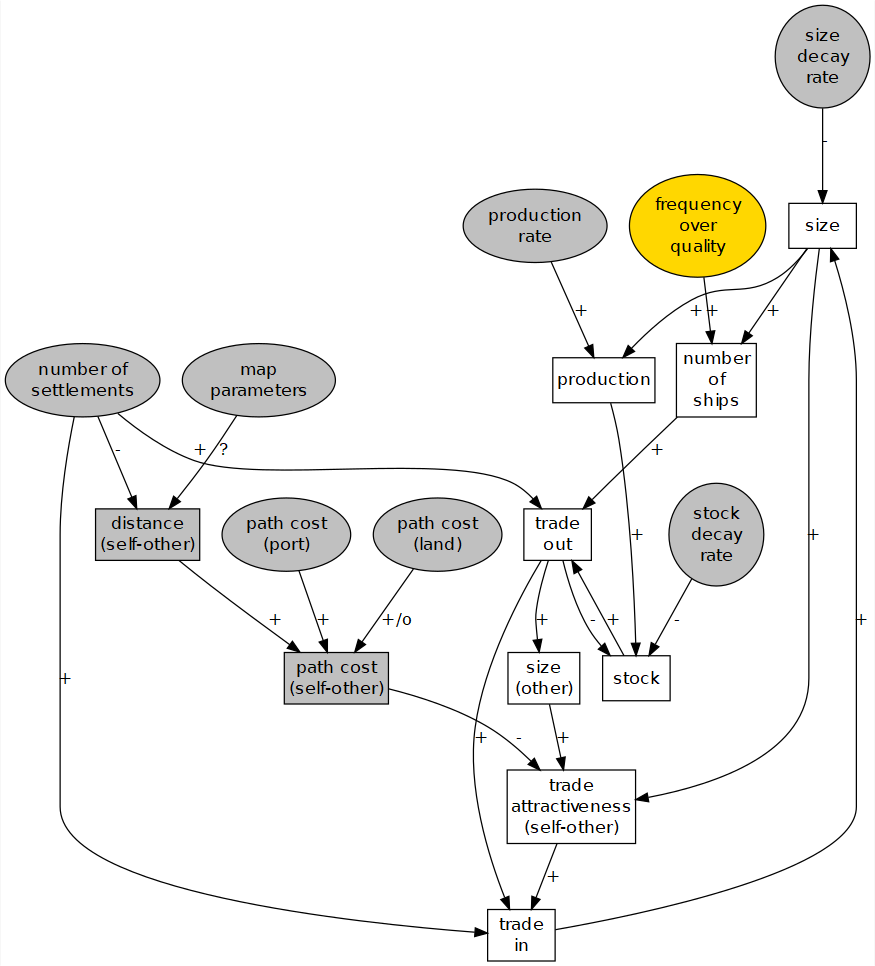
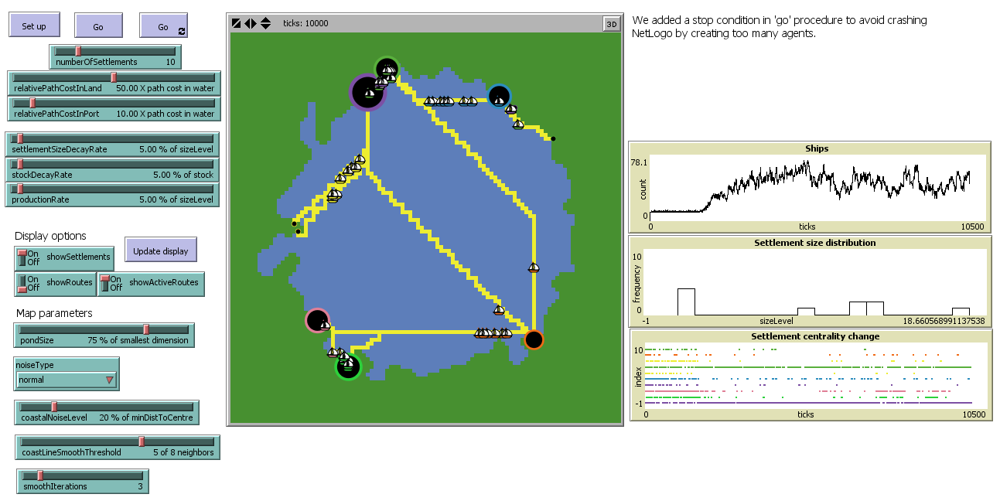
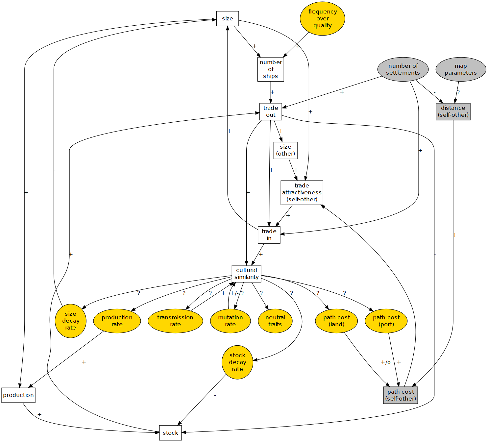
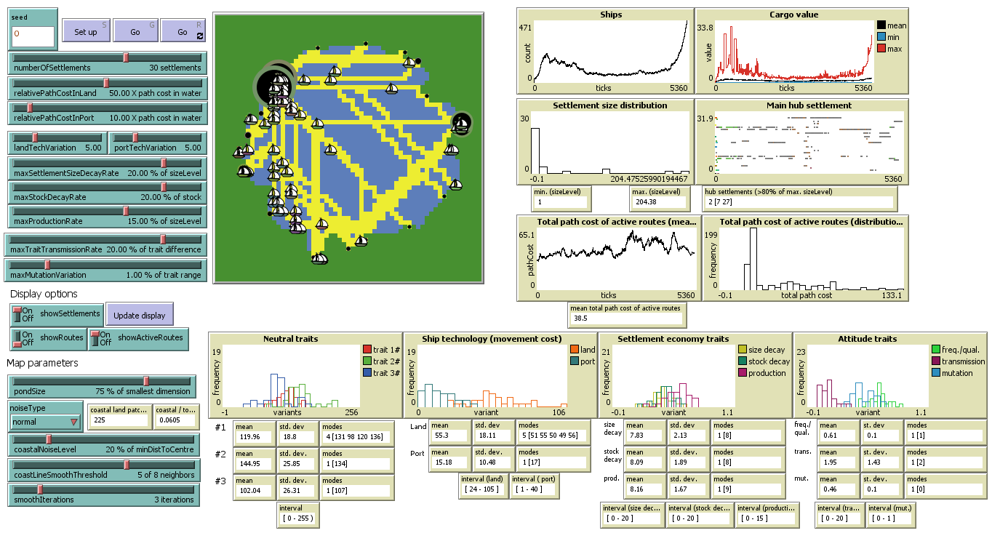
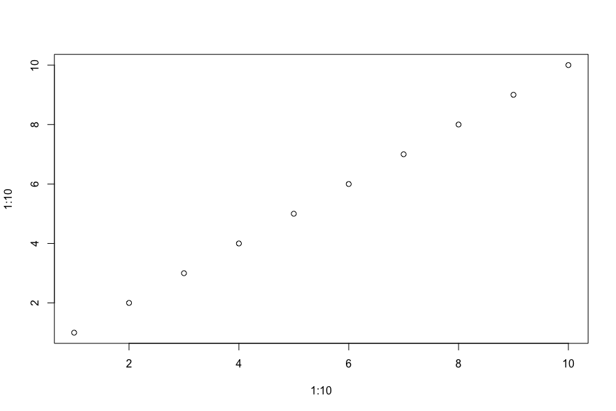

## Artificial Intelligence in Digital Archaeology

To speak of 'artificial intelligence' in archaeology may be to speak too soon yet. We do have machine learning in the service of archaeology (neural networks for classificatory purposes, for instance), and there is a well-established body of work in terms of simulation that could fall under the rubric of 'artificial intelligence'.

Then why use the term? We think it is still useful to use the term because it reminds us that, in using computational power for simulation or image classification we are off-loading some of our expertise and abilities to a non-human actor. In the case of machine learning and neural networks, we really *can't* see inside the 'black box'. But we can examine the training data, for it is in the selection of training data that we introduce biases or agendas into the computation. By thinking of the machine in this case as something non-human, our hope is that we remind you to not accept the results or methods of AI in archaeology blindly, as if the machine was not capable of racist or colonialist results.

Machine learning: a series of techniques that endeavour to train a computer program to identify and classify data according to some previously determined values. We will in this chapter discuss image recognition using the neural network model trained by Google, the Inception3 model, which we will query using the Tensorflow package.

Agent based simulation: a series of techniques that create a population of software 'agents' who are programmed with contextual rules (*e.g.*, *if this happens, do that*) governing the behaviour of individual agents. The context can be both in terms of the simulated environment (GIS data, for instance) or the social environment (social relationships as a network).<!---The simulation iterates--> Simulation experiments iterate over multiple combinations of parameters' values<!---an entire landscape of possible variables-->, <!---creating--> the 'behaviour space'. <!---which is--> Simulation results are then used by the investigator to <!---understand the emergent behaviour in the situation, to understand better the possible range of situations that could account for the observed phenomenon in the 'real world'--> explain the 'real world' phenomenon as an emergency of a population of agents following a set of rules under certain situations.

The value of machine learning: it makes us think carefully about what we are looking for and at in the first place; and then it can be scaled massively.

The value of agent-based modeling: it forces us to think carefully about what it is we think actually *happened* in the past such that it can be <!---encoded as a series of individual-level instructions--> expressed as a series of contextual rules of behavior, functioning under certain conditions.


### Agent-based modeling (ABM)

<div class = rmdcaution> _This section is under development_. </div>

<div class = rmdnote> _Launch the [Binder on Agent-Based Modeling with Python](https://mybinder.org/v2/gh/o-date/abm/master)_. </div>

<div class = rmdnote> _Launch the [Binder for Agent-Based Modeling with Netlogo without the Netlogo GUI](https://mybinder.org/v2/gh/o-date/abm3/master)_. </div>

This section is an overview of agent-based modeling (**_ABM_**), as it is used within archaeology, anthropology, and behavioral sciences. Before tackling the "agent-based", we start with a brief introduction to what "modeling" means. To place ABM in a bigger picture, we introduce the reader to several dimensions of the variability of simulation models. We describe the necessary and optional parts of ABM models, including their characteristic type of element, i.e. the agent. At this point, the student must be aware that _**simulation models**_ in our context involve computer code (they are *digital*) and the iteration of processes (they are *dynamic*).

Following the definition of ABM, we describe the process of creating a model or *formalizing* an informal model. This process can be divided into seven phases: *definition*, *design*, *implementation*, *verification*, *validation*, *understanding* and *documentation*. In explaining all modeling tasks, we aim to keep instructions general enough for them to be valid for most approaches, theoretical backgrounds, and platforms or programming languages.<!--<TO BE DONE.>Next, we cover the *why* and *how* of the application of ABM in archaeology, history, and social sciences. We discuss some key foundational works, including models that predate the development of ABM as it defined today. Specifically regarding archaeological applications, we illustrate the diversity of ABM approaches by presenting several examples of models with varying goals, spatial and temporal scales, and theoretical backgrounds.-->Last, we present a set of exercises to introduce the practical aspects involved in creating and using ABM models. 

Throughout this section, several concepts will probably sound *alien* for most history and archaeology students; and some may remain obscure long after completing this lesson. Beyond any practical application, ABM has strong roots in mathematics and logic. _**Don't panic!**_ Most ABM modelers don't go through formal introductions nor are well-versed in algebra and calculus. As in most digital approaches in humanities and social sciences, ABM is mostly done by self-taught experts with hybrid and tortuous academic profiles. Also, because ABM modellers in archaeology are not often computer scientists, the community lacks conventions about how to communicate models and simulation results, though proposals do exist [*e.g.*, the **_ODD_** document, see @Grimm2006; @Grimm2010; @Muller2013]. Disclaimer: the modelling strategy explained here is highly focused in theory-building (general, explorative), not hypothesis-testing and prediction (specific, data-driven). In this sense, the content of this section should NOT be considered the standard among the ABM-archaeology community.

To the date, there is no easy way to begin doing ABM. We encourage students to engage in modelling the sooner, the better, by following our exercises, other tutorials, or trying to develop their interests, research questions, and creative anxieties. The full comprehension of ABM will require years of practice and transdisciplinary readings; certainly, a greater mastery in programming.

Despite the rarity of ABM in history and archaeology mainstream curricula, there are many publications that offer introductions to ABM in archaeology, writen by authors with different backgrounds and perspectives [*e.g.*, @Breitenecker2015; @Cegielski2016; @Romanowska2015]; also visit [_The ABM in Archaeology Bibliography_](https://github.com/ArchoLen/The-ABM-in-Archaeology-Bibliography), for an extensive and constantly updated list of references. As a source of examples and former experiences, the student can find a variety of archaeology/ABM-related articles in academic journals such as [Journal of Archaeological Method and Theory](https://link.springer.com/journal/10816), [Ecological Modelling](https://www.journals.elsevier.com/ecological-modelling), [Journal of Artificial Societies and Social Simulation](http://jasss.soc.surrey.ac.uk/JASSS.html) (OPEN), [Proceedings of the National Academy of Sciences](https://www.pnas.org/) (OPEN), [Journal of Archaeological Science](https://www.journals.elsevier.com/journal-of-archaeological-science), [Journal of Anthropological Archaeology](https://www.journals.elsevier.com/journal-of-anthropological-archaeology), [Structure and Dynamics](https://escholarship.org/uc/imbs_socdyn_sdeas), [Human Biology](https://digitalcommons.wayne.edu/humbiol/).

#### ABM as modeling and simulation

>"Essentially, all models are wrong, but some are useful"  
>George Box, 1987  
>@box1987empirical, p. 424

The first thing to consider is that ABM is about models. *A model is a representation of a phenomenon as a set of elements and their relationships*; the key term being *representation*. It is a generalization/abstraction/simplification of what we consider as *THE* phenomenon. 

Think about a pineapple. The mental representation of the phenomenon, "the pineapple", is already a model. It consists of a set of traits or visual cues, and their relative positions (*e.g.*, crown of spicky leafs on top, thorns covering the oval body). Empirically, every pineapple has different visual properties, but we still are able to identify any pineapple we encounter by using this model.



Another important statement about models is that they are, as any mental process, a phenomenon in its own right. That puts us in the realm of epistemology and cognitive sciences. It follows that one's model is *a* model and that there are many models representing a phenomenon as there are minds that recognise this phenomenon. Observe the diversity of pineapple drawings. 

Adding further complexity to this picture, minds are constantly changing with the integration of new experiences (creating, modifying, merging, and forgetting models) and we often exchange and contrast alternative models through expressing them to ourselves and others. As the last straw of confusion, the ability for communicating models give them the status of *'material objects'*, with a *existence* of their own, reproduced through learning, checked by the clash of new experiences, and in perpetual change through innovation and creativity. For example, a child with little or no experience with the 'real pineapple' is able to learn (and graciously modify) a model of pineapple.

Well, what do pineapple drawings have in common with doing models in archaeology? You may imagine that, if your mental representation of a pineapple is a model, human minds are bursting with models about everything, including *models of models*, *models within models*, and *models of ourselves*. If an archaeologist, there will be many archaeologically-sensitive models buried deep inside such mental apparatus. 

>"Why did people in this site buried food remains in small pits?" 

>"They wanted to avoid attracting critters."

>"They did not stand the smell of decomposition."

>"One person with high status started doing it and them the rest just followed."

>"They were offering sustainance to the land spirit."

These explanations derive directly from models of *why people behave as they do*. Often tagged as *social* or *behavioral*, this kind of model is as omnipresent in archaeology as it is neglected. Given that archaeological practice orbits around materials, archaeologists tend to relegate social models to a second plane, as if the goal is actually to understand the material remains of human behavior rather than the behavior itself. More importantly, many archaeologists are hardly cognizant that they are using social models even when being avowedly 'non-theoretical'.  

Another common practice is to present authoritative models as 'mantras' while unconsciously hidding the models used. Social models are indeed more permeable to *personal*, *subjective* perspectives (in contrast with a model of stratification, for example) because we use them daily to interact with others, aside of archaeological affairs. Thus, they are strongly moulded to our life experiences and beliefs, which vary depending on many socio-cultural factors, including those less obvious such as age and gender. Even though there are shared traits between them, these models are as many and diverse as pineapple drawings.

Why bother then doing formalized models in our research?

Ultimately, we are searching for knowledge, statements with at least some *value of truth*, independent of any individual. Remember that models of a phenomena, as diverse they may be, are contrasted with experiences of that phenomena, which are much less variable. As George Box's famous phrase states, models are NOT equivalent reproductions of a phenomenon, but tools for observing and interacting with it. What we could define as *imaginative models*, such as the smiling pineapple, though still able to exist for other purposes, can be clearly distinguished from models with *some degree of truth*, because they fail to match our sensible experience and are incompatible with other successful models. Those that cannot be distinguished, should be considered *valid*, *competing* models; their study, validation, and improvement being the main goal of scientific endeavours.

Unfortunately, models involving human behavior are less straightforward to validate or dismiss than a "smiley pineapple". Still, when having many competing models, progress can be made by ordering them by 'probability of being true', following many criteria. A warning though: almost-certain models might be eventually proven false, and marginal (even discredited) models can end up being mainstream. To be alive (read, _useful_) models must be communicated, used, re-used, abused, recycled, hacked, and broken. A well-documented model, preserved in many locations and formats, could as easily be considered *hibernating*, awaiting new evidence for validation or a new generation of scholarship.

Models are not only inevitable for any living mind, but they are also the keystone for the generation of knowledge. However, if models can be so simple, spontaneous, and intuitive as a pineapple drawing, what is the need of doing strange models with complicated equations, painstaking specifications, and fathomless designs? Archaeologist use models to define their research agenda and guide their interpretations. A lot of ink has been spilled in presenting, discussing, and revisiting archaeological and archaeologicaly-relevant models. Nonetheless, few of these works are able to define unambiguosly the model(s) in question, not because they lack in effort but due to the intrinsic limitation of the media objectifying the model: human, natural, verbal language. 

For example, we may write a book on how we believe, given known evidence, that kinship relates to property rights among, say, the Armenians contemporaneous to the Early Roman Empire. Our reasoning and description of possible factors can be lengthy and impeccable; however, we are bound to be misunderstood at some point, because readers may not share the same concepts and certainly not all connotations that we may have wanted to convey. A significant part of the model in our minds would be writen between the lines or not at all. Depending on their background, readers can potentially miss altogether that we are referring to *a model*, and consider the elements of our model as loose speculations or, worse, as given facts.

Formal models, or rather *formalizing* informal models, reduce ambiguity, setting aside part of the risk of being misunderstood. In a formal model everything must be defined, even when the elements of our model are still abstract and general. Our imaginary book about ancient Armenians could be complemented with one or several formal models that crystalize the main features of our informal model(s). For instance, if our informal model about property inheritance includes the nuclear patriarchal family as the main kinship structure, we must define it in *null* terms, explaining to ourselves and to others what "family", "nuclear", and "patriarchal" means, at least in the context of our model. _Does a model assume that family implies co-habitation? Does our model consider adopted members? What happens if a spouse dies?_ As it is often the case, we may end up changing our informal model through the effort of formalization; by realizing, for example, that we can replace "patriarchal" with "patrilineal" because our model does not assume a particular power structure within families.

Formalization often demands the use of formal logic and to some extent, quantification. Seen from the perspective of the human natural language, mathematics and logic contain lots of repetitions, fixed vocabulary, and no nuances. Nevertheless, computational systems function strictly with this kind of language, and they are both empowered and limited by it.

A formal definition is a disclaimer saying: *"This is what X means in this model, no more, no less. You can now criticize it at will."* Without the formal definition, we would probably spend a chapter reviewing everything we read and thought about "nuclear patriarchal family" and still would not "be at the same page" as all our readers. The terms on which we define a model are its *assumptions*. At any point, new evidence or insight can suggest us that an assumption is unjustified or unnecessary, and we may change it or remove it altogether.

The power of simulation emerges from the elaboration and exploration of the consequences of these rigorous formal definitions. @Epstein2008 perhaps put it best:

> The first question that arises frequently—sometimes innocently and sometimes not—is simply, "Why model?" Imagining a rhetorical (non-innocent) inquisitor, my favorite retort is, "You are a modeler." Anyone who ventures a projection, or imagines how a social dynamic—an epidemic, war, or migration—would unfold is running some model.
> But typically, it is an implicit model in which the assumptions are hidden, their internal consistency is untested, their logical consequences are unknown, and their relation to data is unknown. But, when you close your eyes and imagine an epidemic spreading, or any other social dynamic, you are running some model or other. It is just an implicit model that you haven't written down...
> This being the case, I am always amused when these same people challenge me with the question, "Can you validate your model?" The appropriate retort, of course, is, "Can you validate yours?" At least I can write mine down so that it can, in principle, be calibrated to data, if that is what you mean by "validate," a term I assiduously avoid (good Popperian that I am). 
>The choice, then, is not whether to build models; it's whether to build explicit ones. In explicit models, assumptions are laid out in detail, so we can study exactly what they entail. On these assumptions, this sort of thing happens. When you alter the assumptions that is what happens. By writing explicit models, you let others replicate your results.

Modeling, including ABM, can sometimes be seen as implying prediction; for archaeology, prediction might very well be the least useful thing that a formalized model might do. Instead, as @Epstein2008 lists, there are many reasons to model:

> Explain (very distinct from predict)
> Guide data collection
> Illuminate core dynamics
> Suggest dynamical analogies
> Discover new questions
> Promote a scientific habit of mind
> Bound (bracket) outcomes to plausible ranges
> Illuminate core uncertainties.
> Offer crisis options in near-real time
> Demonstrate tradeoffs / suggest efficiencies
> Challenge the robustness of prevailing theory through perturbations
> Expose prevailing wisdom as incompatible with available data
> Train practitioners
> Discipline the policy dialogue
> Educate the general public
> Reveal the apparently simple (complex) to be complex (simple)

Not everything on that list may apply to archaeology, but nevertheless, the list opens up the possibility space for archaeological simulation. See for instance Vi Hart and Nicky Case's [Parable of the Polygons](https://ncase.me/polygons/), which implements Schelling's 1971 Segragation Model [@schelling1971, see also Exercise 2 in this section] which showed how even minor expressions of preference could lead to segregated neighborhoods. Hart and Case's 'playable post' implements the model interactively in the browser, and uses engaging graphics to communicate the dynamic to the public. An archaeological agent based model similarly deployed could be an excellent public archaeology intervention.

#### Agent-based models and their key elements

ABM can be broadly understood as a way of modeling a phenomenon by modeling its constituents parts. Therefore, ABM involves the expectation that the phenomenon at the macro-level is an *emergency* of the dynamics at the micro-level. Moreover, ABM implies that the parts, the agents, constitute 'populations', *i.e.* they share common properties and behavioral rules. 'Agent' also implies a certain autonomy with respect to other agents and the environment, which justifies simulating their behavior at an individual level.

In practice, 'autonomy' often translates as the agents' ability to take action, to move, to decide, or even think and remember. Nevertheless, agent-based models also include entities that are *technically* agents (on the terms of [multi-agent systems](https://en.wikipedia.org/wiki/Multi-agent_system)), but lack those abilities or are not considered real discrete entities. The most common case is to represent sectors of space as agents fixed to unique positions in a grid to facilitate the implementation of distributed spatial processes (*e.g.*, the growth of vegetation dependent on local factors). In NetLogo, this type of agent is pre-defined as `patches` and is extensively used in models in ecology and geography.

Compared to other modeling and simulation approaches, ABM is more intuitive but also more complex. For example, the [Lotka-Volterra predator-prey model](https://en.wikipedia.org/wiki/Lotka%E2%80%93Volterra_equations) in ecology is a pair of differential equations that are relatively simple and conceptually straightforward.

>more prey -> more predators will survive and reproduce
>more predators -> less prey will survive and reproduce
>less prey -> fewer predators will survive and reproduce
>fewer predator -> more prey will survive and reproduce

The same model can also be implemented with ABM (see the comparison in [NetLogo's Model Library Wolf-Sheep Predation (Docked Hybrid)](http://ccl.northwestern.edu/netlogo/models/WolfSheepPredation(DockedHybrid))). The ABM implementation requires many additional specifications on how predator and prey agents should behave individually. These specifications both help the model to be more 'intuitive' or 'realistic' and complicate the model design and implementation significantly, even though generating the same aggregate dynamics of the equation-based version (*i.e.*, oscillations).

Another important and distinctive aspect of agent-based models is that they are unavoidably *stochastic*. By definition, the order in which agents of a type perform their processes should not be predefined and, overall, should not be the same followed every iteration of the model. The only unbiased way of *scheduling* agents processes is to randomize all sequences using a [pseudorandom number generator](https://en.wikipedia.org/wiki/Pseudorandom_number_generator). This technique is also used to create variation within a population of agents, *i.e.* drawing the value of an individual property from a probability distribution.

#### How do we model with ABM?

Although the reality is messier, this process can be divided into *definition* of research question and phenomenon, *design*, *implementation*, and *verification*. *Validation*, which is considered a fifth step by most of the modeling literature, is regarded here as an extra, lengthy process, often separable from the tasks involved in creating and exploring a model. Furthermore, we introduce two additional steps that are not normally acknowledged: *understanding* and *documenting* the model. In explaining all modeling steps, we keep instructions general enough for them to be valid when dealing with any platform or programming language.

In simple terms, building a model involves the following steps.
- Define hypotheses, questions or simply the phenomenon of interest (identify the system)
- Define the elements and processes (you believe are) required to address the system (model the system). mention paradox Occam's razor vs. emergence
- Express the chosen elements and processes as computer code (implement the model)
- Modeling is a process of constant iteration. Each stage is an iteration loop that is often repeated several times before jumping into the next step.  The end result of development and exploration of a model may be relatively stable, often in the form of publications. However, this product potentially feeds a new  modeling effort (and that is actually the main usefulness of models in the long run).

<!--
#### ABM in Archaeology and Social Sciences

- Emergence... Life game, deterministic chaos [@Epstein1996; @Epstein1999]
- Saving the gap between atomism and holism, or individual and social structure
- Virtual laboratory for social sciences
- Examples [@Axtell2002]
- Mention the cycles of enthusiasm and skepticism, and the tendency to develop closed circles
- Challenges and pitfalls
-->
#### Exercises

We propose a set of exercises for introducing the practicalities of ABM. As to enable the student to understand model implementations in multiple platforms and programming languages, these exercises include references to code in [Python 3](https://www.python.org/)<!--, R,--> and [NetLogo](https://ccl.northwestern.edu/netlogo/) [@Wilensky1999].

Exercises are neither exhaustive nor exclusive and we encourage the search for other materials that may delve deeper on students' interests. There are many sources of modelling examples available online, such as [OpenABM by CoMSES network](https://www.comses.net/), NetLogo's [Official](http://ccl.northwestern.edu/netlogo/models/) and [Community](http://ccl.northwestern.edu/netlogo/models/community/) Models Libraries, and [Modeling Commons](http://modelingcommons.org). We also recommend visiting the Jupyter Notebook by Shawn Graham that uses an agent-based model written in Python as the basis for an exploration of computational creativity (see the 'Worldbuilding' subfolder in [this repository](https://github.com/o-date/creativity2)). Ben Davis' [Agent-based modelling of prehistoric landscape use with R and NetLogo](https://benmarwick.github.io/How-To-Do-Archaeological-Science-Using-R/agent-based-modelling-prehistoric-landscape-use-with-r-and-netlogo.html) gives a well-documented example of ABM applications for archaeology that goes beyond representing social dynamics.

Exercises 1-3 present classical examples of ABM (**_Forest Fire_**, **_Schelling's Segregation_**, and **_Epstein's Civil Violence_** models) referring to their implementations using [mesa](https://github.com/projectmesa/mesa), a Python-based framework (mesa-Python, from now on). These implementations can be executed using the online Jupyter Notebook offered in [ODATE main web page](https://o-date.github.io/support/notebooks-toc/) or directly in [binder](https://mybinder.org/v2/gh/o-date/abm/master). These exercises are not complex, but require a minimal knowledge of Python (or similar [object-oriented programming](https://en.wikipedia.org/wiki/Object-oriented_programming) languages) to be fully understood.

Exercise 4 presents the **_Pond Trade_** model, designed specifically to showcase many elements common in ABM applications in archaeology. This model is inspired by the theme of emergence and collapse of territorial cultural integration by means of material exchange. The tasks of designing and programming was intentionally broken down into smaller, progressive steps to illustrate an organized pace of code development, from simple to increasingly complex algorithms. The Pond Trade model and all its versions are in [this repository](https://github.com/Andros-Spica/PondTrade) and can be downloaded and executed using a local NetLogo installation. The exercise assumes no previous programming knowledge, but practice with NetLogo's language and interface is required to fully understand the code of the advanced versions of the model. Please do consider the [binder for Agent-Based Modeling with Netlogo without the Netlogo GUI](https://mybinder.org/v2/gh/o-date/abm3/master)_.

Notes for all exercises:
- 'Random' ('randomized', etc.) refers to drawing values within a predefined range, using a uniform probability distribution, when not specified otherwise.
- In NetLogo, 2D grid cells or positions are defined explicitly as a special kind of agent (`patches`).
- 'Neighborhood' refers to cells around a reference cell in the context of a 2D orthogonal grid. It is used often to refer specifically to the eight cells including diagonals ([Moore neighborhood](https://en.wikipedia.org/wiki/Moore_neighborhood)).
<!--
SG: code chunks didn't render correctly through the bookdown generation process, which is baffling. check the original bookdown book for how to sort this out. removed the executable code chunk, put it into a different script, ran it, copied the output here. this is not optimal.

AA: didn't find anything useful about that...  Anyhow, I can continue by loading images and leaving r chunks as generic code

TO DO CHALLENGE: get R code for plots/diagrams to compile in the server instead of using image files
{r, echo = FALSE}
library(DiagrammeR)
grViz("diagrams/4-4-abm-pondTradeConcept-start.dot")


If you choose to modify models code directly with Binder in your Internet browser, watch out the active user timeout. A possible work around is to copy the entire code to a local editor (save it in a local file) and then paste it back. NEED TO TEST HOW SAVING WORKS IN BINDER
-->

##### Exercise 1: Forest Fire Model

Forest Fire is a model representing the spread of a fire in a forest, depending particularly on the density of trees. It is one of the models that illustrate the concepts behind the [percolation theory](https://en.wikipedia.org/wiki/Percolation_theory) in physics. This model is one of the curricular models for ABM, and it holds the core mechanism of most diffusion models in both natural and social sciences.

The mesa-Python version used in our Jupyter Notebook is available in [ODATE repository](https://github.com/o-date/abm/tree/master/forest_fire) (see also original in [mesa repository](https://github.com/projectmesa/mesa/tree/master/examples/forest_fire)). The student can also consult the [NetLogo](https://ccl.northwestern.edu/netlogo/) version called 'Fire' in [Modeling Commons](http://modelingcommons.org/browse/one_model/1624) or [NetLogo Model Library](http://ccl.northwestern.edu/netlogo/models/Fire), where there is also a more complex version of this model.

[](images/4-4-abm-fire-par57-optimized.gif)
<!--TO DO: include new ipynb file that runs the model once and shows the state of grid graphically. Instead of showing the NetLogo version-->
This model represents a set of trees (*agents*) distributed among positions in a 2D grid. Trees have three possible states: `"Fine"`, `"On Fire"`, and `"Burned Out"`. Every time step trees check if they are `On Fire`, in which case they will set on fire all adjacent trees that are `Fine` and update their state as `Burned Out`. This model considers the eight adjacent grid cells surrounding the agent ([Moore neighborhood](https://en.wikipedia.org/wiki/Moore_neighborhood)).

In "`forest_fire/agent.py`", lines 27-35:

```{python, eval = FALSE, python.reticulate = FALSE}
def step(self):
  """
  If the tree is on fire, spread it to fine trees nearby.
  """
  if self.condition == "On Fire":
    for neighbor in self.model.grid.neighbor_iter(self.pos):
      if neighbor.condition == "Fine":
        neighbor.condition = "On Fire"
    self.condition = "Burned Out"
```

The cycle of the model involves solely on messaging agents to run their cycle in a random order (*i.e.*, *schedule*). In "`forest_fire/model.py`", lines 15-61:

```{python, eval=FALSE, python.reticulate = FALSE}
def __init__(self, height=100, width=100, density=0.65):
  ### <skiped code>
  self.schedule = RandomActivation(self) ### this line initialize the class object that randomizes the order of agents steps
  ### <skiped code>
        
def step(self):
  ### <skiped code>
  self.schedule.step() ### this line orders agents to execute their own "step"
  ### <skiped code>

```

Note that this design assumes that burning and spreading take the same amount of time (*i.e.*, a "step" of the model). Possible ways of further developing this model could be by extending the duration of burning relative to spreading. As a challenge, try to modify the model, so it takes five times more to burn out a tree than for fire to spread. Hints: (1) you should modify at least the class `TreeCell` (agent); (2) declaring a new parameter inside the class `ForestFire` would be the best practice here; (3) this challenge can be done by adding only **_four_** lines of code.

Although this model is agent-based, it is a derivation of another type of formal model, technically less developed, called [*cellular automaton*](https://en.wikipedia.org/wiki/Cellular_automaton) system. In cellular automata, the 'agents' are cells, entities that are fixed to a certain position on a 2D grid. Typically, such systems are expressable in relatively simple rules that regulate the state of an agent depending on the states of its 'neighborhood' of agents. One relatively famous (and playful) example is [Conway's Game of Life](https://en.wikipedia.org/wiki/Conway%27s_Game_of_Life) (see [mesa-Python version](https://github.com/projectmesa/mesa/tree/master/examples/conways_game_of_life)), which demonstrates how few and simple local rules can generate an immense richness of diversity of system behavior (*i.e.*, *emergence*). As a conceptual challenge, think on how the Forest Fire model could be designed as a cellular automaton. HINTS: (1) the ABM version involves less computation than a cellular automaton version - Why?.

##### Exercise 2: Schelling's Segregation Model

The Segregation model represents the dynamics of segregation in a very abstract but compelling manner. It was created by [Thomas C. Schelling](https://en.wikipedia.org/wiki/Thomas_Schelling), Nobel prize economist, in 1969 aiming to unravel the formation of racially mixed versus segregated neighborhoods in the United States [@schelling1971]. For this exercise, we recommend consulting the mesa-Python version ([ODATE repository](https://github.com/o-date/abm/tree/master/Schelling) or the original [mesa repository](https://github.com/projectmesa/mesa/tree/master/examples/Schelling)) and the [NetLogo](https://ccl.northwestern.edu/netlogo/) version ('Segregation' in [Modeling Commons](http://modelingcommons.org/browse/one_model/1466) or [NetLogo Model Library](http://ccl.northwestern.edu/netlogo/models/Segregation); see also other versions included in this library).

The model consists of individuals or households (*agents*) of two types ("races") occupying a position in a finite space and being able to move away if they are not satisfied with their neighborhood. Their satisfaction is given by the ratio of neighbors of the same type, concerning the level found acceptable (`homophily`), which is defined as a global parameter.

As in Forest Fire, the model cycle is to order agents to execute their cycle in a random order. The agent cycle comprises two processes: (1) count how many agents of the same type are present in the neighborhood ([Moore neighborhood](https://en.wikipedia.org/wiki/Moore_neighborhood)); (2) move to an empty cell if there are less similar neighbors than required by homophily.

In "`Sechilling/agent.py`", lines 26-36:

```{python, eval=FALSE, python.reticulate = FALSE}
def step(self):
  # FIRST PROCESS: counting similar neighbors
  similar = 0
  for neighbor in self.model.grid.neighbor_iter(self.pos):
    if neighbor.type == self.type:
      similar += 1

  # SECOND PROCESS: check if the number of similar neighbors is less than homophily,
  ## move if it isn't
  # If unhappy, move:
  if similar < self.model.homophily:
    self.model.grid.move_to_empty(self)
  else:
    self.model.happy += 1
```

The Segregation model is one of the oldest and most influential references in the ABM community. However, as the antecedents of the Forest Fire model, the original version of this model is a cellular automaton, where cells are habitat units (*e.g.*, houses, apartments) with three states: empty and two types of inhabitants. @schelling1971 started with an even simpler model, analyzing the mechanisms first in one dimension to then run simulations using 2D grids.


<!--TO DO: include new ipynb file that runs the model once and shows the state of grid graphically. Instead of showing the NetLogo version-->

The ABM implementations, though mostly equivalent, represent inhabitants explicitly as agents, which are conceptually more sound. The fully developed agent-based approach also allows for more flexibility; for instance, inhabitants can be placed in a continuous space instead of a 2D grid (*e.g.*, see another Python implementation in ['Quantitative Economics with Julia'](https://lectures.quantecon.org/jl/schelling.html)).

The model was able to produce insight in accord with other contemporary ideas within the general fields of [system dynamics](https://en.wikipedia.org/wiki/System_dynamics), [chaos theory](https://en.wikipedia.org/wiki/Chaos_theory) and [cybernetics](https://en.wikipedia.org/wiki/Cybernetics): (1) complex behavior can come from simple rules [*emergence*; see @Schelling1978] and (2) minimal differences at the individual level can resonate as great differences at the aggregated or collective level (*tipping point*). Specifically, Schelling found that, within this model, high segregation levels emerge even when individual preferences are quite tolerant of diversity in their neighborhood. Additionally, the model demonstrates that levels of segregation do not respond linearly to the level of tolerance of individuals. We recommend Vi Hart and Nicky Case's [Parable of the Polygons](https://ncase.me/polygons/) as a playful discussion on the logic and implications of this model.

In `Schelling/analysis.ipynb`, modify the parameters values in chunk 3, re-run chunks 3 to 7, and observe the effects in chunk 7 plot. This practice cannot be a systematic exploration of parameters. However, it is a useful way of getting familiar with the model behavior. 

As a programming exercise, try to expand the model by modifying "Schelling/model.py" in the Jupyter Notebook (NOTE: check the result by re-running `Schelling/analysis.ipynb`). Although we encourage the exploration of new ideas, start by conceptually simple additions, such as adding a third type of agent, changing the 'happiness' criterion to considering the number of neighbors of a different type, or having different homophily parameters for each type of agent. A further challenge is to replace the 'type' approach and differentiate agents using a continuous variable (*e.g.*, height).

##### Exercise 3: Epstein's Civil Violence Model

The Civil Violence model represents the dynamics of civil rebellion towards a central power acting through agents of policing and repression. It was created by [Joshua M. Epstein](https://en.wikipedia.org/wiki/Joshua_M._Epstein) [@Epstein2002], one of the most influential authors in the ABM community. This model also has a mesa-Python version ([ODATE repository](https://github.com/o-date/abm/tree/master/epstein_civil_violence) or the original [mesa repository](https://github.com/projectmesa/mesa/tree/master/examples/epstein_civil_violence)), to which we refer throughout this exercise. However, you may also consult the equivalent [NetLogo](https://ccl.northwestern.edu/netlogo/) version ('Rebellion' in [Modeling Commons](http://modelingcommons.org/browse/one_model/1472) or [NetLogo Model Library](http://ccl.northwestern.edu/netlogo/models/Rebellion); see also other versions included in this library).

Unlike the Segregation model, the Civil Violence model defines two types of agents that have qualitatively different properties and rules of behavior, `Citizen` and `Cop` agents. The `Citizen` agents, members of the general population, can be either rebellious (`"Active"`) or not (`"Quiescent"`). The `Cop` agents pursue and arrest rebel citizens. All agents occupy space and move in a 2D grid.


<!--TO DO: include new ipynb file that runs the model once and shows the state of grid graphically. Instead of showing the NetLogo version-->
The probability of a citizen to become rebellious depend on their current `grievance` ($G$), which increase with the level of `hardship` ($H$) they suffered and decrease with the `legitimacy` ($L$) they attribute to the central power.

$G=H(1-L)$

In "`civil_violence/agent.py`", line 60:

```{python, eval=FALSE, python.reticulate = FALSE}
self.grievance = self.hardship * (1 - self.regime_legitimacy)
```

As explained by @Epstein2002:

>For example, the British government enjoyed unchallenged legitimacy ($L=1$) during World War II. Hence, the extreme hardship produced by the blitz of London did not produce grievance toward the government. By the same token, if people are suffering (high H), then the revelation of government corruption (low L) may be expected to produce increased levels of grievance.

Besides their grievance, citizens decide to rebel depending on their perception of the current risk of being arrested (`arrest_probability` or $P$), which, in turn, depend on the ratio between cops and rebel citizens within the agent's radius of vision ($(C/A)_v$).

$P=1-exp(-k(C/A)_v)$

in "`civil_violence/agent.py`", lines 107-109:

```{python, eval=FALSE, python.reticulate = FALSE}
self.arrest_probability = 1 - math.exp(
  -1 * self.model.arrest_prob_constant * (
    cops_in_vision / actives_in_vision))
```

The parameter `arrest_prob_constant` ($k$) expresses the probability of a cop arresting a rebel citizen when there is only one of each ($C=1, A=1$).  

However, the model also considers that citizens may have different *intrinsic* inclination towards rebellion or taking risks (`risk_aversion` or $R$), which is a randomized property fixed at the start of the simulation. This property weights on citizens' perceived risk or 'net' risk ($N$ or `net_risk`) by modulating the arrest probability.

$N=RP$

in "`civil_violence/agent.py`", lines 72:

```{python, eval=FALSE, python.reticulate = FALSE}
net_risk = self.risk_aversion * self.arrest_probability
```

Citizens become rebellious only if their grievance, discounted the risk of being arrested, is greater than an arbitrary general threshold ($T$ or `active_threshold` in "model.py" and `threshold` in "agent.py").

*if* $G-N>T$ *be active; otherwise be quiet*

In "`civil_violence/agent.py`", lines 73-78:

```{python, eval=FALSE, python.reticulate = FALSE}
if self.condition == 'Quiescent' and (
    self.grievance - net_risk) > self.threshold:
  self.condition = 'Active'
elif self.condition == 'Active' and (
    self.grievance - net_risk) <= self.threshold:
  self.condition = 'Quiescent'
```

If rebel citizens are arrested, they receive a sentence expressed in time steps without any action. In "`civil_violence/agent.py`", lines 68-69:

```{python, eval=FALSE, python.reticulate = FALSE}
if self.jail_sentence:
  self.jail_sentence -= 1
  return  # no other changes or movements if agent is in jail.
```

The behavior of cops is less complex. They will search for rebels in the cells within their vision and, if any, randomly arrest one of them. The length of the sentence is given randomly between 0 and the parameter `model.max_jail_term`. Last, they will move in a random direction whenever there are no citizens around. In "`civil_violence/agent.py`", lines 139-149:

```{python, eval=FALSE, python.reticulate = FALSE}
class Cop(Agent):
  ### <skiped code>
  def step(self):
        """
        Inspect local vision and arrest a random active agent. Move if
        applicable.
        """
        self.update_neighbors() # Cop 'sees' and identifies citizens/cops around (held in self.neighbors)
        active_neighbors = []
        for agent in self.neighbors: # identifies 'active' citizens
            if agent.breed == 'citizen' and \
                    agent.condition == 'Active' and \
                    agent.jail_sentence == 0:
                active_neighbors.append(agent)
        if active_neighbors: # if there are active citizens,
            arrestee = self.random.choice(active_neighbors) # make an arrest
            sentence = self.random.randint(0, self.model.max_jail_term) # emit a sentence
            arrestee.jail_sentence = sentence # the sentence is held by the citizen
        if self.model.movement and self.empty_neighbors: # if there are no citizens around
            new_pos = self.random.choice(self.empty_neighbors) # move to a random neighbor position
            self.model.grid.move_agent(self, new_pos)
  ### <skiped code>
```

The Civil Violence model offers a good opportunity to understand how agent-based simulations may stimulate new insights and help us reason our expectations. @Epstein2002, p. 7245-48 comments on the outcomes of this model in light of four aspects:

- **Deceiving agents**: "(...) privately aggrieved agents turn blue (as if they were nonrebellious) when cops are near, but then turn red (actively rebellious) when cops move away."
- **Rebellion outburst as 'social breakdowns'**: "(...) high concentrations of actives arise endogenously in zones of low cop density."
- **Salami tactics** or promoting dramatic legitimacy crises as strategy for revolution: "Rather than chip away at the regime’s legitimacy over a long period with daily exposés of petty corruption, it is far more effective to be silent for long periods and accumulate one punchy exposé."
- **Cop reduction** cause outbursts: "Unlike the case of incremental legitimacy reductions above (salami tactics), there comes a point at which a marginal reduction in central authority does ‘tip’ society into rebellion."

This kind of 'reading' of simulation results are known within the ABM community as 'stylised facts', and it is a common practice either when dealing with models with a strong social component or when the main objective is to explain rather than predict.

Read the code in `model.py`and `agent.py` carefully. As the first exercise for both practicing and critical discussion, find an aspect of the mesa-Python implementation does not affect simulations, although it was considered by @Epstein2002. This 'phantom code' is probably because this version was left incomplete. HINTS: (1) the *find* tool of your Internet browser can be a powerful ally here; (2) do all parameters have an impact on the model dynamics? Use "`Epstein civil violence.ipynb`" to change parameter values and re-run simulations.

Within ABM, we refer to finding and correcting errors in a model as *verification* or *internal validation*. Unfortunately, its importance is greatly underrated outside Computer Science, where the focus bends towards the *validation* of simulation results in respect to empirical datasets. However, incomplete, deceiving or even 'buggy' code is not rare in ABM. A modeler will be lucky if the model has a bug in the code, instead of a conceptual error that does not prevent simulations to produce plausible results (and publish them!). Put in perspective with Forest Fire and Schelling's Segregation, one can appreciate how difficult it is to spot errors in agent-based models that are slightly more complex than a cellular automaton system. This is one of the main reason why it is paramount to "hold your horses" when creating a model. Even though we may be conscious of our modeling decisions, the whole of the model will often overwhelm our human understanding. This is why we need computers to handle simulations! The general advice is: do not overcomplicate the design and test the code at every small, seemingly-trivial step.

As a second more advanced challenge, try to implement the second model presented by @Epstein2002. The second model, referred by Epstein as **_Inter-group violence_**, is an extension where the central authority seeks to suppress communal violence between two groups of citizens.

##### Exercise 4: the Pond Trade model

This exercise introduces the student to the process of designing and implementing an original model. We illustrate some of the practical aspects of how to generate the behaviors envisaged when defining (and re-defining) a conceptual model. Our particular concern is to offer an example of a systematic, progressive, and test-driven workflow that can help prevent getting lost during the implementation process.

The **_Pond Trade_** model was designed by A. Angourakis in [NetLogo](https://ccl.northwestern.edu/netlogo/) to facilitate the learning process regarding ABM for archaeology and history. This model represents mechanisms that links *cultural integration* and *economic cycles* caused by the *exchange of materials* ("trade") between settlements placed in a heterogeneous space ("pond"). The model implementation intentionally includes several aspects that are commonly used in ABM in archaeology and social sciences, such as multiple types of agents, vectors as agent properties (*i.e.*, "cultural vector"), parametric maps (*i.e.*, "procedurally generated")<!-- and interaction with GIS data-->, networks, and the recycling of submodels and algorithms.

The Pond Trade model and all its versions are available for download in [this repository](https://github.com/Andros-Spica/PondTrade). The same repository contains a detailed tutorial explaining all steps ("`README.md`", visible at the main page; **UNDER DEVELOPMENT**). The ".nlogo" files can be executed using a local NetLogo installation, which is free, works on most operating systems and computer setting, and does not require registration.

**_Steps_**

- Step 0: drawing a blue circle
- Step 1: replacing "magic numbers"
- Step 2: refactoring
- Step 3: adding noise
- Step 4: design alternatives and printing to the console
- Step 5: refactoring and organizing
- Step 6: agent types
- Step 7: agent AI
- Step 8: adding feedback loops I 
- Step 9: adding feedback loops II
- Step 10: cultural vectors
- Step 11: trait selection
- Step 12: interface statistics
- Step 13: output statistics

**_Defining initial ideas (conceptual model v.0.1)_**

- **Phenomena** or *what we want to represent*: cycles of growth and collapse (*i.e.*, fluctuations in the scale of site occupation) not explained by climate change. Focus on coastal settlements around a water body (*e.g.*, lake, bay, sea) to grasp the contrast between land and maritime costs of transportation.
- **Main assumption**: topography, transport technology, exchange network, settlement size, wealth, and cultural diversity are intertwined.
- **Elements**: "pond" or water body, settlements, ships, routes, goods.
- **Rules**:
  - Coastal settlements of variable size around a rounded water body ("pond").
  - Trade ships travel between the settlements.
  - Once in their base settlement, ships evaluate all possible trips and choose the one with the greater cost-benefit ratio.
  - Ships carry economic value and cultural traits between the base and destination settlements.
  - Settlement size depends on the economic value received from trading.
  - The economic value produced in a settlement depends on its size.
  - The number of ships per settlement depends on its size.

**_Implementation_**

Follow steps in the [tutorial](https://github.com/Andros-Spica/PondTrade/blob/master/README.md).

I. Initial **conceptual model** (step 0 to step 7).

At this stage, we are aiming to set up (*what we think will be*) the core mechanism of our model. We recommend starting with the first intuition that comes to mind. Although its logic structure may be oversimplified, incomplete, or faulty after later scrutiny, it would most likely be representative of an informal model that we share with other scholars, given the previous contact with the subject. Using an informed guess as a starting strategy helps to avoid the 'blank page panic' while also overthinking and overworking a model version which usefulness lies on its preliminary nature.

The Pond Trade model main idea was inspired on the premise that the size of the economy associated with a settlement (as a gross measure of, *e.g.*, population size, volume of material production, built surface) is dependent on the volume of materials exchanged between settlements for economic reasons (named as 'trade'), specifically concerning maritime and fluvial routes as opportunities for transportation. The guiding suggestion was that, because of the shifting nature of trade routes, economy size displays a chaotic behavior as described by [chaos theory](https://en.wikipedia.org/wiki/Chaos_theory) (apparently 'random' oscillations).

](images/4-4-double-pendulum.png)

Even though the initial inspiration may be theoretically profound, empirically-based, or well-connected to discussions in the academic literature, the primary core mechanism must narrow down to a straightforward, intelligible process. In this case, the focus is to represent a positive feedback loop between economic size and trade volume coming in and out, which can be described as follows:

1. Ships stakeholders choose their destination trying to maximize the value of their cargo by considering settlement size and distance from their base settlement;
2. An active trade route will increase the economic size of settlements at both ends;
3. An increase in size will increase trade by: 
  3a. Making a settlement more attractive to ship stakeholders from other settlements;
  3b. Allowing the settlement to host more ships;

In addition to the core mechanism, we may consider other aspects to represent the phenomenon better. For instance, the first implementation steps in the Pond Trade tutorial addresses the setting of a 'geography' of settlements implicit in the concept of *route*, which is not a trivial task from the programming perspective.


Once a minimum conceptual model is defined, we should use caution when attempting our first implementation. As seen in the previous exercise, a relatively simple model may still correspond to code that can be very difficult to control and understand. Simulation models are very sensitive to the presence of feedback loops. Notice in the tutorial that the positive feedback loops present in the conceptual model are not included until the most basic and predictable aspects are properly defined and their behaviors verified.

Elements included in the model up to step 7:

- agents: `settlements` and `ships`

- variables:
  - `settlement`: `sizeLevel`
  - `ship`: `base`, `route`, `destination`, `direction`, `lastPosition`
  - `patch`: `isLand`, `pathCost`

- parameters:
  - `numberOfSettlements`
  - `relativePathCostInLand`, `relativePathCostInPort`
  - Map parameters: `pondSize`, `noiseType`, `coastalNoiseLevel`, `costLineSmoothThreshold`, `smoothIterations`



II. After including **feedback loops** (steps 8 and 9)

When trying to express the initial conceptual model in code, we may encounter several unforeseen complications that require further modeling decisions. The emergence of new issues and questions is often due to the 'undefined' or 'informal' nature of the initial approach. For example, if settlement size increases with trade, should we consider that it also decreases for other reasons? If not, we would end up having a model of growing settlements racing towards infinity.

At this stage, we should detect the factors potentially affecting the core mechanisms and include them as parameters or subprocesses. In respect to modeling details, 'sky is the limit'; however, all additional complexity comes with costs: higher mistake risk, more demanding computational requirements, and greater challenges to validate, document, and communicate the model.



Elements included in the model up to step 9:

- variables:
  - `settlement`: `sizeLevel`, `currentNumberOfShips`, `potentialNumberOfShips`, `stock`, `frequencyOverQuality` (fixed at set up)
  - `ship`: `base`, `route`, `destination`, `direction`, `lastPosition`, `cargoValue`, `isActivated` (helper)
  - `patch`: `isLand`, `pathCost`

- parameters:
  - `numberOfSettlements`
  - `relativePathCostInLand`, `relativePathCostInPort`
  - `settlementSizeDecayRate`, `stockDecayRate`, `productionRate`
  - Map parameters: `pondSize`, `noiseType`, `coastalNoiseLevel`, `costLineSmoothThreshold`, `smoothIterations`

The version of the Pond Trade model accomplished by step 9 in the tutorial is a working implementation of the initial conceptual model. In this sense, this version already displays the system behavior we wanted to represent: boom-and-bust unpredictable cycles of settlement size. Furthermore, we can observe the periodic alternation between the centrality of settlements within the trade network and the emergence of 'central regions' without any intrinsic advantage (see in 'Settlement centrality change' plot of the model interface: 'green' and 'violet' settlements alternate as the larger economies while located close to each other).



III. After including a settlement cultural vector and trait dynamics

As a humanist or social scientist, you will hardly be satisfied with representing only those aspects accounted by the initial conceptual model. It is very much possible that, while implementing the model, you find the opportunity for exploring other factors/processes/consequences that you believe are also connected to the phenomena of interest. Should you do it? Among ABM practitioners, there are strong arguments both in favor and against expanding the complexity of models to pursue goals beyond their initial intent. Even though limiting the complexity of a model is generally good practice, ultimately, the modeler should follow her/his own judgment.

Steps 10 and 11 illustrate one kind of model expansion, where a global parameter in previous versions (*e.g.*, `productionRate`) is broken down into a new global parameter (*e.g.*, `maxProductionRate`) and an agent variable (*e.g.*, a value between 0 and `maxProductionRate`, at the seventh position in the `culturalVector` of every `settlement`). A similar example would be to have a model of a population with a  parameter called 'averageHeight', and then expand it by defining the 'height' of every individual by drawing a number between two new parameters, 'minHeight' and 'maxHeight'.

In this case, we decided to expand the initial conceptual model to represent how the system behavior caused by trade could influence **cultural diversity**. In the version of step 11, settlements have a cultural vector of length 12 representing cultural traits of two types: 'neutral', those that are of no consequence to the mechanisms defined in the model, and 'functional', which affect the outcome of settlement processes. We assume that settlements are intrinsically different from each other (*traits vary and 'mutate'*), and that the transport of materials between settlements reduce such differences (*traits are transmitted*). Functional traits potentially activate additional feedback loops of various nature. For instance, a settlement with higher production rate (trait) sends more cargo value to active trade partners, reinforcing their size and increasing the probability that the route will remain active, while also transmitting their particular traits. Neutral traits are useful to observe the process of drift or divergence when there are competing trading 'provinces', and convergence when most settlements are connected through one or two 'hubs' (note how the settlement colors change in the interface during a simulation).



Elements included in the model up to step 13:

- variables:
  - `settlement`: `sizeLevel`, `currentNumberOfShips`, `potentialNumberOfShips`, `stock`, `culturalVector`, which includes: three neutral traits (1, 2, 3), the deviations from `relativePathCostInLand` (4) and `relativePathCostInPort` (5), `settlementSizeDecayRate` (6), `stockDecayRate` (7), `productionRate` (8), `frequencyOverQuality` (9), `traitTransmissionRate` (10), `mutationRate` (11)
  - `ship`: `base`, `route`, `destination`, `direction`, `lastPosition`, `cargoValue`, `culturalSample`, `isActivated` (helper)
  - `patch`: `isLand`, `pathCost`
- parameters:
  - `numberOfSettlements`
  - `relativePathCostInLand`, `relativePathCostInPort`, `landTechVariation`, `portTechVariation` 
  - `maxSettlementSizeDecayRate`, `maxStockDecayRate`, `maxProductionRate`
  - `maxTraitTransmissionRate`, `maxMutationRate`
  - Map parameters: `pondSize`, `noiseType`, `coastalNoiseLevel`, `costLineSmoothThreshold`, `smoothIterations`



<!--
4. After combining the model with GIS data (DEM, archaeological sites)
...
-->

<!--
**_Simulation experiments and analysis_**

- Simulations and experiment design
- Analysis and display of results (R example)

TO DO: include examples of preparing experiments (ways of exploring parameter space) and ploting/analyzing results 
```r
plot(1:10, 1:10)
```

-->

After finishing the tutorial, we encourage to modify/extend/simplify the Pond Trade model following other directions and interests. A simple exercise to get started is to modify the map generation procedures to test the same model in other scenarios, such as regions with two or more adjacent lakes or a network of navigable rivers. Another, more exhaustive, exercise is to implement all steps done in mesa-Python or any other ABM platform.

## Computer Vision and Archaeology

<div class = rmdnote> _Launch [the image classifier binder](https://mybinder.org/v2/gh/o-date/image-classifier/master)_. </div>

<div class = rmdnote> _Launch [the image clustering with tensorflow binder](http://mybinder.org/v2/gh/shawngraham/bindr-test-Identifying-Similar-Images-with-TensorFlow/master)_. </div>

It has become practical in recent years to use neural networks to identify objects, people, and places, in photographs. This use of neural networks _applied to imagery_ in particular has seen rapid advancement since 2012 and the first appearance of 'convolutional' neural networks (@deshpande2016overview provides an accessible guide to this literature). But neural networks in general have appeared sporadically in the archaeological literature since the 1990s; @baxter2014overview provides a useful overview. Recent interesting uses include @benhabiles2016 which uses the approach to enhance pottery databases, and @wang_2017 on stylistic analysis of statuary as an aid to restoration. In this section, we provide a gentle introduction to how convolutional neural networks work as preparation, and then two jupyter binders that may be repurposed or expanded with more data to create actual working classifiers.

### Convolutional Neural Networks

Neural networks are a biological metaphor for a kind of sequence of computations drawing on the architecture of the eye, the optic nerve, and the brain. When the retina of the eye is exposed to light, different structures within the retina react to different aspects of the image being projected against the retina. These 'fire' with greater or lesser strength, depending on what is being viewed. Subsequent neurons will fire if the signal(s) they receive are strong enough. These differential cascades of firing neurons 'light up' the brain in particular, repeatable ways when exposed to different images. Computational neural networks aim to achieve a similar effect. In the same way that a child eventually learns to recognize _this_ pattern of shapes and colour as an 'apple' and _that_ pattern as an 'orange', we can train the computer to 'know' that a particular pattern of activations _should be_ labelled 'apple'.

A 'convolutional' neural network begins by 'looking' at an image in terms of its most basic features - curves or areas of contiguous colour. As the information percolates through the network the layers are sensitive to more and more abstraction in the image, some 2048 different dimensions of information. English does not have words to understand _what_ precisely, some (most) of these dimensions are responding to, although if you've seen any of the 'Deep Dream' artworks [SG insert figure here] you are seeing a visualization of some of those dimensions of data. The final layer of neurons predicts from the 2048 dimensions what the image is supposed to be. When we are training such a network, we know at the beginning what the image is of; if at the end, the network does not correctly predict 'apple', this error causes the network to shift its weighting of connections between neurons back through the network ('backpropogation') to increase the chances of a correct response. This process of calculation, guess, evaluation, adjustment goes on until no more improvement seems to occur.

Neural networks like this can have very complicated architectures to increase their speed, or their accuracy, or some other feature of interest to the researcher. In general, such neural networks are composed of four kinds of layers. The first is the **convolutional** layer. This is a kind of filter that responds to different aspects of an image; it moves across the image from left to right, top to bottom (whence comes the name 'convolutional'). The next layer is the layer that reacts to the information provided by the filter; it is the **activation** layer. The neural network is dealing with an astounding amount of information at this point, and so the third layer, the **pooling** layer does a kind of mathematical reduction or compression to strip out the noise and leave only the most important features in the data. Any particular neural network might have several such 'sandwiches' of neurons arranged in particular ways. The last layer is the **connected** layer, which is the layer with the information concerning the labels. These neurons run a kind of 'vote' on whether or not the 2048-dimension representation of the image 'belongs' to their particular category. This vote is expressed as a percentage, and is typically what we see as the output of a CNN applied to the problem of image identification.

### Applications

Training a neural network to recognize categories of objects is massively computationally intense. Google's Inception3 model - that is, the final state of the neural network Google trained - took the resources of a massive company to put together and millions of images. However, Google _released_ its model to the public. Now anyone can take that _finished_ pattern of weights and neurons and use them in their own applications. But Google didn't train their model on archaeological materials, so it's reasonable to wonder if such a model has any value to us.

It turns out that it does, because of an interesting by-product of the way the model was trained and created. **Transfer learning** allows us to take the high-dimensional ways-of-seeing that the Inception3 model has learned, and apply them to a tweaked final voting layer. We can give the computer mere thousands of images and tell it to learn _these_ categories: and so we can train an image classifier on different kinds of pottery relatively quickly. Google has also released a version of Inception3 called Mobilnet that is much smaller (only 1001 dimensions or ways-of-seeing) and can be used in conjunction with a smartphone. We can use transfer learning on the smaller model as well and create a smartphone application trained to recognize Roman pottery fabrics, for instance.

The focus on identifying objects in photographs does obscure an interesting aspect of the model - that is, there are interesting and useful things that can be done when we dismiss the labeling. The second-to-last layer of the neural network is the numerical representation of the feature-map of the image. We don't need to know what the image is of in order to make use of that information. We can instead feed these representations of the the images into various kinds of k-means, nearest-neighbour, t-sne, or other kinds of statistical tools to look for pattern and structure in the data. If our images are from tourist photos uploaded to flickr of archaeological sites, we might use such tools to understand how tourists are framing their photos (and so, their archaeological consciousness). @huffer2018fleshing are using this tool to identify visual tropes in the photographs connected to the communities of people who buy, sell, and collect photos of, human remains on Instagram. Historians are using this approach to understand patterns in 19th century photographs; others are looking at the evolution of advertising in print media.

These technologies are rapidly being put to uses that we regard as deeply unethical. Amazon, for instance, has a facial recognition service called 'Rekognition' that it has been trying to sell to police services [@wingfield_2018_amazon], which can be considered a kind of digital 'carding' or profiling by race. In China, massive automated computer vision is deployed to keep control over minority populations [@economist_2018]. Various software companies promise to identify 'ethnicity' or 'race' from store security camera footage, in order to increase sales (and a quick search of the internet will find them for you).  In Graham and Huffer's [Bone Trade](http://bonetrade.github.io) project, one possible mooted outcome is to use computer vision to determine descendent communities to which belong the human bones being trade online. Given that many of these bones probably were removed from graves in the first place to 'prove' deplorable theories on race (see @redman_2016 on the origins) such a use of computer vision runs the risk of re-creating the sins of the past. 

Before deploying computer vision in the service of archaeology, or indeed, any technology, one should always ask how the technology could be abused: who could this hurt?

### Exercises

1. Build an image classifier. The code for this exercise is [in our repo](https://github.com/o-date/image-classifier); [launch the binder](https://mybinder.org/v2/gh/o-date/image-classifier/master) and work carefully through the steps. Pay attention to the various 'flags' that you can set for the training script. Google them; what do they do? Can you improve the speed of the transfer learning? The accuracy? Use what you've learned in section 2.5 to retrieve more data upon which you might build a classifier (hint: there's a script in the repo that might help you with that).

2. Classify similar images. The code for this exercise is in [Shawn Graham's repo](); [launch the binder](http://mybinder.org/v2/gh/shawngraham/bindr-test-Identifying-Similar-Images-with-TensorFlow/master) and work through the steps. Add more image data so that the results are clearer.

3. If you are feeling adventurous, explore Matt Harris' [signboardr](https://github.com/mrecos/signboardr), an R package that uses computer vision to identify and extract text from archaeological photos containing a sign board, and then putting that data into the metadata of the photos. Harris' code is a good example of the power of R and computer vision for automating what would otherwise be time consuming.
