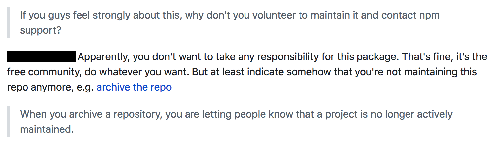
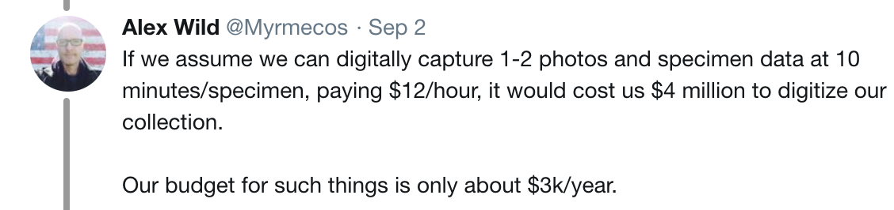

## Sustainability & Power in Digital Archaeology

 _This section is under development_. 

Consider all of the tools and approaches you have encountered in this text. All of them require a substantial investment of time and energy - and money, often! - for them to work. And it is _work_ - designing, implementing, and maintaining the various packages and services that digital archaeology relies upon is every bit as scholarly, every bit as taxing, as 'academic' work. Who does this work? Where does the money come from? In some cases, the answer is 'the library'. Which workers? Are they full-time, or are they precariously employed? What's the gender breakdown of that labour, and who receives the credit? In other cases, it is someone (often without institutional support) who takes it on as a duty. Sometimes, this can lead to [trouble](https://arstechnica.com/information-technology/2018/11/hacker-backdoors-widely-used-open-source-software-to-steal-bitcoin/), as the screenshot (Fig 5.1) demonstrates.

Things like that are, fortunately, rare. But it identifies the key issue - we are happy to use others' software, but are we happy to pay for it? Are we happy to do the heavy work of understanding who maintains it, and to recognize those individuals as co-creators of our work?

Critical services such as [OpenContext](http://opencontext.org) or the [Archaeological Data Service](http://www.archaeologydataservice.ac.uk/advice/chargingPolicy.xhtml) cost money to run. Consider [this tweet](https://twitter.com/Myrmecos/status/1036437847153274881) by Alex Wild, Curator of Entomology at the University of Texas at Austin, shown as Fig 5.2, where he works out the cost of digitizing their collection.

That's just the cost of taking a photograph. Imagine then the costs involved with cleaning up data, of making sure data is available online, protected against attacks, and served up following best practices. 

To not recognize this work, this _labour_ is an exercise of privilege and power. That is to say, the power to erase the contributions of those whose work underpins our own. Therefore, in this final section of ODATE, we invite you to reflect on what underpins your own digital archaeological work, and to wonder at what should be done in order to ensure its sustainability. Is your code open? Your data? Has it been future-proofed? Have all contributors been acknowledged publically, appropriately?

In a public lecture at Carleton University in November 2018, Katherine Cook of the Université de Montréal discussed these and other issues. Her talk was called ["There is no ‘net neutrality’ in digital archaeology"](https://youtu.be/vDqle5mNiZE) and it is worth considering in full.

<iframe width="560" height="315" src="https://www.youtube.com/embed/vDqle5mNiZE" frameborder="0" allow="accelerometer; autoplay; encrypted-media; gyroscope; picture-in-picture" allowfullscreen></iframe>

### exercises

1. Consider the different services you have used in ODATE. Can you work out the costs to operate/host/develop those services?
2. Search for a recent publication that uses digital archaeological tools or perspectives. What do the authors say or don't say about the sustainability of their tools?
3. Search for a field report. Who does the digital analytical work? What is their status in the hierarchy of the project? 
4. Explore [OpenContext](http://opencontext.org) for a project in your field of interest. Using Alex Wild's rule-of-thumb for digitizing images, try to estimate the cost of digitizing the project for OpenContext. Your estimate *will* be an underestimate, of course. What other costs might you be missing?