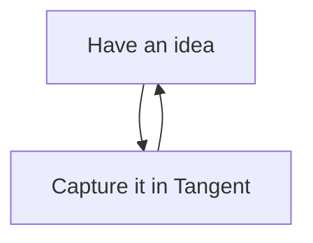

Tangent will render and display mermaid diagrams defined in a code block. For example:

Check out the [official Mermaid documentation](https://mermaid.js.org/intro/syntax-reference.html) for more details.