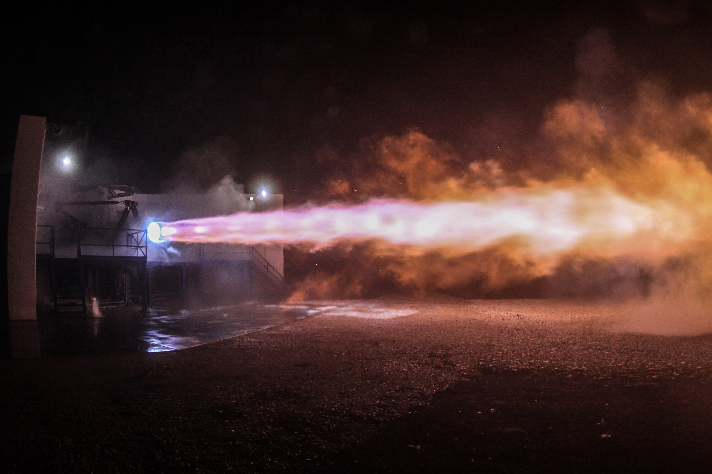

# External Images
I should be able to link to an external image with standard markdown. e.g. 
 And this should resolve itself nicely

# Local Images
You should be able to embed _local_ images via wiki links, e.g.
![[Test Image.jpg|500]]
You should also be able to embed local images through relative markdown links, e.g.  

And also with encoded URIs:
 

![[Test Image]]

![[Attachments/Pasted on 2021-11-01 at 14.58.47.png]]

![[Attachments/Pasted on 2021-11-01 at 16.39.06.png]]	